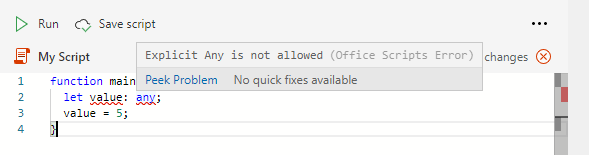

# Einschränkungen für TypeScript in Office Scripts

Office Scripts verwenden die TypeScript-Sprache. In den meisten Beispielen funktioniert jeder TypeScript- oder JavaScript-Code in einem Office-Skript. Es gibt jedoch einige Einschränkungen, die vom Code-Editor erzwungen werden, um sicherzustellen, dass Ihr Skript konsistent und wie beabsichtigt mit Ihrer Excel-Arbeitsmappe funktioniert.

## Kein "beliebiger" Typ in Office-Skripts

[Schreibtypen](https://www.typescriptlang.org/docs/handbook/typescript-in-5-minutes.html) sind in TypeScript optional, da die Typen abgeleitet werden können. Office Script erfordert jedoch, dass eine Variable keinen Typ [haben darf.](https://www.typescriptlang.org/docs/handbook/basic-types.html#any) Sowohl explizit als auch implizit `any` sind in einem Office-Skript nicht zulässig. Diese Fälle werden als Fehler gemeldet.

### Explizit `any`

Sie können eine Variable nicht explizit als Typ `any` in office-Skripts deklarieren (d. h. `let someVariable: any;` ). Der `any` Typ verursacht Probleme bei der Verarbeitung durch Excel. Ein Muss z. `Range` B. wissen, dass ein Wert ein `string` , oder `number` `boolean` ist. You will receive a compile-time error (an error prior to running the script) if any variable is explicitly defined as the `any` type in the script.

Im obigen Screenshot wird angegeben, dass #5, #16 `[5, 16] Explicit Any is not allowed` Typ `any` definiert. Auf diese Weise können Sie den Fehler ermitteln.

Um dieses Problem zu beheben, definieren Sie immer den Typ der Variablen. Wenn Sie unsicher sind, welche Art von Variable Sie haben, können Sie einen [Vereinigungstyp verwenden.](https://www.typescriptlang.org/docs/handbook/unions-and-intersections.html) Dies kann für Variablen nützlich sein, die Werte enthalten, die vom Typ , oder (der Typ für Werte ist eine Vereinigung der `Range` `string` `number` `boolean` `Range` werte: ) sein können. `string | number | boolean`

### Implizit `any`

TypeScript-Variablentypen können [implizit definiert](https://www.typescriptlang.org/docs/handbook/type-inference.html) werden. Wenn der #A0 den Typ einer Variablen nicht ermitteln kann (entweder weil der Typ nicht explizit definiert ist oder der Typverweis nicht möglich ist), handelt es sich um einen impliziten Fehler, und Sie erhalten einen Kompilierungszeitfehler. `any`

Der häufigste Fall bei impliziten `any` Deklarationen ist eine Variablendeklaration, z. B. `let value;` . Es gibt zwei Möglichkeiten, dies zu vermeiden:

* Weisen Sie die Variable einem implizit identifizierbaren Typ ( `let value = 5;` oder `let value = workbook.getWorksheet();` ) zu.
* Geben Sie die Variable explizit ein ( `let value: number;` )

## Keine Vererbung von Office -Skriptklassen oder -Schnittstellen

Klassen und Schnittstellen, die in Ihrem Office Script erstellt [werden,](https://www.typescriptlang.org/docs/handbook/classes.html#inheritance) können keine Klassen oder Schnittstellen von Office Scripts erweitern oder implementieren. Mit anderen Worten, nichts im `ExcelScript` Namespace kann Unterklassen oder Unterwebsites enthalten.

## Inkompatible TypeScript-Funktionen

Office-Skript-APIs können nicht in den folgenden Beispielen verwendet werden:

* [Generatorfunktionen](https://developer.mozilla.org/docs/Web/JavaScript/Guide/Iterators_and_Generators#generator_functions)
* [Array.sort](https://developer.mozilla.org/docs/Web/JavaScript/Reference/Global_Objects/Array/sort)

## `eval` wird nicht unterstützt

Die [JavaScript-eval-Funktion](https://developer.mozilla.org/docs/Web/JavaScript/Reference/Global_Objects/eval) wird aus Sicherheitsgründen nicht unterstützt.

## Eingeschränkte Identitäten

Die folgenden Wörter können nicht als Bezeichner in einem Skript verwendet werden. Es handelt sich um reservierte Begriffe.

* `Excel`
* `ExcelScript`
* `console`

## Leistungswarnungen

Der [Linter](https://wikipedia.org/wiki/Lint_(software)) des Codeeditors gibt Warnungen aus, wenn beim Skript Leistungsprobleme auftreten können. Die Fälle und deren Umarbeitung sind unter "Verbessern der Leistung Ihrer [Office-Skripts" dokumentiert.](web-client-performance.md)

## Externe API-Aufrufe

Weitere [Informationen finden Sie unter "Externe API-Anrufunterstützung in Office-Skripts".](external-calls.md)

## Siehe auch

* [Grundlagen der Skripterstellung für Office-Skripts in Excel im Web](scripting-fundamentals.md)
* [Verbessern der Leistung Ihrer Office-Skripts](web-client-performance.md)
