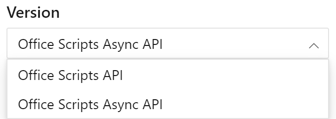

Verwenden Sie [diesen Link, um die Async-Version der API-Referenzdokumentation anzuzeigen](/javascript/api/office-scripts/excelscript?view=office-scripts-async). Sie können zwischen den Standard-APIs und den asynchronen Versionen mithilfe des Steuerelements Versionsauswahl oberhalb des Inhaltsverzeichnisses in der Referenzdokumentation wechseln.

