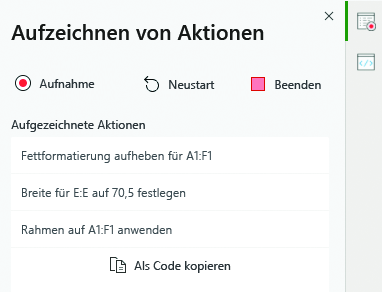
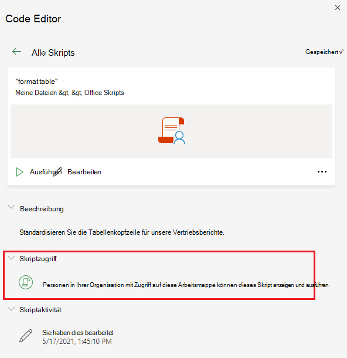

# Office-Skripts in Excel im Web (Vorschau)Office Scripts in Excel on the web (preview)

Mit Office-Skripts in Excel im Web können Sie Ihre täglichen Aufgaben automatisieren.Office Scripts in Excel on the web let you automate your day-to-day tasks. Sie können Ihre Excel-Aktionen mit dem Action Recorder aufzeichnen, wodurch ein Skript erstellt wird.You can record your Excel actions with the Action Recorder, which creates a script. Sie können Skripts auch mit dem Code Editor erstellen und bearbeiten.You can also create and edit scripts with the Code Editor. Ihre Skripts können dann für ihre gesamte Organisation freigegeben werden, sodass Ihre Kollegen den Workflow entsprechend automatisieren können.Your scripts can then be shared across your organization so your coworkers can also automate their workflows.

In dieser Reihe von Dokumenten lernen Sie, wie Sie diese Tools verwenden.This series of documents teaches you how to use these tools. Sie werden in den Action Recorder eingeführt und erfahren, wie Sie Ihre häufigen Excel-Aktionen aufzeichnen können.You'll be introduced to the Action Recorder and see how to record your frequent Excel actions. Außerdem erfahren Sie, wie Sie eigene Skripts mit dem Code Editor erstellen oder aktualisieren können.You'll also learn how to make or update your own scripts with the Code Editor.

 

> [!VIDEO https://www.microsoft.com/videoplayer/embed/RE4qdFF]

## AnforderungenRequirements

[!INCLUDE [Preview note](../includes/preview-note.md)]

Wenn Sie Office-Skripts verwenden möchten, benötigen Sie Folgendes.To use Office Scripts, you'll need the following.

1. [Excel im Web](https://www.office.com/launch/excel) (andere Plattformen, z. B. Desktop, werden nicht unterstützt).[Excel on the web](https://www.office.com/launch/excel) (other platforms, such as desktop, are not supported).
1. Office-Skripts [von Ihrem Administrator aktiviert](https://support.office.com/article/office-scripts-settings-in-m365-19d3c51a-6ca2-40ab-978d-60fa49554dcf).Office Scripts [enabled by your administrator](https://support.office.com/article/office-scripts-settings-in-m365-19d3c51a-6ca2-40ab-978d-60fa49554dcf).
1. Jede kommerzielle oder pädagogische Microsoft 365-Lizenz mit Zugriff auf Microsoft 365 Office-Desktop-Apps wie:Any commercial or educational Microsoft 365 license with access to the Microsoft 365 Office desktop apps, such as:

    - Office 365 BusinessOffice 365 Business
    - Office 365 Business PremiumOffice 365 Business Premium
    - Office 365 ProPlusOffice 365 ProPlus
    - Office 365 ProPlus für GeräteOffice 365 ProPlus for Devices
    - Office 365 Enterprise E3Office 365 Enterprise E3
    - Office 365 Enterprise E5Office 365 Enterprise E5
    - Office 365 A3Office 365 A3
    - Office 365 A5Office 365 A5

## Wann empfiehlt sich die Verwendung von Office-SkriptsWhen to use Office Scripts

Mit Skripts können Sie Ihre Excel-Aktionen in verschiedenen Arbeitsmappen und Arbeitsblättern aufzeichnen und wiedergeben.Scripts allow you to record and replay your Excel actions on different workbooks and worksheets. Wenn Sie immer wieder dieselben Aufgaben ausführen, können Sie alle diese Aufgaben in ein einfaches Office-Skript umwandeln.If you find yourself doing the same things over and over again, you can turn all that work into an easy-to-run Office Script. Führen Sie das Skript durch den Klick auf eine Schaltfläche in Excel aus, oder kombinieren Sie es mit Power Automation, um den gesamten Workflow zu optimieren.Run your script with a button-press in Excel or combine it with Power Automate to streamline your entire workflow.

Angenommen, Sie beginnen Ihren Arbeitstag, indem Sie eine .csv-Datei auf einer Kontoführungswebsite in Excel öffnen.As an example, say you start your work day by opening a .csv file from an accounting site in Excel. Sie müssen dann mehrere Minuten lang nicht benötigte Spalten löschen, eine Tabelle formatieren, Formeln hinzufügen und eine PivotTable in einem neuen Arbeitsblatt erstellen.You then spend several minutes deleting unnecessary columns, formatting a table, adding formulas, and creating a PivotTable in a new worksheet. Die Aktivitäten, die Sie täglich wiederholen, können einmalig mit dem Action Recorder aufzeichnet werden.Those actions you repeat daily can be recorded once with the Action Recorder. Ab dem Zeitpunkt wird durch Ausführen des Skripts die gesamte .csv-Konvertierung für Sie vorgenommen.From then on, running the script will take care of your entire .csv conversion. Sie können nicht nur das Risiko minimieren, Schritte zu vergessen, sondern sind in der Lage, Ihren Prozess mit anderen zu teilen, ohne ihnen etwas beibringen zu müssen.You'll not only remove the risk of forgetting steps, but be able to share your process with others without having to teach them anything. Office-Skripts automatisieren Ihre allgemeinen Aufgaben, damit Sie und Ihre Arbeitsumgebung effizienter und produktiver arbeiten können.Office Scripts automate your common tasks so you and your workplace can be more efficient and productive.

## Action RecorderAction Recorder

Die Action Recorder zeichnet Aktionen auf, die Sie in Excel ausführen, und speichert diese als Skript.The Action Recorder records actions you take in Excel and saves them as a script. Während der Action Recorder ausgeführt wird, können Sie die Excel-Aktionen erfassen, während Sie Zellen bearbeiten, Formatierungen ändern und Tabellen erstellen.With the Action recorder running, you can capture the Excel actions as you edit cells, change formatting, and create tables. Das resultierende Skript kann in anderen Arbeitsblättern und Arbeitsmappen ausgeführt werden, um die ursprünglichen Aktionen neuerlich zu erstellen.The resulting script can be run on other worksheets and workbooks to recreate your original actions.

## Code EditorCode Editor

Alle mit dem Action Recorder aufgezeichneten Skripts können über den Code Editor bearbeitet werden.All scripts recorded with the Action Recorder can be edited through the Code Editor. Auf diese Weise können Sie das Skript so optimieren und anpassen, so dass es Ihren genauen Anforderungen besser entspricht.This lets you tweak and customize the script to better suit your exact needs. Sie können auch Logiken und Funktionen hinzufügen, die nicht direkt über die Excel-Benutzeroberfläche zugänglich sind, z. B. bedingte Anweisungen (sofern/andernfalls) und Schleifen.You can also add logic and functionality that is not directly accessible through the Excel UI, such as conditional statements (if/else) and loops.

Eine einfache Möglichkeit, die Fähigkeiten von Office-Skripts zu erlernen besteht darin, Skripts in Excel im Web aufzuzeichnen und sich den resultierenden Code anzeigen zu lassen.One easy way to start learning the capabilities of Office Scripts is to record scripts in Excel on the web and view the resulting code. Eine weitere Möglichkeit besteht darin, unseren [Lernprogrammen](../tutorials/excel-tutorial.md) zu folgen, um geleitet und strukturierter zu lernen.Another option is to follow our [tutorials](../tutorials/excel-tutorial.md) to learn in a more guided and structured way.

## Freigeben von SkriptsSharing scripts

Office-Skripts können für andere Benutzer einer Excel-Arbeitsmappe freigegeben werden.Office Scripts can be shared with other users of an Excel workbook. Wenn Sie ein Skript für andere Personen in einer Arbeitsmappe freigeben, wird das Skript an die Arbeitsmappe angefügt.When you share a script with others in a workbook, the script is attached to the workbook. Ihre Skripts werden in Ihrem OneDrive gespeichert. Wenn Sie ein Script freigeben, erstellen Sie einen Link zu diesem Skript in der geöffneten Arbeitsmappe.Your scripts are stored in your OneDrive, and when you share one, you create a link to it in the workbook you have open.

Weitere Informationen zur Freigabe und zum Aufheben der Freigabe von Scripts entnehmen Sie dem Artikel [Freigeben von Office-Skripts in Excel für das Web](https://support.microsoft.com/office/sharing-office-scripts-in-excel-for-the-web-226eddbc-3a44-4540-acfe-fccda3d1122b?storagetype=live&ui=en-US&rs=en-US&ad=US).More details about sharing and unsharing scripts can be in the article [Sharing Office Scripts in Excel for the Web](https://support.microsoft.com/office/sharing-office-scripts-in-excel-for-the-web-226eddbc-3a44-4540-acfe-fccda3d1122b?storagetype=live&ui=en-US&rs=en-US&ad=US).

## Verbinden von Office-Skripts mit Power AutomateConnecting Office Scripts to Power Automate

[Power Automate](https://flow.microsoft.com/) ist ein Dienst, der Ihnen hilft, automatisierte Workflows zwischen mehreren Apps und Diensten zu erstellen.[Power Automate](https://flow.microsoft.com/) is a service that helps you create automated workflows between multiple apps and services. Office-Skripts können in diesen Workflows verwendet werden. Sie erhalten somit die Kontrolle über Ihre Skripts außerhalb der Arbeitsmappe.Office Scripts can be used in these workflows, giving you control of your scripts outside of the workbook. Sie können Ihre Skripts nach einem Zeitplan ausführen, sie als Antwort auf E-Mails auslösen und vieles mehr.You can run your scripts on a schedule, trigger them in response to emails, and much more. Im Lernprogramm [Ausführen von Office-Skripts in Excel im Web mit Power Automate](../tutorials/excel-power-automate-manual.md) erfahren Sie die Grundlagen des Verbindungsaufbaus zu diesen Automatisierungsdiensten.Visit the [Run Office Scripts in Excel on the web with Power Automate](../tutorials/excel-power-automate-manual.md) tutorial to learn the basics of connecting these automation services.

## Nächste SchritteNext steps

Führen Sie die [Office-Skripts in Excel im Web-Lernprogramm](../tutorials/excel-tutorial.md) aus, um zu erfahren, wie Sie Ihre ersten Office-Skripts erstellen können.Complete the [Office Scripts in Excel on the web tutorial](../tutorials/excel-tutorial.md) to learn how to create your first Office Scripts.

## Siehe auchSee also

- [Grundlagen der Skripterstellung für Office-Skripts in Excel im WebScripting fundamentals for Office Scripts in Excel on the web](../develop/scripting-fundamentals.md)
- [Referenzdokumentation zur Office Scripts-APIOffice Scripts API reference](/javascript/api/office-scripts/overview)
- [Behandeln von Problemen mit Office-SkriptsTroubleshooting Office Scripts](../testing/troubleshooting.md)
- [Office-Skripts-Einstellungen in M365Office Scripts settings in M365](https://support.office.com/article/office-scripts-settings-in-m365-19d3c51a-6ca2-40ab-978d-60fa49554dcf)
- [Einführung in Office-Skripts in Excel (unter support.office.com)Introduction to Office Scripts in Excel (on support.office.com)](https://support.office.com/article/introduction-to-office-scripts-in-excel-9fbe283d-adb8-4f13-a75b-a81c6baf163a)
- [Office-Skripts in Excel für das WebSharing Office Scripts in Excel for the Web](https://support.microsoft.com/office/sharing-office-scripts-in-excel-for-the-web-226eddbc-3a44-4540-acfe-fccda3d1122b?storagetype=live&ui=en-US&rs=en-US&ad=US)
