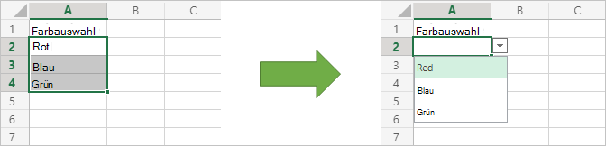

# <a name="basic-scripts-for-office-scripts-in-excel-on-the-web"></a>Grundlegende Skripts für Office-Skripts in Excel im Web

Die folgenden Beispiele sind einfache Skripts, die Sie in Ihren eigenen Arbeitsmappen ausprobieren können. So verwenden Sie sie in Excel im Web:

1. Öffnen Sie die Registerkarte **Automatisieren**.
2. Drücken **Sie den Code-Editor**.
3. Drücken **Sie neues Skript** im Aufgabenbereich des Code-Editors.
4. Ersetzen Sie das gesamte Skript durch das Beispiel Ihrer Wahl.
5. Drücken **Sie im** Aufgabenbereich des Code-Editors die Ausführung.

## <a name="scripting-basics"></a>Grundlagen der Skripterstellung

In diesen Beispielen werden grundlegende Bausteine für Office-Skripts gezeigt. Fügen Sie diese zu Ihren Skripts hinzu, um Ihre Lösung zu erweitern und häufige Probleme zu lösen.

### <a name="read-and-log-one-cell"></a>Lesen und Protokollieren einer Zelle

In diesem Beispiel wird der Wert von **A1 gelesen** und in der Konsole gedruckt.

```TypeScript
function main(workbook: ExcelScript.Workbook) {
  // Get the current worksheet.
  let selectedSheet = workbook.getActiveWorksheet();

  // Get the value of cell A1.
  let range = selectedSheet.getRange("A1");
  
  // Print the value of A1.
  console.log(range.getValue());
}
```

### <a name="read-the-active-cell"></a>Lesen der aktiven Zelle

Dieses Skript protokolliert den Wert der aktuellen aktiven Zelle. Wenn mehrere Zellen ausgewählt sind, wird die zelle ganz oben links protokolliert.

```TypeScript
function main(workbook: ExcelScript.Workbook) {
  // Get the current active cell in the workbook.
  let cell = workbook.getActiveCell();

  // Log that cell's value.
  console.log(`The current cell's value is ${cell.getValue()}`);
}
```

### <a name="change-an-adjacent-cell"></a>Ändern einer benachbarten Zelle

Dieses Skript ruft benachbarte Zellen mithilfe relativer Verweise ab. Beachten Sie, dass, wenn sich die aktive Zelle in der oberen Zeile befindet, ein Teil des Skripts fehlschlägt, da es auf die Zelle über der aktuell ausgewählten Zelle verweist.

```TypeScript
function main(workbook: ExcelScript.Workbook) {
  // Get the currently active cell in the workbook.
  let activeCell = workbook.getActiveCell();
  console.log(`The active cell's address is: ${activeCell.getAddress()}`);

  // Get the cell to the right of the active cell and set its value and color.
  let rightCell = activeCell.getOffsetRange(0,1);
  rightCell.setValue("Right cell");
  console.log(`The right cell's address is: ${rightCell.getAddress()}`);
  rightCell.getFormat().getFont().setColor("Magenta");
  rightCell.getFormat().getFill().setColor("Cyan");

  // Get the cell to the above of the active cell and set its value and color.
  // Note that this operation will fail if the active cell is in the top row.
  let aboveCell = activeCell.getOffsetRange(-1, 0);
  aboveCell.setValue("Above cell");
  console.log(`The above cell's address is: ${aboveCell.getAddress()}`);
  aboveCell.getFormat().getFont().setColor("White");
  aboveCell.getFormat().getFill().setColor("Black");
}
```

### <a name="change-all-adjacent-cells"></a>Ändern aller benachbarten Zellen

Dieses Skript kopiert die Formatierung in der aktiven Zelle in die benachbarten Zellen. Beachten Sie, dass dieses Skript nur funktioniert, wenn sich die aktive Zelle nicht an einem Rand des Arbeitsblatts befindet.

```TypeScript
function main(workbook: ExcelScript.Workbook) {
  // Get the active cell.
  let activeCell = workbook.getActiveCell();

  // Get the cell that's one row above and one column to the left of the active cell.
  let cornerCell = activeCell.getOffsetRange(-1,-1);

  // Get a range that includes all the cells surrounding the active cell.
  let surroundingRange = cornerCell.getResizedRange(2, 2)

  // Copy the formatting from the active cell to the new range.
  surroundingRange.copyFrom(
    activeCell, /* The source range. */
    ExcelScript.RangeCopyType.formats /* What to copy. */
    );
}
```

### <a name="change-each-individual-cell-in-a-range"></a>Ändern der einzelnen Zellen in einem Bereich

Dieses Skript übernimmt eine Schleife über den aktuell ausgewählten Bereich. Es wird die aktuelle Formatierung entfernt und die Füllfarbe in jeder Zelle auf eine zufällige Farbe fest.

```TypeScript
function main(workbook: ExcelScript.Workbook) {
  // Get the currently selected range.
  let range = workbook.getSelectedRange();

  // Get the size boundaries of the range.
  let rows = range.getRowCount();
  let cols = range.getColumnCount();

  // Clear any existing formatting
  range.clear(ExcelScript.ClearApplyTo.formats);

  // Iterate over the range.
  for (let row = 0; row < rows; row++) {
    for (let col = 0; col < cols; col++) {
      // Generate a random color hex-code.
      let colorString = `#${Math.random().toString(16).substr(-6)}`;

      // Set the color of the current cell to that random hex-code.
      range.getCell(row, col).getFormat().getFill().setColor(colorString);
    }
  }
}
```

### <a name="get-groups-of-cells-based-on-special-criteria"></a>Gruppen von Zellen basierend auf speziellen Kriterien erhalten

Dieses Skript ruft alle leeren Zellen im verwendeten Bereich des aktuellen Arbeitsblatts ab. Anschließend werden alle zellen mit gelbem Hintergrund hervorgehoben.

```TypeScript
function main(workbook: ExcelScript.Workbook) {
    // Get the current used range.
    let range = workbook.getActiveWorksheet().getUsedRange();
    
    // Get all the blank cells.
    let blankCells = range.getSpecialCells(ExcelScript.SpecialCellType.blanks);

    // Highlight the blank cells with a yellow background.
    blankCells.getFormat().getFill().setColor("yellow");
}
```

## <a name="collections"></a>Auflistungen

Diese Beispiele funktionieren mit Auflistungen von Objekten in der Arbeitsmappe.

### <a name="iterating-over-collections"></a>Iterieren über Sammlungen

Dieses Skript ruft die Namen aller Arbeitsblätter in der Arbeitsmappe ab und protokolliert sie. Außerdem werden die Registerkartenfarben auf eine zufällige Farbe fest.

```TypeScript
function main(workbook: ExcelScript.Workbook) {
  // Get all the worksheets in the workbook.
  let sheets = workbook.getWorksheets();

  // Get a list of all the worksheet names.
  let names = sheets.map ((sheet) => sheet.getName());

  // Write in the console all the worksheet names and the total count.
  console.log(names);
  console.log(`Total worksheets inside of this workbook: ${sheets.length}`);
  
  // Set the tab color each worksheet to a random color
  for (let sheet of sheets) {
    // Generate a random color hex-code.
    let colorString = `#${Math.random().toString(16).substr(-6)}`;

    // Set the color of the current worksheet's tab to that random hex-code.
    sheet.setTabColor(colorString);
  }
}
```

### <a name="querying-and-deleting-from-a-collection"></a>Abfragen und Löschen aus einer Auflistung

Mit diesem Skript wird ein neues Arbeitsblatt erstellt. Es wird nach einer vorhandenen Kopie des Arbeitsblatts überprüft und gelöscht, bevor ein neues Blatt erstellt wird.

```TypeScript
function main(workbook: ExcelScript.Workbook) {
  // Name of the worksheet to be added.
  let name = "Index";

  // Get any worksheet with that name.
  let sheet = workbook.getWorksheet("Index");
  
  // If `null` wasn't returned, then there's already a worksheet with that name.
  if (sheet) {
    console.log(`Worksheet by the name ${name} already exists. Deleting it.`);
    // Delete the sheet.
    sheet.delete();
  }
  
  // Add a blank worksheet with the name "Index".
  // Note that this code runs regardless of whether an existing sheet was deleted.
  console.log(`Adding the worksheet named ${name}.`);
  let newSheet = workbook.addWorksheet("Index");

  // Switch to the new worksheet.
  newSheet.activate();
}
```

## <a name="dates"></a>Datumsangaben

In den Beispielen in diesem Abschnitt wird die Verwendung des JavaScript [Date-Objekts](https://developer.mozilla.org/docs/web/javascript/reference/global_objects/date) gezeigt.

Das folgende Beispiel ruft das aktuelle Datum und die aktuelle Uhrzeit ab und schreibt diese Werte dann in zwei Zellen im aktiven Arbeitsblatt.

```TypeScript
function main(workbook: ExcelScript.Workbook) {
  // Get the cells at A1 and B1.
  let dateRange = workbook.getActiveWorksheet().getRange("A1");
  let timeRange = workbook.getActiveWorksheet().getRange("B1");

  // Get the current date and time with the JavaScript Date object.
  let date = new Date(Date.now());

  // Add the date string to A1.
  dateRange.setValue(date.toLocaleDateString());

  // Add the time string to B1.
  timeRange.setValue(date.toLocaleTimeString());
}
```

Im nächsten Beispiel wird ein Datum gelesen, das in Excel gespeichert ist, und es in ein JavaScript Date-Objekt übersetzt. Es verwendet die [numerische Seriennummer des Datums](https://support.office.com/article/now-function-3337fd29-145a-4347-b2e6-20c904739c46) als Eingabe für das JavaScript-Datum.

```TypeScript
function main(workbook: ExcelScript.Workbook) {
  // Read a date at cell A1 from Excel.
  let dateRange = workbook.getActiveWorksheet().getRange("A1");

  // Convert the Excel date to a JavaScript Date object.
  let excelDateValue = dateRange.getValue() as number;
  let javaScriptDate = new Date(Math.round((excelDateValue - 25569) * 86400 * 1000));
  console.log(javaScriptDate);
}
```

## <a name="display-data"></a>Anzeigen von Daten

In diesen Beispielen wird gezeigt, wie Sie mit Arbeitsblattdaten arbeiten und Benutzern eine bessere Ansicht oder Organisation bieten.

### <a name="apply-conditional-formatting"></a>Anwenden bedingter Formatierung

In diesem Beispiel wird bedingte Formatierung auf den derzeit im Arbeitsblatt verwendeten Bereich angewendet. Die bedingte Formatierung ist eine grüne Füllung für die obersten 10 % der Werte.

```TypeScript
function main(workbook: ExcelScript.Workbook) {
  // Get the current worksheet.
  let selectedSheet = workbook.getActiveWorksheet();

  // Get the used range in the worksheet.
  let range = selectedSheet.getUsedRange();

  // Set the fill color to green for the top 10% of values in the range.
  let conditionalFormat = range.addConditionalFormat(ExcelScript.ConditionalFormatType.topBottom)
  conditionalFormat.getTopBottom().getFormat().getFill().setColor("green");
  conditionalFormat.getTopBottom().setRule({
    rank: 10, // The percentage threshold.
    type: ExcelScript.ConditionalTopBottomCriterionType.topPercent // The type of the top/bottom condition.
  });
}
```

### <a name="create-a-sorted-table"></a>Erstellen einer sortierten Tabelle

In diesem Beispiel wird eine Tabelle aus dem verwendeten Bereich des aktuellen Arbeitsblatts erstellt und anschließend basierend auf der ersten Spalte sortiert.

```TypeScript
function main(workbook: ExcelScript.Workbook) {
  // Get the current worksheet.
  let selectedSheet = workbook.getActiveWorksheet();

  // Create a table with the used cells.
  let usedRange = selectedSheet.getUsedRange();
  let newTable = selectedSheet.addTable(usedRange, true);

  // Sort the table using the first column.
  newTable.getSort().apply([{ key: 0, ascending: true }]);
}
```

### <a name="log-the-grand-total-values-from-a-pivottable"></a>Protokollieren der "Grand Total"-Werte aus einer PivotTable

In diesem Beispiel wird die erste PivotTable in der Arbeitsmappe gefunden und die Werte in den Zellen "Grand Total" protokolliert (wie im folgenden Bild grün hervorgehoben).


```TypeScript
function main(workbook: ExcelScript.Workbook) {
  // Get the first PivotTable in the workbook.
  let pivotTable = workbook.getPivotTables()[0];

  // Get the names of each data column in the PivotTable.
  let pivotColumnLabelRange = pivotTable.getLayout().getColumnLabelRange();

  // Get the range displaying the pivoted data.
  let pivotDataRange = pivotTable.getLayout().getBodyAndTotalRange();

  // Get the range with the "grand totals" for the PivotTable columns.
  let grandTotalRange = pivotDataRange.getLastRow();

  // Print each of the "Grand Totals" to the console.
  grandTotalRange.getValues()[0].forEach((column, columnIndex) => {
    console.log(`Grand total of ${pivotColumnLabelRange.getValues()[0][columnIndex]}: ${grandTotalRange.getValues()[0][columnIndex]}`);
    // Example log: "Grand total of Sum of Crates Sold Wholesale: 11000"
  });
}
```

### <a name="use-data-validation-to-create-a-drop-down-list"></a>Verwenden der Datenüberprüfung zum Erstellen einer Dropdownliste

Dieses Skript erstellt eine Dropdownauswahlliste für eine Zelle. Es verwendet die vorhandenen Werte des ausgewählten Bereichs als Auswahlmöglichkeiten für die Liste.



```TypeScript
function main(workbook: ExcelScript.Workbook) {
  // Get the values for data validation.
  let selectedRange = workbook.getSelectedRange();
  let rangeValues = selectedRange.getValues();

  // Convert the values into a comma-delimited string.
  let dataValidationListString = "";
  rangeValues.forEach((rangeValueRow) => {
    rangeValueRow.forEach((value) => {
      dataValidationListString += value + ",";
    });
  });

  // Clear the old range.
  selectedRange.clear(ExcelScript.ClearApplyTo.contents);

  // Apply the data validation to the first cell in the selected range.
  let targetCell = selectedRange.getCell(0,0);
  let dataValidation = targetCell.getDataValidation();

  // Set the content of the drop-down list.
  dataValidation.setRule({
      list: {
        inCellDropDown: true,
        source: dataValidationListString
      }
    });
}
```

## <a name="formulas"></a>Formeln

In diesen Beispielen werden Excel-Formeln verwendet, und es wird gezeigt, wie sie in Skripts verwendet werden.

### <a name="single-formula"></a>Einzelne Formel

Dieses Skript legt die Formel einer Zelle fest und zeigt dann an, wie Excel die Formel und den Wert der Zelle separat speichert.

```TypeScript
function main(workbook: ExcelScript.Workbook) {
  let selectedSheet = workbook.getActiveWorksheet();

  // Set A1 to 2.
  let a1 = selectedSheet.getRange("A1");
  a1.setValue(2);

  // Set B1 to the formula =(2*A1), which should equal 4.
  let b1 = selectedSheet.getRange("B1")
  b1.setFormula("=(2*A1)");

  // Log the current results for `getFormula` and `getValue` at B1.
  console.log(`B1 - Formula: ${b1.getFormula()} | Value: ${b1.getValue()}`);
}
```

### <a name="spilling-results-from-a-formula"></a>Spilling results from a formula

Dieses Skript transponiert den Bereich "A1:D2" mithilfe der TRANSPOSE-Funktion in "A4:B7". Wenn die Transponieren zu einem fehler #SPILL, wird der Zielbereich geleert und die Formel erneut angewendet.

```TypeScript
function main(workbook: ExcelScript.Workbook) {
  let sheet = workbook.getActiveWorksheet();
  // Use the data in A1:D2 for the sample.
  let dataAddress = "A1:D2"
  let inputRange = sheet.getRange(dataAddress);

  // Place the transposed data starting at A4.
  let targetStartCell = sheet.getRange("A4");

  // Compute the target range.
  let targetRange = targetStartCell.getResizedRange(inputRange.getColumnCount() - 1, inputRange.getRowCount() - 1);

  // Call the transpose helper function.
  targetStartCell.setFormula(`=TRANSPOSE(${dataAddress})`);

  // Check if the range update resulted in a spill error.
  let checkValue = targetStartCell.getValue() as string;
  if (checkValue === '#SPILL!') {
    // Clear the target range and call the transpose function again.
    console.log("Target range has data that is preventing update. Clearing target range.");
    targetRange.clear();
    targetStartCell.setFormula(`=TRANSPOSE(${dataAddress})`);
  }

  // Select the transposed range to highlight it.
  targetRange.select();
}
```

## <a name="suggest-new-samples"></a>Vorschlagen neuer Beispiele

Wir freuen uns über Vorschläge für neue Beispiele. Wenn es ein gängiges Szenario gibt, das anderen Skriptentwicklern helfen würde, teilen Sie uns dies im folgenden Feedbackabschnitt mit.
