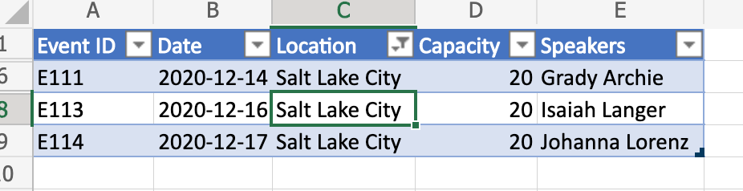
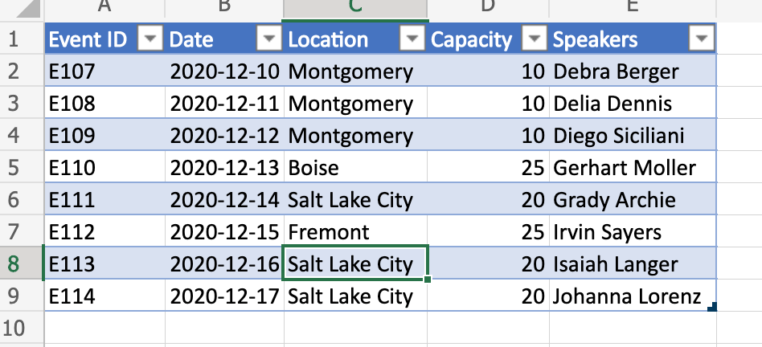

# <a name="clear-table-column-filter-based-on-active-cell-location"></a><span data-ttu-id="a7ba5-103">Löschen des Tabellenspaltenfilters basierend auf der aktiven Zellenposition</span><span class="sxs-lookup"><span data-stu-id="a7ba5-103">Clear table column filter based on active cell location</span></span>

<span data-ttu-id="a7ba5-104">In diesem Beispiel wird der Tabellenspaltenfilter basierend auf der aktiven Zellenposition entfernt.</span><span class="sxs-lookup"><span data-stu-id="a7ba5-104">This sample clears the table column filter based on the active cell location.</span></span> <span data-ttu-id="a7ba5-105">Das Skript erkennt, ob die Zelle Teil einer Tabelle ist, bestimmt die Tabellenspalte und filtert, die darauf angewendet werden.</span><span class="sxs-lookup"><span data-stu-id="a7ba5-105">The script detects if the cell is part of a table, determines the table column, and clears any filter that are applied on it.</span></span>

<span data-ttu-id="a7ba5-106">Wenn Sie mehr darüber erfahren möchten, wie Sie den Filter speichern, bevor Sie ihn löschen (und später erneut anwenden), finden Sie weitere Informationen unter [Move rows across tables by saving filters](move-rows-across-tables.md), a more advanced sample.</span><span class="sxs-lookup"><span data-stu-id="a7ba5-106">If you wish to learn more about how to save the filter prior to clearing it (and re-apply later), see [Move rows across tables by saving filters](move-rows-across-tables.md), a more advanced sample.</span></span>

<span data-ttu-id="a7ba5-107">_Vor dem Löschen des Spaltenfilters (beachten Sie die aktive Zelle)_</span><span class="sxs-lookup"><span data-stu-id="a7ba5-107">_Before clearing column filter (notice the active cell)_</span></span>



<span data-ttu-id="a7ba5-109">_Nach dem Löschen des Spaltenfilters_</span><span class="sxs-lookup"><span data-stu-id="a7ba5-109">_After clearing column filter_</span></span>



## <a name="sample-code-clear-table-column-filter-based-on-active-cell"></a><span data-ttu-id="a7ba5-111">Beispielcode: Tabellenspaltenfilter basierend auf aktiver Zelle löschen</span><span class="sxs-lookup"><span data-stu-id="a7ba5-111">Sample code: Clear table column filter based on active cell</span></span>

<span data-ttu-id="a7ba5-112">Das folgende Skript entfernt den Tabellenspaltenfilter basierend auf der aktiven Zellenposition und kann auf jede Beliebige Excel-Datei mit einer Tabelle angewendet werden.</span><span class="sxs-lookup"><span data-stu-id="a7ba5-112">The following script clears the table column filter based on active cell location and can be applied to any Excel file with a table.</span></span> <span data-ttu-id="a7ba5-113">Zur Vereinfachung können Sie die Datei herunterladen und <a href="table-with-filter.xlsx">table-with-filter.xlsx. </a></span><span class="sxs-lookup"><span data-stu-id="a7ba5-113">For convenience, you can download and use <a href="table-with-filter.xlsx">table-with-filter.xlsx</a>.</span></span>

```TypeScript
function main(workbook: ExcelScript.Workbook) {
    // Get active cell.
    const cell = workbook.getActiveCell();

    // Get all tables associated with that cell.
    const tables = cell.getTables();
    
    // If there is no table on the selection, return/exit.
    if (tables.length !== 1) {
      console.log("The selection is not in a table.");
      return;
    }

    // Get table (since it is already determined that there is only
    // a single table part of the selection).
    const currentTable = tables[0];

    console.log(currentTable.getName());
    console.log(currentTable.getRange().getAddress());

    const entireCol = cell.getEntireColumn();
    const intersect = entireCol.getIntersection(currentTable.getRange());
    console.log(intersect.getAddress());

    const headerCellValue = intersect.getCell(0,0).getValue() as string;
    console.log(headerCellValue);

    // Get column.
    const col = currentTable.getColumnByName(headerCellValue);

    // Clear filter.
    col.getFilter().clear();
}
```

## <a name="training-video-clear-table-column-filter-based-on-active-cell-location"></a><span data-ttu-id="a7ba5-114">Schulungsvideo: Löschen des Tabellenspaltenfilters basierend auf der position der aktiven Zelle</span><span class="sxs-lookup"><span data-stu-id="a7ba5-114">Training video: Clear table column filter based on active cell location</span></span>

<span data-ttu-id="a7ba5-115">Ein Beispiel für die Arbeit mit Bereichen finden Sie unter [Range basics training videos](range-basics.md#training-videos-range-basics).</span><span class="sxs-lookup"><span data-stu-id="a7ba5-115">For an example of how to work with ranges, see [Range basics training videos](range-basics.md#training-videos-range-basics).</span></span>
