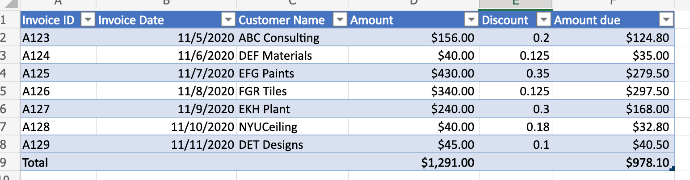

# <a name="use-office-scripts-and-power-automate-to-email-images-of-a-chart-and-table"></a>Verwenden von Office-Skripts und Power Automate zum E-Mail-Senden von Bildern eines Diagramms und einer Tabelle

In diesem Beispiel werden Office-Skripts und Power Automate zum Erstellen eines Diagramms verwendet. Anschließend werden Bilder des Diagramms und seiner Basistabelle per E-Mail gesendet.

## <a name="example-scenario"></a>Beispielszenario

* Berechnen Sie, um die neuesten Ergebnisse zu erhalten.
* Diagramm erstellen.
* Get chart and table images.
* Senden Sie eine E-Mail an die Bilder mit Power Automate.

_Eingabedaten_



_Ausgabediagramm_


_E-Mails, die über den Power Automate-Fluss empfangen wurden_


## <a name="solution"></a>Lösung

Diese Lösung besteht aus zwei Teilen:

1. [Ein Office-Skript zum Berechnen und Extrahieren von Excel-Diagrammen und -Tabellen](#sample-code-calculate-and-extract-excel-chart-and-table)
1. Ein Power Automate-Fluss zum Aufrufen des Skripts und zum Senden der Ergebnisse per E-Mail. Ein Beispiel dazu finden Sie unter Erstellen eines automatisierten [Workflows mit Power Automate](../../tutorials/excel-power-automate-returns.md#create-an-automated-workflow-with-power-automate).

## <a name="sample-code-calculate-and-extract-excel-chart-and-table"></a>Beispielcode: Berechnen und Extrahieren von Excel-Diagrammen und -Tabellen

Das folgende Skript berechnet und extrahiert ein Excel-Diagramm und eine Tabelle.

Laden Sie die Beispieldatei <a href="email-chart-table.xlsx">email-chart-table.xlsx</a> und verwenden Sie sie mit diesem Skript, um sie selbst auszuprobieren!

```TypeScript
function main(workbook: ExcelScript.Workbook): ReportImages {

  workbook.getApplication().calculate(ExcelScript.CalculationType.full);
  
  let sheet1 = workbook.getWorksheet("Sheet1");
  const table = workbook.getWorksheet('InvoiceAmounts').getTables()[0];
  const rows = table.getRange().getTexts();

  const selectColumns = rows.map((row) => {
    return [row[2], row[5]];
  });
  table.setShowTotals(true);
  selectColumns.splice(selectColumns.length-1, 1);
  console.log(selectColumns);

  workbook.getWorksheet('ChartSheet')?.delete();
  const chartSheet = workbook.addWorksheet('ChartSheet');
  const targetRange = updateRange(chartSheet, selectColumns);

  // Insert chart on sheet 'Sheet1'.
  let chart_2 = chartSheet.addChart(ExcelScript.ChartType.columnClustered, targetRange);
  chart_2.setPosition('D1');
  const chartImage = chart_2.getImage();
  const tableImage = table.getRange().getImage();
  return {
    chartImage,
    tableImage
  }
}

function updateRange(sheet: ExcelScript.Worksheet, data: string[][]): ExcelScript.Range {
  const targetRange = sheet.getRange('A1').getResizedRange(data.length-1, data[0].length-1);
  targetRange.setValues(data);
  return targetRange;
}

interface ReportImages {
  chartImage: string
  tableImage: string
}
```

## <a name="training-video-extract-and-email-images-of-chart-and-table"></a>Schulungsvideo: Extrahieren und E-Mail-Bilder von Diagramm und Tabelle

[](https://youtu.be/152GJyqc-Kw "Schritt-für-Schritt-Video zum Extrahieren und E-Mail-Bilder von Diagramm und Tabelle")
