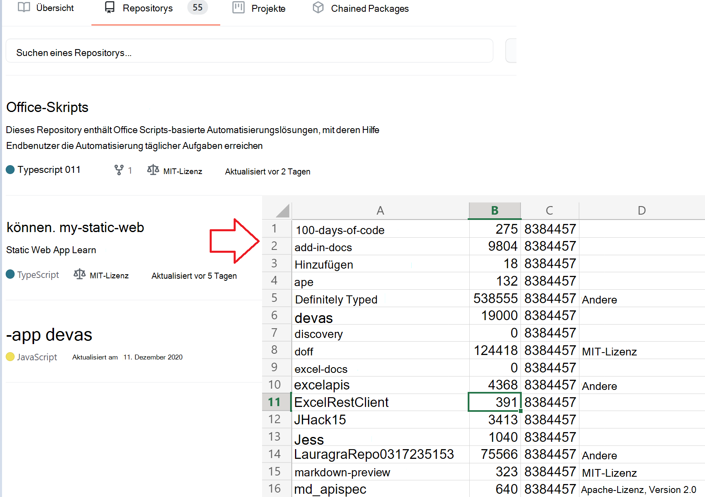

# <a name="use-external-fetch-calls-in-office-scripts"></a><span data-ttu-id="3dd82-103">Verwenden von externen Abrufanrufen in Office-Skripts</span><span class="sxs-lookup"><span data-stu-id="3dd82-103">Use external fetch calls in Office Scripts</span></span>

<span data-ttu-id="3dd82-104">Dieses Skript ruft grundlegende Informationen zu den Repositorys eines Benutzers GitHub ab.</span><span class="sxs-lookup"><span data-stu-id="3dd82-104">This script gets basic information about a user's GitHub repositories.</span></span> <span data-ttu-id="3dd82-105">Es zeigt, wie sie `fetch` in einem einfachen Szenario verwendet werden.</span><span class="sxs-lookup"><span data-stu-id="3dd82-105">It shows how to use `fetch` in a simple scenario.</span></span>

<span data-ttu-id="3dd82-106">Sie können mehr über die GItHub-APIs erfahren, die in der [GitHub-API-Referenz verwendet werden.](https://docs.github.com/rest/reference/repos#list-repositories-for-a-user)</span><span class="sxs-lookup"><span data-stu-id="3dd82-106">You can learn more about the GItHub APIs being used in the [GitHub API reference](https://docs.github.com/rest/reference/repos#list-repositories-for-a-user).</span></span> <span data-ttu-id="3dd82-107">Sie können auch die Ausgabe von unformatiertem API-Aufruf anzeigen, indem Sie einen Webbrowser aufrufen (stellen Sie sicher, dass Sie den `https://api.github.com/users/{USERNAME}/repos` Platzhalter {USERNAME} durch Ihre Github-ID ersetzen).</span><span class="sxs-lookup"><span data-stu-id="3dd82-107">You can also see the raw API call output by visiting `https://api.github.com/users/{USERNAME}/repos` in a web browser (be sure to replace the {USERNAME} placeholder with your Github ID).</span></span>



## <a name="sample-code-get-basic-information-about-users-github-repositories"></a><span data-ttu-id="3dd82-109">Beispielcode: Grundlegende Informationen zum Benutzerrepository GitHub erhalten</span><span class="sxs-lookup"><span data-stu-id="3dd82-109">Sample code: Get basic information about user's GitHub repositories</span></span>

```TypeScript
async function main(workbook: ExcelScript.Workbook) {

  // Replace the {USERNAME} placeholder with your GitHub username.
  const response = await fetch('https://api.github.com/users/{USERNAME}/repos');
  const repos: Repository[] = await response.json();
  
  const rows: (string | boolean | number)[][] = [];
  for (let repo of repos){ 
    rows.push([repo.id, repo.name, repo.license?.name, repo.license?.url])
  }
  const sheet = workbook.getActiveWorksheet();
  const range = sheet.getRange('A2').getResizedRange(rows.length - 1, rows[0].length - 1);
  range.setValues(rows);
  return;
}

interface Repository {
  name: string,
  id: string,
  license?: License 
}

interface License {
  name: string,
  url: string
}
```

## <a name="training-video-how-to-make-external-api-calls"></a><span data-ttu-id="3dd82-110">Schulungsvideo: So nehmen Sie externe API-Aufrufe vor</span><span class="sxs-lookup"><span data-stu-id="3dd82-110">Training video: How to make external API calls</span></span>

<span data-ttu-id="3dd82-111">[Sehen Sie sich an, wie Sudhi Ramamurthy dieses Beispiel auf YouTube durchspazieren.](https://youtu.be/fulP29J418E)</span><span class="sxs-lookup"><span data-stu-id="3dd82-111">[Watch Sudhi Ramamurthy walk through this sample on YouTube](https://youtu.be/fulP29J418E).</span></span>
