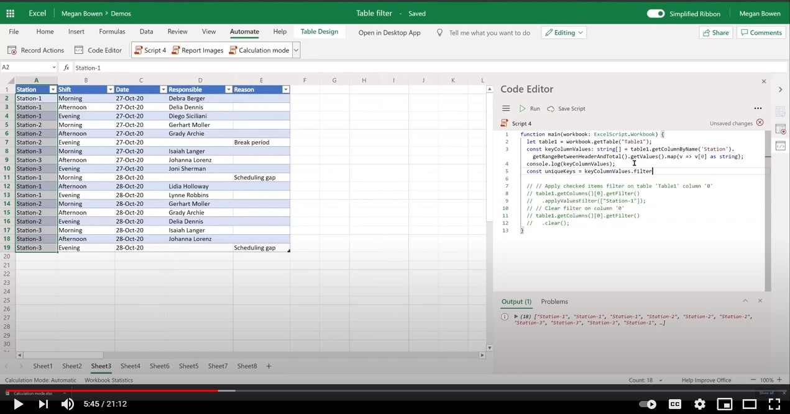

# <a name="filter-excel-table-and-get-visible-range-as-a-json-object"></a><span data-ttu-id="e1081-103">Filtern der Excel-Tabelle und Erhalten des sichtbaren Bereichs als JSON-Objekt</span><span class="sxs-lookup"><span data-stu-id="e1081-103">Filter Excel table and get visible range as a JSON object</span></span>

<span data-ttu-id="e1081-104">In diesem Beispiel wird eine Excel-Tabelle filtert und der sichtbare Bereich als JSON-Objekt zurückgegeben.</span><span class="sxs-lookup"><span data-stu-id="e1081-104">This sample filters an Excel table and returns the visible range as a JSON object.</span></span> <span data-ttu-id="e1081-105">Diese JSON könnte einem Power Automate-Fluss als Teil einer größeren Lösung bereitgestellt werden.</span><span class="sxs-lookup"><span data-stu-id="e1081-105">This JSON could be provided to a Power Automate flow as part of a larger solution.</span></span>

## <a name="example-scenario"></a><span data-ttu-id="e1081-106">Beispielszenario</span><span class="sxs-lookup"><span data-stu-id="e1081-106">Example scenario</span></span>

* <span data-ttu-id="e1081-107">Wenden Sie einen Filter auf eine Tabellenspalte an.</span><span class="sxs-lookup"><span data-stu-id="e1081-107">Apply a filter to a table column.</span></span>
* <span data-ttu-id="e1081-108">Extrahieren Sie den sichtbaren Bereich nach dem Filtern.</span><span class="sxs-lookup"><span data-stu-id="e1081-108">Extract the visible range after filtering.</span></span>
* <span data-ttu-id="e1081-109">Zusammenstellen und Zurückgeben eines Objekts mit einer [bestimmten JSON-Struktur](#sample-json).</span><span class="sxs-lookup"><span data-stu-id="e1081-109">Assemble and return an object with a [specific JSON structure](#sample-json).</span></span>

## <a name="sample-code-filter-a-table-and-get-visible-range"></a><span data-ttu-id="e1081-110">Beispielcode: Filtern einer Tabelle und Erhalten eines sichtbaren Bereichs</span><span class="sxs-lookup"><span data-stu-id="e1081-110">Sample code: Filter a table and get visible range</span></span>

<span data-ttu-id="e1081-111">Das folgende Skript filtert eine Tabelle und ruft den sichtbaren Bereich ab.</span><span class="sxs-lookup"><span data-stu-id="e1081-111">The following script filters a table and gets the visible range.</span></span>

<span data-ttu-id="e1081-112">Laden Sie die Beispieldatei <a href="table-filter.xlsx">table-filter.xlsx</a> und verwenden Sie sie mit diesem Skript, um sie selbst auszuprobieren!</span><span class="sxs-lookup"><span data-stu-id="e1081-112">Download the sample file <a href="table-filter.xlsx">table-filter.xlsx</a> and use it with this script to try it out yourself!</span></span>

```TypeScript
function main(workbook: ExcelScript.Workbook): ReturnTemplate {
  const table1 = workbook.getTable("Table1");
  const keyColumnValues: string [] = table1.getColumnByName('Station').getRangeBetweenHeaderAndTotal().getValues().map(v => v[0] as string);
  const uniqueKeys = keyColumnValues.filter((v, i, a) => a.indexOf(v) === i);

  console.log(uniqueKeys);
  const returnObj: ReturnTemplate = {}

  uniqueKeys.forEach((key: string) => {
    table1.getColumnByName('Station').getFilter()
      .applyValuesFilter([key]);
    const rangeView = table1.getRange().getVisibleView();
    returnObj[key] = returnObjectFromValues(rangeView.getValues() as string[][]);
  })
  table1.getColumnByName('Station').getFilter().clear();
  console.log(JSON.stringify(returnObj));
  return returnObj
}

function returnObjectFromValues(values: string[][]): BasicObj[] {
  let objArray = [];
  let objKeys: string[] = [];
  for (let i=0; i < values.length; i++) {
    if (i===0) {
      objKeys = values[i]
      continue;
    }
    let obj = {}
    for (let j=0; j < values[i].length; j++) {
      obj[objKeys[j]] = values[i][j]
    }
    objArray.push(obj);
  }
  return objArray;
}

interface BasicObj {
  [key: string] : string
}

interface ReturnTemplate {
  [key: string]: BasicObj[]
}
```

### <a name="sample-json"></a><span data-ttu-id="e1081-113">Beispiel-JSON</span><span class="sxs-lookup"><span data-stu-id="e1081-113">Sample JSON</span></span>

<span data-ttu-id="e1081-114">Jeder Schlüssel stellt einen eindeutigen Wert einer Tabelle dar.</span><span class="sxs-lookup"><span data-stu-id="e1081-114">Each key represents a unique value of a table.</span></span> <span data-ttu-id="e1081-115">Jede Arrayinstanz stellt die Zeile dar, die angezeigt wird, wenn der entsprechende Filter angewendet wird.</span><span class="sxs-lookup"><span data-stu-id="e1081-115">Each array instance represents the row that is visible when the corresponding filter is applied.</span></span>

```json
{
  "Station-1": [{
    "Station": "Station-1",
    "Shift": "Morning",
    "Date": "27-Oct-20",
    "Responsible": "Debra Berger",
    "Reason": ""
  }, {
    "Station": "Station-1",
    "Shift": "Afternoon",
    "Date": "27-Oct-20",
    "Responsible": "Delia Dennis",
    "Reason": ""
  }, {
    "Station": "Station-1",
    "Shift": "Afternoon",
    "Date": "28-Oct-20",
    "Responsible": "Lidia Holloway",
    "Reason": ""
  }],
  "Station-2": [{
    "Station": "Station-2",
    "Shift": "Morning",
    "Date": "27-Oct-20",
    "Responsible": "Gerhart Moller",
    "Reason": ""
  }, {
    "Station": "Station-2",
    "Shift": "Afternoon",
    "Date": "28-Oct-20",
    "Responsible": "Grady Archie",
    "Reason": ""
  }],
  "Station-3": [{
    "Station": "Station-3",
    "Shift": "Morning",
    "Date": "27-Oct-20",
    "Responsible": "Isaiah Langer",
    "Reason": ""
  }]
}
```

## <a name="training-video-filter-an-excel-table-and-get-the-visible-range"></a><span data-ttu-id="e1081-116">Schulungsvideo: Filtern einer Excel-Tabelle und Erhalten des sichtbaren Bereichs</span><span class="sxs-lookup"><span data-stu-id="e1081-116">Training video: Filter an Excel table and get the visible range</span></span>

<span data-ttu-id="e1081-117">[](https://youtu.be/Mv7BrvPq84A "Schritt-für-Schritt-Video zum Filtern einer Excel-Tabelle und zum Erhalten des sichtbaren Bereichs")</span><span class="sxs-lookup"><span data-stu-id="e1081-117">[](https://youtu.be/Mv7BrvPq84A "Step-by-step video on how to filter an Excel table and get the visible range")</span></span>
