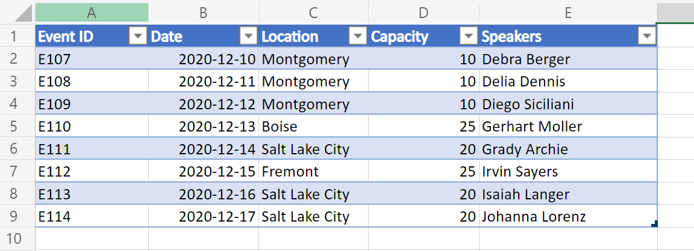
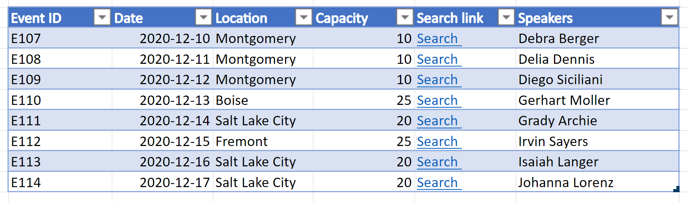
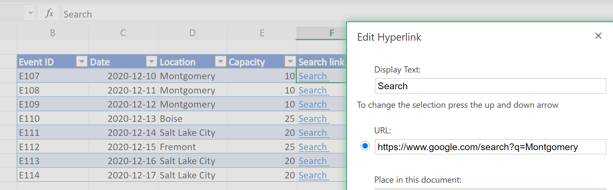

# <a name="output-excel-table-data-as-json-for-usage-in-power-automate"></a>Ausgabe von Excel-Tabellendaten als JSON für die Verwendung in Power Automate

Excel-Tabellendaten können als Array von Objekten in Form von JSON dargestellt werden. Jedes Objekt stellt eine Zeile in der Tabelle dar. Dadurch werden die Daten aus Excel in einem konsistenten Format extrahiert, das für den Benutzer sichtbar ist. Die Daten können dann über Power Automate-Flüsse an andere Systeme gegeben werden.

_Eingabetabelle_



Eine Variante dieses Beispiels enthält auch die Hyperlinks in einer der Tabellenspalten. Dadurch können zusätzliche Ebenen von Zelldaten im JSON angezeigt werden.

_Eingabetabelle mit Hyperlinks_



_Dialogfeld zum Bearbeiten von Hyperlinks_



## <a name="sample-excel-file"></a>Beispiel-Excel-Datei

Laden Sie die Datei <a href="table-data-with-hyperlinks.xlsx">table-data-with-hyperlinks.xlsx, </a> die in diesen Beispielen verwendet wird, herunter, und testen Sie sie selbst!

## <a name="sample-code-return-table-data-as-json"></a>Beispielcode: Zurückgeben von Tabellendaten als JSON

> [!NOTE]
> Sie können die Struktur `interface TableData` so ändern, dass sie ihren Tabellenspalten entsprechen. Beachten Sie, dass Sie bei Spaltennamen mit Leerzeichen den Schlüssel in Anführungszeichen setzen, z. B. `"Event ID"` mit im Beispiel.

```TypeScript
function main(workbook: ExcelScript.Workbook): TableData[] {
  const table = workbook.getWorksheet('PlainTable').getTables()[0];
  // If you know the table name, you can also do the following:
  // const table = workbook.getTable('Table13436');
  const texts = table.getRange().getTexts();
  let returnObjects: TableData[] = [];
  if (table.getRowCount() > 0)  {
    returnObjects = returnObjectFromValues(texts);
  } 
  console.log(JSON.stringify(returnObjects));  
  return returnObjects
}

function returnObjectFromValues(values: string[][]): TableData[] {
  let objArray = [];
  let objKeys: string[] = [];
  for (let i = 0; i < values.length; i++) {
    if (i === 0) {
      objKeys = values[i]
      continue;
    }
    let obj = {}
    for (let j = 0; j < values[i].length; j++) {
      obj[objKeys[j]] = values[i][j]
    }
    objArray.push(obj);
  }
  return objArray as TableData[];
}

interface BasicObj {
  [key: string]: string
}

interface TableData {
  "Event ID": string
  Date: string
  Location: string
  Capacity: string
  Speakers: string
}
```

### <a name="sample-output"></a>Beispielausgabe

```json
[{
    "Event ID": "E107",
    "Date": "2020-12-10",
    "Location": "Montgomery",
    "Capacity": "10",
    "Speakers": "Debra Berger"
}, {
    "Event ID": "E108",
    "Date": "2020-12-11",
    "Location": "Montgomery",
    "Capacity": "10",
    "Speakers": "Delia Dennis"
}, {
    "Event ID": "E109",
    "Date": "2020-12-12",
    "Location": "Montgomery",
    "Capacity": "10",
    "Speakers": "Diego Siciliani"
}, {
    "Event ID": "E110",
    "Date": "2020-12-13",
    "Location": "Boise",
    "Capacity": "25",
    "Speakers": "Gerhart Moller"
}, {
    "Event ID": "E111",
    "Date": "2020-12-14",
    "Location": "Salt Lake City",
    "Capacity": "20",
    "Speakers": "Grady Archie"
}, {
    "Event ID": "E112",
    "Date": "2020-12-15",
    "Location": "Fremont",
    "Capacity": "25",
    "Speakers": "Irvin Sayers"
}, {
    "Event ID": "E113",
    "Date": "2020-12-16",
    "Location": "Salt Lake City",
    "Capacity": "20",
    "Speakers": "Isaiah Langer"
}, {
    "Event ID": "E114",
    "Date": "2020-12-17",
    "Location": "Salt Lake City",
    "Capacity": "20",
    "Speakers": "Johanna Lorenz"
}]
```

## <a name="sample-code-return-table-data-as-json-with-hyperlink-text"></a>Beispielcode: Zurückgeben von Tabellendaten als JSON mit Hyperlinktext

> [!NOTE]
> Das Skript extrahiert immer Hyperlinks aus der 4. Spalte (0 Index) der Tabelle. Sie können diese Reihenfolge ändern oder mehrere Spalten als Hyperlinkdaten hinzufügen, indem Sie den Code unter dem Kommentar ändern. `// For the 4th column (0 index), extract the hyperlink and use that instead of text.`

```TypeScript
function main(workbook: ExcelScript.Workbook): TableData[] {
  const table = workbook.getWorksheet('WithHyperLink').getTables()[0];
  const range = table.getRange();
  // If you know the table name, you can also do the following:
  // const table = workbook.getTable('Table13436');
  const texts = table.getRange().getTexts();
  let returnObjects: TableData[] = [];
  if (table.getRowCount() > 0)  {
    returnObjects = returnObjectFromValues(texts, range);
  } 
  console.log(JSON.stringify(returnObjects));  
  return returnObjects
}

function returnObjectFromValues(values: string[][], range: ExcelScript.Range): TableData[] {
  let objArray = [];
  let objKeys: string[] = [];
  for (let i = 0; i < values.length; i++) {
    if (i === 0) {
      objKeys = values[i]
      continue;
    }
    let obj = {}
    for (let j = 0; j < values[i].length; j++) {
      // For the 4th column (0 index), extract the hyperlink and use that instead of text. 
      if (j === 4) {
        obj[objKeys[j]] = range.getCell(i, j).getHyperlink().address;
      } else {
        obj[objKeys[j]] = values[i][j];
      }
    }
    objArray.push(obj);
  }
  return objArray as TableData[];
}

interface BasicObj {
  [key: string]: string
}

interface TableData {
  "Event ID": string
  Date: string
  Location: string
  Capacity: string
  "Search link": string
  Speakers: string
}
```

### <a name="sample-output"></a>Beispielausgabe

```json
[{
    "Event ID": "E107",
    "Date": "2020-12-10",
    "Location": "Montgomery",
    "Capacity": "10",
    "Search link": "https://www.google.com/search?q=Montgomery",
    "Speakers": "Debra Berger"
}, {
    "Event ID": "E108",
    "Date": "2020-12-11",
    "Location": "Montgomery",
    "Capacity": "10",
    "Search link": "https://www.google.com/search?q=Montgomery",
    "Speakers": "Delia Dennis"
}, {
    "Event ID": "E109",
    "Date": "2020-12-12",
    "Location": "Montgomery",
    "Capacity": "10",
    "Search link": "https://www.google.com/search?q=Montgomery",
    "Speakers": "Diego Siciliani"
}, {
    "Event ID": "E110",
    "Date": "2020-12-13",
    "Location": "Boise",
    "Capacity": "25",
    "Search link": "https://www.google.com/search?q=Boise",
    "Speakers": "Gerhart Moller"
}, {
    "Event ID": "E111",
    "Date": "2020-12-14",
    "Location": "Salt Lake City",
    "Capacity": "20",
    "Search link": "https://www.google.com/search?q=salt+lake+city",
    "Speakers": "Grady Archie"
}, {
    "Event ID": "E112",
    "Date": "2020-12-15",
    "Location": "Fremont",
    "Capacity": "25",
    "Search link": "https://www.google.com/search?q=Fremont",
    "Speakers": "Irvin Sayers"
}, {
    "Event ID": "E113",
    "Date": "2020-12-16",
    "Location": "Salt Lake City",
    "Capacity": "20",
    "Search link": "https://www.google.com/search?q=salt+lake+city",
    "Speakers": "Isaiah Langer"
}, {
    "Event ID": "E114",
    "Date": "2020-12-17",
    "Location": "Salt Lake City",
    "Capacity": "20",
    "Search link": "https://www.google.com/search?q=salt+lake+city",
    "Speakers": "Johanna Lorenz"
}]
```

## <a name="use-in-power-automate"></a>Verwenden in Power Automate

Informationen zur Verwendung eines solchen Skripts in Power Automate finden Sie unter [Erstellen eines automatisierten Workflows mit Power Automate](../../tutorials/excel-power-automate-returns.md#create-an-automated-workflow-with-power-automate).
