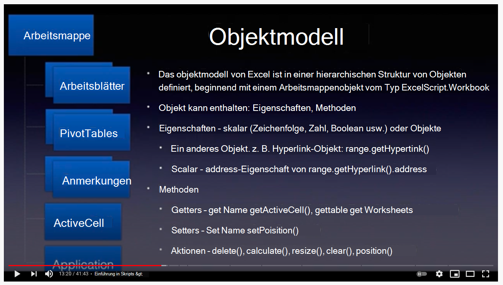

# <a name="getting-started"></a>Erste Schritte

Dieser Abschnitt enthält Details zu den Grundlagen Office Skripts, einschließlich Zugriff, Umgebung, Skriptgrundwerte und wenigen grundlegenden Skriptmustern.

## <a name="environment-setup"></a>Umgebungseinrichtung

Erfahren Sie mehr über die Grundlagen des Zugriffs, der Umgebung und des Skript-Editors.

[](https://youtu.be/vvCtxsjPxo8 "Grundlagen Office Skriptanwendung")

### <a name="access"></a>Zugriff

Office Skripts erfordern Administratoreinstellungen, die für Microsoft 365 administrator unter **Einstellungen**  >  **Org settings** Office Scripts verfügbar  >  **sind.** Standardmäßig ist es für alle Benutzer aktiviert. Es gibt zwei Untereinstellungen, die der Administrator ein- und ausschalten kann.

* Möglichkeit zum Freigeben von Skripts innerhalb der Organisation
* Möglichkeit der Verwendung von Skripts in Power Automate

Sie können sehen, ob Sie Zugriff auf Office-Skripts haben, indem Sie eine  Datei in Excel im Web (Browser) öffnen und sehen, ob die Registerkarte Automatisieren im Menüband Excel angezeigt wird oder nicht.
Wenn die Registerkarte Automatisieren weiterhin nicht angezeigt **wird,** lesen Sie [diesen Abschnitt zur Problembehandlung](../../testing/troubleshooting.md#automate-tab-not-appearing-or-office-scripts-unavailable).

### <a name="availability"></a>Verfügbarkeit

Office Skripts sind nur in der Excel im Web für Enterprise E3+-Lizenzen verfügbar (Consumer- und E1-Konten werden nicht unterstützt). Office Skripts werden noch nicht in Excel auf Windows und Mac unterstützt.

### <a name="scripts-and-editor"></a>Skripts und Editor

Der Code-Editor ist direkt in Excel im Web (Onlineversion) integrierte. Wenn Sie Editoren wie "Visual Studio Code" oder "Sublime" verwendet haben, ist diese Bearbeitungserfahrung ziemlich ähnlich.
Die meisten Tastenkombinationen, die Visual Studio Code Editor verwenden, arbeiten auch Office Skriptbearbeitung. Sehen Sie sich die folgenden Tastenkombinationen an.

* [macOS](https://code.visualstudio.com/shortcuts/keyboard-shortcuts-macos.pdf)
* [Windows](https://code.visualstudio.com/shortcuts/keyboard-shortcuts-windows.pdf)

#### <a name="key-things-to-note"></a>Wichtige Dinge, die Sie beachten müssen

* Office Skripts sind nur für Dateien verfügbar, die auf OneDrive for Business, SharePoint und Teamwebsites gespeichert sind.
* Der Editor zeigt die Erweiterung des Skripts nicht an. In Wirklichkeit handelt es sich dabei um TypeScript-Dateien, die jedoch mit einer benutzerdefinierten Erweiterung namens gespeichert `.osts` werden.
* Die Skripts werden in Ihrem eigenen Ordner OneDrive for Business `My Files/Documents/OfficeScripts` gespeichert. Sie müssen diesen Ordner nicht verwalten. Sie können diesen Aspekt ignorieren, während der Editor die Anzeige-/Bearbeitungserfahrung verwaltet.
* Skripts werden nicht als Teil der Excel gespeichert. Sie werden separat gespeichert.
* Sie können das Skript für eine Excel freigeben, was bedeutet, dass Sie das Skript mit der Datei verknüpfen und nicht anfügen. Wer Zugriff auf die Excel hat, kann auch eine Kopie  des Skripts **anzeigen,** ausführen oder erstellen. Dies ist ein wichtiger Unterschied im Vergleich zu VBA-Makros.
* Wenn Sie Ihre Skripts nicht freigeben, kann niemand darauf zugreifen, wie sie sich in Ihrer eigenen Bibliothek befinden.
* Skripts können nicht von einem lokalen Datenträger oder benutzerdefinierten Cloudspeicherorten verknüpft werden. Office Skripts erkennen und ausführen nur ein Skript, das sich am vordefinierten Speicherort befindet (ihr OneDrive oben erwähnt) oder freigegebene Skripts.
* Während der Bearbeitung werden Dateien vorübergehend im Browser gespeichert, Aber Sie müssen das Skript speichern, bevor Sie das Excel-Fenster schließen, um es am speicherort OneDrive speichern. Vergessen Sie nicht, die Datei nach den Bearbeitungen zu speichern.

## <a name="gentle-introduction-to-scripting"></a>Behutsame Einführung in skripterstellung

Office Skripts sind eigenständige Skripts, die in der TypeScript-Sprache geschrieben wurden und Anweisungen zum Ausführen einer Automatisierung für die ausgewählte Excel enthalten. Alle Automatisierungsanweisungen sind in einem Skript enthalten, und Skripts können keine anderen Skripts aufrufen oder aufrufen. Alle Skripts werden in eigenständigen Dateien gespeichert und im Ordner OneDrive gespeichert. Sie können ein neues Skript aufzeichnen, ein aufgezeichnetes Skript bearbeiten oder ein ganz neues Skript in einer integrierten Editorschnittstelle von Grund auf neu schreiben. Der beste Teil Office Skripts ist, dass sie keine weiteren Setups von Benutzern benötigen. Keine externen Bibliotheken, Webseiten oder Benutzeroberflächenelemente, Setup usw. Alle Umgebungseinstellungen werden von skripts Office und ermöglicht einen einfachen und schnellen Zugriff auf die Automatisierung über eine einfache API-Schnittstelle.

Zu den grundlegenden Konzepten, die hilfreich sind, um das Bearbeiten und Navigieren in Skripts zu verstehen, gehören:

* Grundlegende TypeScript-Sprachsyntax
* Verstehen von `main` Funktionen und Argumenten
* Objekte und Hierarchie, Methoden, Eigenschaften
* Auflistung (Array): Navigation und Vorgänge
* Typdefinitionen
* Umgebung: Aufzeichnen/Bearbeiten, Ausführen, Untersuchen von Ergebnissen, Freigeben

In diesem Video und Abschnitt werden einige dieser Konzepte ausführlich erläutert.

[](https://youtu.be/8Zsrc1uaiiU "Grundlagen von Skripts")

### <a name="language-typescript"></a>Sprache: TypeScript

[Office](../../index.md) Skripts werden mit der [TypeScript-Sprache](https://www.typescriptlang.org/)geschrieben, einer Open-Source-Sprache, die auf JavaScript (eine der weltweit am häufigsten verwendeten) basiert, indem statische Typdefinitionen hinzugefügt werden. Wie die Website sagt, bieten Sie eine Möglichkeit, die Form eines Objekts zu beschreiben, eine bessere Dokumentation zur Verfügung zu stellen und TypeScript zu ermöglichen, um zu überprüfen, ob Ihr Code `Types` ordnungsgemäß funktioniert.

Die Sprachsyntax selbst wird mithilfe von [JavaScript mit](https://developer.mozilla.org/docs/Web/JavaScript) zusätzlichen Eingaben geschrieben, die im Skript mithilfe von TypeScript-Konventionen definiert sind. In den meisten Beispielen können Sie sich Office Skripts wie in JavaScript geschrieben. Es ist wichtig, dass Sie die Grundlagen der JavaScript-Sprache verstehen, um Ihre Office Skripts zu beginnen. Sie müssen sich jedoch nicht damit ausgnüssen, um Ihren Automatisierungsweg zu beginnen. Mit dem Office Skripts können Sie die Skriptanweisungen verstehen, da Codekommentare enthalten sind und Sie kleine Änderungen mit verfolgen und ausführen können.

Office Skript-APIs, mit denen das Skript mit Excel interagieren kann, sind für Endbenutzer konzipiert, die möglicherweise nicht über einen großen Codierungshintergrund verfügen. APIs können synchron aufgerufen werden, und Sie benötigen keine erweiterten Themen wie Zusagen oder Rückrufe. Office Das Skript-API-Design bietet:

* Einfaches Objektmodell mit Methoden, Getters/Setters.
* Leicht zugängliche Objektsammlungen als reguläre Arrays.
* Einfache Fehlerbehandlungsoptionen.
* Optimierte Leistung für ausgewählte Szenarien, die Benutzern dabei helfen, sich auf das szenario zu konzentrieren.

### <a name="main-function-the-scripts-starting-point"></a>`main` Funktion: Ausgangspunkt des Skripts

Office Die Ausführung von Skripts beginnt bei der `main` Funktion. Ein Skript ist eine einzelne Datei, die eine oder mehrere Funktionen zusammen mit Deklarationen von Typen, Schnittstellen, Variablen usw. enthält. Um dem Skript zu folgen, beginnen Sie mit der Funktion als Excel die Funktion immer zuerst aufruft, wenn `main` `main` Sie ein Skript ausführen. Die Funktion hat immer mindestens ein Argument (oder Parameter) namens , bei dem es sich nur um einen Variablennamen handelt, der die aktuelle Arbeitsmappe identifiziert, für die `main` `workbook` das Skript ausgeführt wird. Sie können zusätzliche Argumente für die Verwendung mit Power Automate (Offline)-Ausführung definieren.

* `function main(workbook: ExcelScript.Workbook)`

Ein Skript kann in kleinere Funktionen organisiert werden, um code reusability, clarity usw. zu unterstützen. Andere Funktionen können sich innerhalb oder außerhalb der Hauptfunktion, aber immer in derselben Datei enthalten. Ein Skript ist eigenständiges Skript und kann nur funktionen verwenden, die in derselben Datei definiert sind. Skripts können kein anderes Skript aufrufen oder Office aufrufen.

Zusammenfassung:

* Die `main` Funktion ist der Einstiegspunkt für jedes Skript. Wenn die Funktion ausgeführt wird, ruft Excel diese Hauptfunktion auf, indem die Arbeitsmappe als erster Parameter angegeben wird.
* Es ist wichtig, das erste Argument und seine Typdeklaration so zu behalten, `workbook` wie es angezeigt wird. Sie können der Funktion neue Argumente hinzufügen (siehe den nächsten Abschnitt), aber behalten Sie `main` das erste Argument wie folgt bei.

:::image type="content" source="../../images/getting-started-main-introduction.png" alt-text="Die Hauptfunktion ist der Einstiegspunkt des Skripts.":::

#### <a name="send-or-receive-data-from-other-apps"></a>Senden oder Empfangen von Daten von anderen Apps

Sie können Excel mit anderen Teilen Ihrer Organisation verbinden, indem Sie Skripts in [Power Automate.](https://flow.microsoft.com) Erfahren Sie mehr über [das Ausführen Office Skripts in Power Automate Flüssen](../../develop/power-automate-integration.md).

Die Möglichkeit, Daten von und an Excel zu empfangen oder zu senden, ist über die `main` Funktion. Denken Sie daran, dass es das Informationsgateway ist, mit dem eingehende und ausgehende Daten im Skript beschrieben und verwendet werden können. Sie können Daten von außerhalb des Skripts mithilfe des Datentyps empfangen und typeScript-erkannte Daten wie , , oder alle Objekte in Form von Schnittstellen zurückgeben, die Sie im Skript `string` `string` `number` `boolean` definieren.

:::image type="content" source="../../images/getting-started-data-in-out.png" alt-text="Die Eingaben und Ausgaben eines Skripts":::

#### <a name="use-functions-to-organize-and-reuse-code"></a>Verwenden von Funktionen zum Organisieren und Wiederverwenden von Code

Sie können Funktionen verwenden, um Code innerhalb Ihres Skripts zu organisieren und wiederzuverwenden.

:::image type="content" source="../../images/getting-started-use-functions.png" alt-text="Verwenden von Funktionen in einem Skript":::

### <a name="objects-hierarchy-methods-properties-collections"></a>Objekte, Hierarchie, Methoden, Eigenschaften, Auflistungen

Das objektmodell Excel ist in einer hierarchischen Struktur von Objekten definiert, beginnend mit dem Arbeitsmappenobjekt vom Typ `ExcelScript.Workbook` . Ein Objekt kann Methoden, Eigenschaften und andere Objekte enthalten. Objekte werden mithilfe der Methoden miteinander verknüpft. Die Methode eines Objekts kann ein anderes Objekt oder eine Auflistung von Objekten zurückgeben. Die Verwendung der IntelliSense (Codeabschluss)-Funktion des Code-Editors ist eine hervorragende Möglichkeit, die Objekthierarchie zu erkunden. Sie können auch die offizielle [Referenzdokumentationswebsite verwenden,](/javascript/api/office-scripts/overview) um die Beziehungen zwischen Objekten zu verfolgen.

Ein [Objekt](https://developer.mozilla.org/docs/Web/JavaScript/Reference/Global_Objects/Object) ist eine Auflistung von Eigenschaften, und eine Eigenschaft ist eine Zuordnung zwischen einem Namen (oder Schlüssel) und einem Wert. Der Wert einer Eigenschaft kann eine Funktion sein, in diesem Fall wird die Eigenschaft als Methode bezeichnet. Im Fall des Office Scripts-Objektmodells stellt ein Objekt eine Sache in der Excel-Datei dar, mit der Benutzer interagieren, z. B. ein Diagramm, ein Hyperlink, eine Pivottabelle usw. Sie kann auch das Verhalten eines Objekts darstellen, z. B. die Schutzattribute eines Arbeitsblatts.

Das Thema typeScript-Objekte und -Eigenschaften im Vergleich zu Methoden ist sehr tief. Um mit dem Skript zu beginnen und produktiv zu sein, können Sie sich einige grundlegende Dinge merken:

* Auf Objekte und Eigenschaften wird mithilfe `.` der (Punkt-)Notation zugegriffen, mit dem Objekt auf der linken Seite der und der Eigenschaft oder Methode `.` auf der rechten Seite. Beispiele: `hyperlink.address` , `range.getAddress()` .
* Eigenschaften sind skalar in der Natur (Zeichenfolgen, boolesche Werte, Zahlen). Beispielsweise name of a workbook, position of a worksheet, the value of whether the table has a footer or not.
* Methoden werden mithilfe der klammern geöffneten Klammern "aufgerufen" oder "ausgeführt". Beispiel: `table.delete()`. Manchmal wird ein Argument an eine Funktion übergeben, indem sie zwischen offenen Klammern einschleiert wird: `range.setValue('Hello')` . Sie können viele Argumente an eine Funktion übergeben (wie durch ihren Vertrag/ihre Signatur definiert) und diese mithilfe von `,` trennen.  Zum Beispiel: `worksheet.addTable('A1:D6', true)`. Sie können Argumente eines beliebigen Typs übergeben, wie dies von der Methode erforderlich ist, z. B. Zeichenfolgen, Zahlen, boolesche Objekte oder sogar andere Objekte, z. B. , wobei ein An anderer Stelle im Skript erstelltes Objekt `worksheet.addTable(targetRange, true)` `targetRange` ist.
* Methoden können ein Objekt wie eine skalare Eigenschaft (Name, Adresse usw.) oder ein anderes Objekt (Bereich, Diagramm) oder gar nichts zurückgeben (z. B. bei `delete` Methoden). Sie erhalten, was die Methode zurückgibt, indem Sie eine Variable deklarieren oder einer vorhandenen Variablen zuweisen. Sie können dies auf der linken Seite der Anweisung wie `const table = worksheet.addTable('A1:D6', true)` sehen.
* In den meisten Teilen besteht das Office Scripts-Objektmodell aus Objekten mit Methoden, die verschiedene Teile des Excel verknüpfen. Sehr selten werden Ihnen Eigenschaften mit skalaren oder Objektwerten angezeigt.
* In Office Skripts muss Excel Objektmodellmethode offene Klammern enthalten. Die Verwendung von Methoden ohne diese ist nicht zulässig (z. B. das Zuweisen einer Methode zu einer Variablen).

Sehen wir uns einige Methoden für das Objekt `workbook` an.

```TypeScript
function main(workbook: ExcelScript.Workbook) {
    // Return a boolean (true or false) setting of whether the workbook is set to auto-save or not. 
    const autoSave = workbook.getAutoSave(); 
    // Get workbook name.
    const name = workbook.getName();
    // Get active cell range object.
    const cell = workbook.getActiveCell();
    // Get table named SALES.
    const cell = workbook.getTable('SALES');
    // Get all slicer objects.
    const slicers = workbook.getSlicers();
}
```

In diesem Beispiel:

* Die Methoden des Objekts, z. B. `workbook` und zurückgeben eine `getAutoSave()` `getName()` skalare Eigenschaft (Zeichenfolge, Zahl, boolescher Wert).
* Methoden wie das `getActiveCell()` Zurückgeben eines anderen Objekts.
* Die Methode akzeptiert ein Argument (in diesem `getTable()` Fall Tabellenname) und gibt eine bestimmte Tabelle in der Arbeitsmappe zurück.
* Die Methode gibt ein Array (an vielen Stellen als Auflistung bezeichnet) aller `getSlicers()` Datenschnittobjekte in der Arbeitsmappe zurück.

Sie werden feststellen, dass alle diese Methoden ein Präfix haben. Dies ist nur eine Konvention, die im Office Scripts-Objektmodell verwendet wird, um zu vermitteln, dass die Methode etwas `get` zurück gibt. Sie werden auch häufig als "Getter" bezeichnet.

Es gibt zwei weitere Methodentypen, die wir nun im nächsten Beispiel sehen werden:

```TypeScript
function main(workbook: ExcelScript.Workbook) {
    // Get a worksheet named 'Sheet1.
    const sheet = workbook.getWorksheet('Sheet1'); 
    // Set name to SALES.
    sheet.setName('SALES');
    // Position the worksheet at the beginning.
    sheet.setPosition(0);
}
```

In diesem Beispiel:

* Die `setName()` Methode legt einen neuen Namen für das Arbeitsblatt fest. `setPosition()` legt die Position auf die erste Zelle fest.
* Diese Methoden ändern die Excel, indem sie eine Eigenschaft oder ein Verhalten der Arbeitsmappe festlegen. Diese Methoden werden als "Setter" bezeichnet.
* In der Regel verfügen "Setter" beispielsweise über einen Begleiter "Getter", und , beide `worksheet.getPosition` `worksheet.setPosition` sind Methoden.

#### <a name="undefined-and-null-primitive-types"></a>`undefined` und `null` primitive Typen

Es folgen zwei primitive Datentypen, die Sie beachten müssen:

1. Der Wert [`null`](https://developer.mozilla.org/docs/Web/JavaScript/Reference/Global_Objects/null) stellt die beabsichtigte Abwesenheit eines beliebigen Objektwerts dar. Es ist einer der Grundwerte von JavaScript und wird verwendet, um anzugeben, dass eine Variable keinen Wert hat.
1. Eine Variable, der kein Wert zugewiesen wurde, hat den Typ [`undefined`](https://developer.mozilla.org/docs/Web/JavaScript/Reference/Global_Objects/undefined) . Eine Methode oder Anweisung kann auch zurückgeben, wenn die zu bewertende Variable keinen `undefined` zugewiesenen Wert hat.

Diese beiden Typen werden im Rahmen der Fehlerbehandlung angezeigt und können bei nicht ordnungsgemäßer Behandlung einiges an Kopfzerbrechen verursachen. Glücklicherweise bietet TypeScript/JavaScript eine Möglichkeit, zu überprüfen, ob eine Variable vom Typ oder `undefined` `null` ist. Wir werden über einige dieser Prüfungen in späteren Abschnitten sprechen, einschließlich der Fehlerbehandlung.

#### <a name="method-chaining"></a>Methodenkette

Sie können dot notation verwenden, um Objekte zu verbinden, die von einer Methode zurückgegeben werden, um den Code zu kürzen. Manchmal erleichtert diese Technik das Lesen und Verwalten des Codes. Es gibt jedoch nur wenige Dinge, die Sie beachten sollten. Sehen wir uns die folgenden Beispiele an.

Der folgende Code ruft die aktive Zelle und die nächste Zelle ab und legt dann den Wert fest. Dies ist ein guter Kandidat für die Verwendung der Verkettung, da dieser Code immer erfolgreich ist.

```TypeScript
function main(workbook: ExcelScript.Workbook) {
    workbook.getActiveCell().getOffsetRange(0,1).setValue('Next cell');
}
```

Allerdings hat der folgende Code (der eine Tabelle mit dem Namen **SALES** erhält und die spaltenformatierte Spalte aktiviert) ein Problem.

```TypeScript
function main(workbook: ExcelScript.Workbook) {
  workbook.getTable('SALES').setShowBandedColumns(true);
}
```

Was passiert, wenn die **TABELLE SALES** nicht vorhanden ist? Das Skript tritt mit einem Fehler (siehe weiter) auf, da es `getTable('SALES')` zurückgibt (ein JavaScript-Typ, der angibt, dass keine Tabelle wie `undefined` **SALES vorkommt).** Das Aufrufen der Methode auf ist nicht sinnvoll, d. h. , und daher endet das `setShowBandedColumns` `undefined` Skript in einem `undefined.setShowBandedColumns(true)` Fehler.

```text
Line 2: Cannot read property 'setShowBandedColumns' of undefined
```

Sie können [](https://developer.mozilla.org/docs/Web/JavaScript/Reference/Operators/Optional_chaining) den optionalen Verkettungsoperator verwenden, der eine Möglichkeit bietet, den Zugriff auf Werte über verbundene Objekte zu vereinfachen, wenn es möglich ist, dass ein Verweis oder eine Methode vorhanden ist oder (dies ist `undefined` javaScripts Möglichkeit, ein nicht zugewiesenes oder nicht vorhandenes Objekt oder Ergebnis anzuzeigen), um diese Bedingung zu `null` verarbeiten.

```TypeScript
function main(workbook: ExcelScript.Workbook) {
    // This line will not fail as the setShowBandedColumns method is executed only if the SALES table is present.
    workbook.getTable('SALES')?.setShowBandedColumns(true); 
}
```

Wenn Sie nicht vorhandene Objektbedingungen behandeln oder einen Typ behandeln möchten, der von einer Methode zurückgegeben wird, ist es besser, den Rückgabewert aus der Methode zuzuordnen und dies `undefined` separat zu behandeln.

```TypeScript
function main(workbook: ExcelScript.Workbook) {
    const salesTable = workbook.getTable('SALES');
    if (salesTable) {
        salesTable.setShowBandedColumns(true);
    } else { 
        // Handle this condition.
    }
}
```

#### <a name="get-object-reference"></a>Objektreferenz get

Das `workbook` Objekt wird Ihnen in der Funktion `main` gegeben. Sie können damit beginnen, das Objekt `workbook` zu verwenden und direkt auf seine Methoden zu zugreifen.

```TypeScript
function main(workbook: ExcelScript.Workbook) {
    // Get workbook name.
    const name = workbook.getName();
    // Display name to console.
    console.log(name);
}
```

Beginnen Sie für die Verwendung aller anderen Objekte in der Arbeitsmappe mit dem Objekt, und fahren Sie die Hierarchie nach unten, bis Sie zu dem gesuchten `workbook` Objekt kommen. Sie können den Objektverweis abrufen, indem Sie das Objekt mithilfe seiner Methode abrufen oder die Auflistung von Objekten wie `get` unten gezeigt abrufen:

```TypeScript
function main(workbook: ExcelScript.Workbook) {
    // Get the active worksheet.
    const sheet = workbook.getActiveWorksheet();
    // Fetch using an ID or key.
    const sheet = workbook.getWorksheet('SomeSheetName');
    // Invoke methods on the object.
    sheet.setPosition(0); 
    
    // Get collection of methods.
    const tables = sheet.getTables();
    console.log('Total tables in this sheet: ' + tables.length);
}
```

#### <a name="check-if-an-object-exists-then-delete-and-add"></a>Überprüfen, ob ein Objekt vorhanden ist, löschen und hinzufügen

Zum Erstellen eines Objekts, z. B. mit einem vordefinierten Namen, ist es immer besser, ein ähnliches Objekt zu entfernen, das möglicherweise vorhanden ist, und es dann hinzuzufügen. Sie können dies mithilfe des folgenden Musters tun.

```TypeScript
function main(workbook: ExcelScript.Workbook) {
  // Name of the worksheet to be added. 
  let name = "Index";
  // Check if the worksheet already exists. If not, add the worksheet.
  let sheet = workbook.getWorksheet('Index');
  if (sheet) {
    console.log(`Worksheet by the name ${name} already exists. Deleting it.`);
    // Call the delete method on the object to remove it. 
    sheet.delete();
  } 
    // Add a blank worksheet. 
  console.log(`Adding the worksheet named  ${name}.`)
  const indexSheet = workbook.addWorksheet("Index");
}

```

Verwenden Sie alternativ zum Löschen eines Objekts, das möglicherweise vorhanden ist oder nicht, das folgende Muster.

```TypeScript
    // The ? preceding delete() will ensure that the API is only invoked if the object exists. 
    workbook.getWorksheet('Index')?.delete(); 
```

#### <a name="note-about-adding-an-object"></a>Hinweis zum Hinzufügen eines Objekts

Verwenden Sie zum Erstellen, Einfügen oder Hinzufügen eines Objekts wie datenschnitt, Pivottabelle, Arbeitsblatt usw. die **entsprechende add_Object_** Methode. Eine solche Methode ist für das übergeordnete Objekt verfügbar. Die Methode ist `addChart()` beispielsweise für das Objekt `worksheet` verfügbar. Die **add_Object_** -Methode gibt das objekt zurück, das sie erstellt. Empfangen Sie den zurückgegebenen Wert, und verwenden Sie ihn später in Ihrem Skript.

```TypeScript
function main(workbook: ExcelScript.Workbook) {
  // Add object and get a reference to it. 
  const indexSheet = workbook.addWorksheet("Index");
  // Use it elsewhere in the script 
  console.log(indexSheet.getPosition());
}

```

Verwenden Sie alternativ zum Löschen eines Objekts, das möglicherweise vorhanden ist, dieses Muster:

```TypeScript
    workbook.getWorksheet('Index')?.delete(); // The ? preceding delete() will ensure that the API is only invoked if the object exists. 
```

#### <a name="collections"></a>Auflistungen

Auflistungen sind Objekte wie Tabellen, Diagramme, Spalten usw., die als Array abgerufen und zur Verarbeitung iteriert werden können. Sie können eine Auflistung mithilfe der entsprechenden Methode abrufen und die Daten in einer Schleife mithilfe einer von vielen `get` TypScript-Array-Traversaltechniken verarbeiten, z. B.:

* [`for` oder `while`](https://developer.mozilla.org/docs/Web/JavaScript/Guide/Loops_and_iteration)
* [`for..of`](https://developer.mozilla.org/docs/Web/JavaScript/Reference/Statements/for...of)
* [`forEach`](https://developer.mozilla.org/docs/Web/JavaScript/Reference/Global_Objects/Array/forEach)

* [Sprachgrundkenntnisse von Arrays](https://developer.mozilla.org//docs/Learn/JavaScript/First_steps/Arrays)

Dieses Skript veranschaulicht die Verwendung von Sammlungen, die in Office Skript-APIs unterstützt werden. Sie farben jede Arbeitsblattregisterkarte in der Datei mit einer zufälligen Farbe.

```TypeScript
function main(workbook: ExcelScript.Workbook) {

  // Get all sheets as a collection.
  const sheets = workbook.getWorksheets();
  const names = sheets.map ((sheet) => sheet.getName());
  console.log(names);
  console.log(`Total worksheets inside of this workbook: ${sheets.length}`);
  // Get information from specific sheets within the collection.
  console.log(`First sheet name is: ${names[0]}`);
  if (sheets.length > 1) {
    console.log(`Last sheet's Id is: ${sheets[sheets.length -1].getId()}`);
  }
  // Color each worksheet with random color.
  for (const sheet of sheets) {
    sheet.setTabColor(`#${Math.random().toString(16).substr(-6)}`);
  }
}
```

## <a name="type-declarations"></a>Typdeklarationen

Typdeklarationen helfen Benutzern, den Typ der Variablen zu verstehen, mit der sie es zu tun haben. Es hilft bei der automatischen Fertigstellung von Methoden und hilft bei der Überprüfung der Entwicklungszeitqualität.

Typdeklarationen im Skript finden Sie an verschiedenen Stellen, z. B. funktionsdeklaration, variable Deklaration, IntelliSense Definitionen usw.

Beispiele:

* `function main(workbook: ExcelScript.Workbook)`
* `let myRange: ExcelScript.Range;`
* `function getMaxAmount(range: ExcelScript.Range): number`

Sie können die Typen einfach im Code-Editor identifizieren, da sie in der Regel in einer anderen Farbe deutlich angezeigt werden. Ein Doppelpunkt `:` steht in der Regel vor der Typdeklaration.  

Schreibtypen können in TypeScript optional sein, da der Typinferenz ihnen viel Leistung ermöglicht, ohne zusätzlichen Code zu schreiben. Die TypeScript-Sprache kann die Variablentypen meist gut abhingen. In bestimmten Fällen erfordern Office Skripts jedoch, dass die Typdeklarationen explizit definiert werden, wenn die Sprache den Typ nicht eindeutig identifizieren kann. Darüber hinaus sind explizite oder `any` implizite Skripts in Office zulässig. Weitere Informationen dazu später.

### <a name="excelscript-types"></a>`ExcelScript` types

In Office Skripts verwenden Sie die folgenden Typen.

* Systemeigene Sprachtypen wie `number` , , , , , `string` `object` `boolean` `null` usw.
* Excel API-Typen. Sie beginnen mit `ExcelScript` . Beispiel: `ExcelScript.Range` , `ExcelScript.Table` , usw.
* Alle benutzerdefinierten Schnittstellen, die Sie im Skript mithilfe von Anweisungen definiert `interface` haben.

Weitere Informationen finden Sie unter Beispiele für jede dieser Gruppen.

**_Systemeigene Sprachtypen_**

Beachten Sie im folgenden Beispiel Stellen, an denen `string` `number` , und verwendet `boolean` wurden. Dies  sind systemeigene TypeScript-Sprachtypen.

```TypeScript
function main(workbook: ExcelScript.Workbook)
{
  const table = workbook.getActiveWorksheet().getTables()[0];
  const sales = table.getColumnByName('Sales').getRange().getValues();
  console.log(sales);
  // Add 100 to each value.
  const revisedSales = salesAs1DArray.map(data => data as number + 100);
  // Add a column.
  table.addColumn(-1, revisedSales);  
}
/**
 * Extract a column from 2D array and return result.
 */
function extractColumn(data: (string | number | boolean)[][], index: number): (string | number | boolean)[] {

  const column = data.map((row) => {
    return row[index];
  })
  return column;
}
/**
 * Convert a flat array into a 2D array that can be used as range column.
 */
function convertColumnTo2D(data: (string | number | boolean)[]): (string | number | boolean)[][] {

  const columnAs2D = data.map((row) => {
    return [row];
  })
  return columnAs2D;
}
```

**_ExcelScript-Typen_**

Im folgenden Beispiel verwendet eine Hilfsfunktion zwei Argumente. Die erste ist die `sheet` Variable vom `ExcelScript.Worksheet` Typ.

```TypeScript
function main(workbook: ExcelScript.Workbook) {
    const sheet = workbook.getWorksheet('Sheet5');
    const data = ['2016', 'Bikes', 'Seats', '1500', .05];
    addRow(sheet, data);
    return;
}

function addRow(sheet: ExcelScript.Worksheet, data: (string | number | boolean)[]): void {

    const usedRange = sheet.getUsedRange();
    let startCell: ExcelScript.Range;
    // If the sheet is empty, then use A1 as starting cell for update.
    if (usedRange) { 
      startCell = usedRange.getLastRow().getCell(0, 0).getOffsetRange(1, 0);
    } else {
      startCell = sheet.getRange('A1');
    }
    console.log(startCell.getAddress());
    const targetRange = startCell.getResizedRange(0, data.length - 1);      
    targetRange.setValues([data]);
    return;
}
```

**_Benutzerdefinierte Typen_**

Die benutzerdefinierte `ReportImages` Schnittstelle wird verwendet, um Bilder an eine andere Flussaktion zurückzukehren. Die `main` Funktionsdeklaration enthält eine Anweisung, um TypeScript zu informieren, dass ein Objekt dieses `: ReportImages` Typs zurückgegeben wird.

```TypeScript
function main(workbook: ExcelScript.Workbook): ReportImages {
  let chart = workbook.getWorksheet("Sheet1").getCharts()[0];
  const table = workbook.getWorksheet('InvoiceAmounts').getTables()[0];
  
  const chartImage = chart.getImage();
  const tableImage = table.getRange().getImage();
  return {
    chartImage,
    tableImage
  }
}

interface ReportImages {
  chartImage: string
  tableImage: string
}
```

### <a name="type-assertion-overriding-the-type"></a>Typbehauptung (Außerkraftsetzen des Typs)

In der [TypeScript-Dokumentation](https://www.typescriptlang.org/docs/handbook/basic-types.html#type-assertions) heißt es: "Manchmal werden Sie in einer Situation landen, in der Sie mehr über einen Wert wissen als TypeScript. In der Regel geschieht dies, wenn Sie wissen, dass der Typ einer Entität spezifischer sein könnte als der aktuelle Typ. Typbehauptungen sind eine Möglichkeit, dem Compiler zu sagen: "Vertrauen Sie mir, ich weiß, was ich tue". Eine Typbehauptung gleicht einer Typumsetzung in anderen Sprachen, führt jedoch keine spezielle Überprüfung oder Umstrukturierung von Daten durch. Es hat keine Laufzeitwirkung und wird ausschließlich vom Compiler verwendet."

Sie können den Typ mithilfe des Schlüsselworts oder mithilfe von eckigen Klammern `as` wie im folgenden Code gezeigt durchsetzen.

```TypeScript
function main(workbook: ExcelScript.Workbook) {
  let data = workbook.getActiveCell().getValue();
  // Since the add10 function only accepts number, assert data's type as number, otherwise the script cannot be run.
  const answer1 = add10(data as number);
  const answer2 = add10(<number> data);
}

function add10(data: number) { 
  return data + 10;
}
```

#### <a name="any-type-in-the-script"></a>"beliebiger" Typ im Skript

Die [TypeScript-Website gibt an:](https://www.typescriptlang.org/docs/handbook/basic-types.html#any)

  In einigen Situationen sind nicht alle Typinformationen verfügbar, oder die Deklaration würde einen unangemessenen Aufwand in Sich nehmen. Diese können für Werte aus Code auftreten, der ohne TypeScript oder eine Drittanbieterbibliothek geschrieben wurde. In diesen Fällen möchten wir die Typüberprüfung möglicherweise abmelden. Hierzu werden diese Werte mit dem Folgenden `any` gekennzeichnet:

  ```TypeScript
  declare function getValue(key: string): any;
  // OK, return value of 'getValue' is not checked
  const str: string = getValue("myString");
  ```

**Explicit `any` ist NICHT zulässig**

```TypeScript
// This is not allowed
let someVariable: any; 
```

Der Typ stellt die Art und Weise vor Office `any` Skripts die Excel verarbeitet. Es verursacht Probleme, wenn die Variablen zur Verarbeitung an Excel apIs gesendet werden. Das Wissen über den Typ von Variablen, die im Skript verwendet werden, ist für die Verarbeitung des Skripts unerlässlich, und daher ist eine explizite Definition jeder Variablen mit Typ `any` nicht zulässig. Sie erhalten einen Kompilierungszeitfehler (Fehler vor dem Ausführen des Skripts), wenn eine Variable mit dem typ im `any` Skript deklariert ist. Es wird auch ein Fehler im Editor angezeigt.

:::image type="content" source="../../images/getting-started-eanyi.png" alt-text="Expliziter &quot;beliebiger&quot; Fehler":::

:::image type="content" source="../../images/getting-started-expany.png" alt-text="Expliziter &quot;beliebiger&quot; Fehler, der in Ausgabe angezeigt wird":::

Gibt im Code, der in der vorherigen Abbildung angezeigt wird, an, dass Zeile `[5, 16] Explicit Any is not allowed` 5 Spalte 16 den Typ `any` deklariert. Dadurch können Sie die Codezeile finden, die den Fehler enthält.

Um dieses Problem zu beheben, deklarieren Sie immer den Typ der Variablen.

Wenn Sie unsicher sind, wie eine Variable ist, können Sie mit einem coolen Trick in TypeScript [Union-Typen definieren.](https://www.typescriptlang.org/docs/handbook/unions-and-intersections.html) Dies kann für Variablen zum Speichern eines Bereichswerts verwendet werden, der von vielen Typen sein kann.

```TypeScript
// Define value as a union type rather than 'any' type.
let value: (string | number | boolean);
value = someValue_from_another_source;
//...
someRange.setValue(value);
```

### <a name="type-inference"></a>Typinferenz

In TypeScript gibt es mehrere Stellen, an denen [Typinferenz](https://www.typescriptlang.org/docs/handbook/type-inference.html) verwendet wird, um Typinformationen zur Verfügung zu stellen, wenn keine explizite Typanmerkung vor liegt. Der Typ der x-Variablen wird beispielsweise im folgenden Code als Zahl abgeleitet.

```TypeScript
let x = 3;
//  ^ = let x: number
```

Diese Art von Rückschluss erfolgt beim Initialisieren von Variablen und Membern, Festlegen von Parameter standardwerten und Bestimmen von Funktionsrücklauftypen.

### <a name="no-implicit-any-rule"></a>No-implicit-any-Regel

Für ein Skript sind die Typen der Variablen erforderlich, die explizit oder implizit deklariert werden. Wenn der TypeScript-Compiler den Typ einer Variablen nicht ermitteln kann (entweder, weil typ nicht explizit deklariert ist oder ein Typverweis nicht möglich ist), erhalten Sie einen Kompilierungszeitfehler (Fehler vor dem Ausführen des Skripts). Es wird auch ein Fehler im Editor angezeigt.

:::image type="content" source="../../images/getting-started-iany.png" alt-text="Der implizite &quot;beliebige&quot;-Fehler, der im Editor angezeigt wird":::

Die folgenden Skripts haben Kompilierungszeitfehler, da Variablen ohne Typen deklariert werden und TypeScript den Typ zum Zeitpunkt der Deklaration nicht bestimmen kann.

```TypeScript
function main(workbook: ExcelScript.Workbook) {
    // The variable 'value' gets 'any' type
    // because no type is declared.
    let value; 
    // Even when a number type is assigned,
    // the type of 'value' remains any.
    value = 10; 
    // The following statement fails because
    // Office Scripts can't send an argument
    // of type 'any' to Excel for processing.
    workbook.getActiveCell().setValue(value);
    return;
}
```

```TypeScript
function main(workbook: ExcelScript.Workbook) {
    // The variable 'cell' gets 'any' type
    // because no type is defined.
    let cell; 
    cell = workbook.getActiveCell().getValue();
    // Office Scripts can't assign Range type object
    // to a variable of 'any' type.
    console.log(cell.getValue());
    return;
}
```

Verwenden Sie stattdessen die folgenden Muster, um diesen Fehler zu vermeiden. In jedem Fall werden die Variable und ihr Typ gleichzeitig deklariert.

```TypeScript
function main(workbook: ExcelScript.Workbook) {
    const value: number = 10; 
    workbook.getActiveCell().setValue(value);
    return;
}
```

```TypeScript
function main(workbook: ExcelScript.Workbook) {
    const cell: ExcelScript.Range = workbook.getActiveCell().getValue();
    console.log(cell.getValue()); 
    return;
}
```

## <a name="error-handling"></a>Fehlerbehandlung

Office Skriptfehler können in eine der folgenden Kategorien klassifiziert werden.

1. Im Editor angezeigte Warnung zur Kompilierungszeit
1. Kompilierungszeitfehler, der angezeigt wird, wenn Sie ausgeführt werden, aber vor Beginn der Ausführung auftritt
1. Laufzeitfehler

Editorwarnungen können mithilfe der wellenroten Unterstreichungen im Editor identifiziert werden:

:::image type="content" source="../../images/getting-started-eanyi.png" alt-text="Im Editor angezeigte Warnung zur Kompilierungszeit":::

Manchmal werden auch orangefarbene Warnmeldungen und graue Informationsmeldungen angezeigt. Sie sollten genau untersucht werden, obwohl sie keine Fehler verursachen werden.

Es ist nicht möglich, zwischen Kompilierungszeit- und Laufzeitfehlern zu unterscheiden, da beide Fehlermeldungen identisch aussehen. Beide treten auf, wenn Sie das Skript tatsächlich ausführen. Die folgenden Bilder zeigen Beispiele für einen Kompilierungszeitfehler und einen Laufzeitfehler.

:::image type="content" source="../../images/getting-started-expany.png" alt-text="Beispiel für einen Kompilierungszeitfehler":::

:::image type="content" source="../../images/getting-started-error-basic.png" alt-text="Beispiel für einen Laufzeitfehler":::

In beiden Fällen wird die Zeilennummer angezeigt, in der der Fehler aufgetreten ist. Anschließend können Sie den Code untersuchen, das Problem beheben und erneut ausführen.

Im Folgenden finden Sie einige bewährte Methoden zum Vermeiden von Laufzeitfehlern.

### <a name="check-for-object-existence-before-deletion"></a>Überprüfen des Vorhandenseins von Objekten vor dem Löschen

Verwenden Sie alternativ zum Löschen eines Objekts, das möglicherweise vorhanden ist, dieses Muster:

```TypeScript
// The ? ensures that the delete() API is only invoked if the object exists.
workbook.getWorksheet('Index')?.delete();

// Alternative:
const indexSheet = workbook.getWorksheet('Index');
if (indexSheet) {
    indexSheet.delete();
}
```

### <a name="do-pre-checks-at-the-beginning-of-the-script"></a>Durchführen von Vorabüberprüfungen am Anfang des Skripts

Als bewährte Methode sollten Sie vor dem Ausführen des Skripts immer sicherstellen, dass alle Eingaben in Excel vorhanden sind. Möglicherweise haben Sie bestimmte Annahmen dazu gemacht, dass Objekte in der Arbeitsmappe vorhanden sind. Wenn diese Objekte nicht vorhanden sind, tritt in Ihrem Skript möglicherweise ein Fehler auf, wenn Sie das Objekt oder dessen Daten lesen. Anstatt die Verarbeitung und Fehler in der Mitte zu beginnen, nachdem ein Teil der Updates oder Verarbeitung bereits abgeschlossen ist, ist es besser, alle Vorabüberprüfungen zu Beginn des Skripts durchzuführen.

Für das folgende Skript müssen beispielsweise zwei Tabellen mit dem Namen Table1 und Table2 vorhanden sein. Daher überprüft das Skript auf seine Anwesenheit und endet mit der Anweisung und einer entsprechenden `return` Nachricht, wenn sie nicht vorhanden sind.

```TypeScript
function main(workbook: ExcelScript.Workbook) {

  // Tables that should be in the workbook for the script to work:
  const TargetTableName = 'Table1';
  const SourceTableName = 'Table2';

  // Get the table objects.
  let targetTable = workbook.getTable(TargetTableName);
  let sourceTable = workbook.getTable(SourceTableName);

  if (!targetTable || !sourceTable) {
    console.log(`Required tables missing - Check that both source (${TargetTableName}) and target (${SourceTableName}) tables are present before running the script.`);
    return;
  }

  // Continue....
}
```

Wenn die Überprüfung sicherstellen soll, dass eingabedaten in einer separaten Funktion vorliegen, ist es wichtig, das Skript zu beenden, indem Sie die Anweisung aus `return` der Funktion `main` ausgeben.

Im folgenden Beispiel ruft die Funktion die `main` `inputPresent` Funktion auf, um die Vorabüberprüfungen durchzuführen. `inputPresent` gibt einen booleschen Wert ( oder ) zurück, der angibt, ob alle erforderlichen `true` `false` Eingaben vorhanden sind oder nicht. Es liegt dann in der Verantwortung der Funktion, die Anweisung (d. h. innerhalb der Funktion) aus dem Skript zu `main` `return` erstellen, `main` um das Skript sofort zu beenden.

```TypeScript
function main(workbook: ExcelScript.Workbook) {

  // Get the table objects.
  if (!inputPresent(workbook)) {
    return;
  }

  // Continue....
}

function inputPresent( workbook: ExcelScript.Workbook): boolean {

  // Tables that should be in the workbook for the script to work:
  const TargetTableName = 'Table1';
  const SourceTableName = 'Table2';

  // Get the table objects.
  let targetTable = workbook.getTable(TargetTableName);
  let sourceTable = workbook.getTable(SourceTableName);

  if (!targetTable || !sourceTable) {
    console.log(`Required tables missing - Check that both source (${TargetTableName}) and target (${SourceTableName}) tables are present before running the script.`);
    return false;
  }
  return true;
}
```

### <a name="when-to-abort-throw-the-script"></a>Abort ( `throw` ) des Skripts  

In den meisten Prozenten müssen Sie das Skript nicht aborten ( `throw` ). Dies liegt daran, dass das Skript in der Regel den Benutzer darüber informiert, dass das Skript aufgrund eines Problems nicht ausgeführt werden konnte. In den meisten Fällen reicht es aus, das Skript mit einer Fehlermeldung und einer Anweisung aus `return` der Funktion zu `main` beenden.

Wenn Ihr Skript jedoch als Teil der Power Automate ausgeführt wird, sollten Sie den Fluss abbrechen, wenn bestimmte Bedingungen nicht erfüllt sind. Es ist daher wichtig, keinen Fehler zu verwenden, sondern eine Anweisung aus, um das Skript abbricht, damit nachfolgende Codeanweisungen `return` `throw` nicht ausgeführt werden.

```TypeScript
function main(workbook: ExcelScript.Workbook) {

  // Tables that should be in the workbook for the script to work:
  const TargetTableName = 'Table1';
  const SourceTableName = 'Table2';

  // Get the table objects.
  let targetTable = workbook.getTable(TargetTableName);
  let sourceTable = workbook.getTable(SourceTableName);

  if (!targetTable || !sourceTable) {
    // Abort script.
    throw `Required tables missing - Check that both source (${TargetTableName}) and target (${SourceTableName}) tables are present before running the script.`;
  }
  
```

Wie im folgenden Abschnitt erwähnt, ist ein weiteres Szenario, wenn mehrere Funktionen beteiligt sind (Aufrufe, die Aufrufe usw.), wodurch es schwierig ist, den `main` `functionX` Fehler zu prop `functionY` propagatieren. Das Abbrechen/Auswerfen der geschachtelten Funktion mit einer Nachricht ist möglicherweise einfacher, als einen Fehler bis zur Fehlermeldung zurück- und `main` `main` zurücksenden zu lassen.

### <a name="when-to-use-trycatch-throw-exception"></a>Verwendung von try.. catch (Ausnahme ausgelöst)

Die [`try..catch`](https://developer.mozilla.org/docs/Web/JavaScript/Reference/Statements/try...catch) Technik ist eine Möglichkeit, um zu erkennen, ob ein API-Aufruf fehlgeschlagen ist, und diesen Fehler in Ihrem Skript zu behandeln. Es kann wichtig sein, den Rückgabewert einer API zu überprüfen, um sicherzustellen, dass sie erfolgreich abgeschlossen wurde.

Betrachten Sie den folgenden Beispielausschnitt.

```TypeScript
function main(workbook: ExcelScript.Workbook) {

  // Somewhere in the script, perform a large data update.
  range.setValues(someLargeValues);

}
```

Der `setValues()` Aufruf kann fehlschlagen und zu einem Skriptfehler führen. Sie können diese Bedingung in Ihrem Code behandeln und möglicherweise die Fehlermeldung anpassen oder das Update in kleinere Einheiten aufbrechen usw. In diesem Fall ist es wichtig zu wissen, dass die API einen Fehler zurückgegeben hat, und diesen Fehler interpretieren oder behandeln.

```TypeScript
try {
    range.setValues(someLargeValues);
} catch (error) {
    console.log(`The script failed to update the values at location ____. Please inspect and run again.`);
    console.log(error);
    return; // End script (assuming this is in main function).
}

// OR...

try {
    range.setValues(someLargeValues);
} catch (error) {
    console.log(`The script failed to update the values at location ____. Trying a different approach`);
    handleUpdatesInSmallerChunks(someLargeValues);
}

// Continue...
}
```

Ein weiteres Szenario ist, wenn die Hauptfunktion eine andere Funktion aufruft, die wiederum eine andere Funktion aufruft (und so weiter).) und der für Sie wichtige API-Aufruf in der unteren Funktion nach unten erfolgt. Das Weitervermehren des Fehlers bis zu ist möglicherweise nicht `main` machbar oder praktisch. In diesem Fall ist das Auswerfen eines Fehlers in der unteren Funktion am bequemsten.

```TypeScript

function main(workbook: ExcelScript.Workbook) {
    ...
    updateRangeInChunks(sheet.getRange("B1"), data);
    ...
}

function updateRangeInChunks(
    ...
    updateNextChunk(startCell, values, rowsPerChunk, totalRowsUpdated);
    ...
}

function updateTargetRange(
      targetCell: ExcelScript.Range,
      values: (string | boolean | number)[][]
    ) {
    const targetRange = targetCell.getResizedRange(values.length - 1, values[0].length - 1);
    console.log(`Updating the range: ${targetRange.getAddress()}`);
    try {
      targetRange.setValues(values);
    } catch (e) {
      throw `Error while updating the whole range: ${JSON.stringify(e)}`;
    }
    return;
}
```

*Warnung:* Die `try..catch` Verwendung innerhalb einer Schleife verlangsamt ihr Skript. Vermeiden Sie dies innerhalb oder um Schleifen.

## <a name="basic-performance-considerations"></a>Grundlegende Leistungsüberlegungen

### <a name="avoid-slow-operations-in-the-loop"></a>Vermeiden langsamer Vorgänge in der Schleife

Bestimmte Vorgänge, die innerhalb/um die Loop-Anweisungen wie , , , usw. durchgeführt werden, können zu `for` `for..of` `map` `forEach` leistungsschwenkung führen. Vermeiden Sie die folgenden API-Kategorien.

* `get*` APIs

Lesen Sie alle Daten, die Sie außerhalb der Schleife benötigen, anstatt sie innerhalb der Schleife zu lesen. Manchmal ist es schwierig, das Lesen innerhalb von Schleifen zu vermeiden. Stellen Sie in diesem Fall sicher, dass die Schleifenanzahl nicht zu groß ist, oder verwalten Sie sie in Batches, um eine Schleife durch eine große Datenstruktur zu vermeiden.

**Hinweis:** Wenn der Bereich/die Daten, mit dem Sie zu tun haben, recht groß ist (z. B. >100K-Zellen), müssen Sie möglicherweise erweiterte Techniken wie das Aufbrechen von Lese-/Schreibvorgängen in mehrere Blöcke verwenden. Das folgende Video ist wirklich für eine Dateneinrichtung mittlerer Größe. Ein großes Dataset finden Sie unter [Advanced Data Write Scenario](write-large-dataset.md).

[](https://youtu.be/lsR_GvVW3Pg "Video mit Lese- und Schreiboptimierungstipp")

* `console.log` -Anweisung (siehe das folgende Beispiel)

```TypeScript
// Color each cell with random color.
for (let row = 0; row < rows; row++) {
    for (let col = 0; col < cols; col++) {
        range
            .getCell(row, col)
            .getFormat()
            .getFill()
            .setColor(`#${Math.random().toString(16).substr(-6)}`);
        /* Avoid such console.log inside loop */
        // console.log("Updating" + range.getCell(row, col).getAddress());
    }
}
```

* `try {} catch ()` -Anweisung

Vermeiden Sie `for` Ausnahmebehandlungsschleifen. Sowohl innerhalb als auch außerhalb von Schleifen.

## <a name="note-to-vba-developers"></a>Hinweis für VBA-Entwickler

Die TypeScript-Sprache unterscheidet sich sowohl syntaktisch als auch in Benennungskonventionen von VBA.

Sehen Sie sich die folgenden äquivalenten Codeausschnitte an.

```vba
Worksheets("Sheet1").Range("A1:G37").Clear
```

```TypeScript
workbook.getWorksheet('Sheet1').getRange('A1:G37').clear(ExcelScript.ClearApplyTo.all);
```

Einige Dinge, die Sie über TypeScript herausrufen müssen:

* Möglicherweise müssen für alle Methoden offene Klammern zum Ausführen verwendet werden. Argumente werden identisch übergeben, aber einige Argumente sind möglicherweise für die Ausführung erforderlich (d. h. erforderlich im Vergleich zu optional).
* Die Benennungskonvention folgt camelCase anstelle der PascalCase-Konvention.
* Methoden weisen in `get` der Regel Präfixe auf, die angeben, ob Objektm members gelesen `set` oder geschrieben werden.
* Die Codeblöcke werden durch geschweifte geschweifte Geschweifte mit offenem Schließen definiert und identifiziert: `{` `}` . Blöcke sind für `if` Bedingungen, `while` Anweisungen, `for` Schleifen, Funktionsdefinitionen usw. erforderlich.
* Funktionen können andere Funktionen aufrufen, und Sie können sogar Funktionen innerhalb einer Funktion definieren.

Insgesamt ist TypeScript eine andere Sprache, und es gibt nur wenige Ähnlichkeiten zwischen ihnen. Die skripts-API Office verwendet jedoch eine ähnliche Terminologie- und Datenmodellhierarchie (Objektmodell) wie VBA-APIs, und dies sollte Ihnen bei der Navigation helfen.
