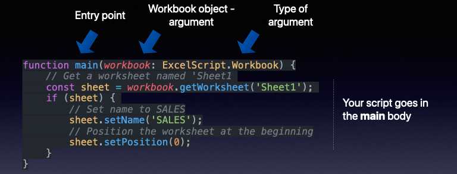
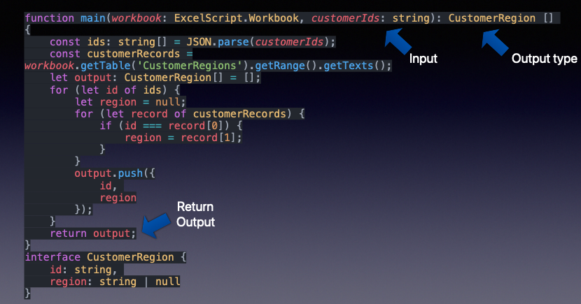
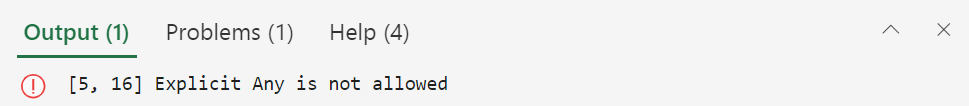
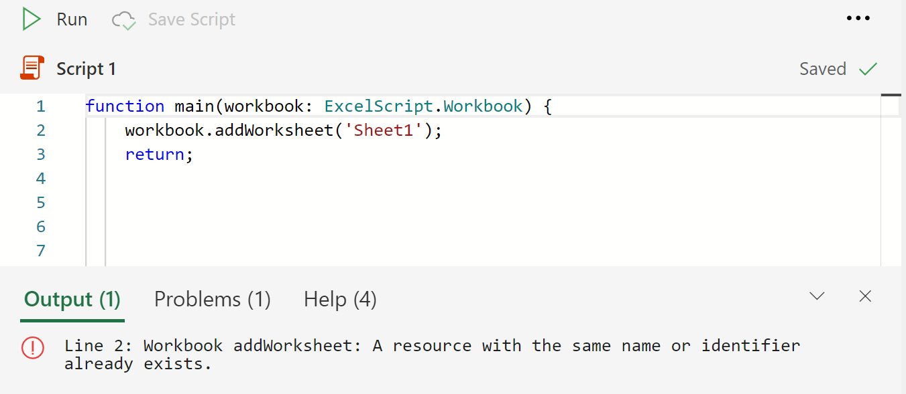

# <a name="getting-started"></a><span data-ttu-id="5fe80-103">Erste Schritte</span><span class="sxs-lookup"><span data-stu-id="5fe80-103">Getting started</span></span>

<span data-ttu-id="5fe80-104">Dieser Abschnitt enthält Details zu den Grundlagen von Office-Skripts, einschließlich Zugriff, Umgebung, Skriptgrundwerte und wenigen grundlegenden Skriptmustern.</span><span class="sxs-lookup"><span data-stu-id="5fe80-104">This section provides details about the basics of Office Scripts including access, environment, script fundamentals, and few basic script patterns.</span></span>

## <a name="environment-setup"></a><span data-ttu-id="5fe80-105">Umgebungseinrichtung</span><span class="sxs-lookup"><span data-stu-id="5fe80-105">Environment setup</span></span>

<span data-ttu-id="5fe80-106">Erfahren Sie mehr über die Grundlagen des Zugriffs, der Umgebung und des Skript-Editors.</span><span class="sxs-lookup"><span data-stu-id="5fe80-106">Learn about the basics of access, environment, and script editor.</span></span>

<span data-ttu-id="5fe80-107">[](https://youtu.be/vvCtxsjPxo8 "Grundlagen der Office Scripts-Anwendung")</span><span class="sxs-lookup"><span data-stu-id="5fe80-107">[](https://youtu.be/vvCtxsjPxo8 "Basics of Office Scripts application")</span></span>

### <a name="access"></a><span data-ttu-id="5fe80-108">Zugriff</span><span class="sxs-lookup"><span data-stu-id="5fe80-108">Access</span></span>

<span data-ttu-id="5fe80-109">Für Office-Skripts sind Administratoreinstellungen erforderlich, die für Microsoft 365-Administrator unter **Einstellungen**  >  **Organisationseinstellungen**  >  **Office-Skripts verfügbar sind.**</span><span class="sxs-lookup"><span data-stu-id="5fe80-109">Office Scripts requires admin settings available for Microsoft 365 administrator under **Settings** > **Org settings** > **Office Scripts**.</span></span> <span data-ttu-id="5fe80-110">Standardmäßig ist es für alle Benutzer aktiviert.</span><span class="sxs-lookup"><span data-stu-id="5fe80-110">By default, it's turned on for all users.</span></span> <span data-ttu-id="5fe80-111">Es gibt zwei Untereinstellungen, die der Administrator ein- und ausschalten kann.</span><span class="sxs-lookup"><span data-stu-id="5fe80-111">There are two sub-settings, which the admin can turn on and off.</span></span>

* <span data-ttu-id="5fe80-112">Möglichkeit zum Freigeben von Skripts innerhalb der Organisation</span><span class="sxs-lookup"><span data-stu-id="5fe80-112">Ability to share scripts within the organization</span></span>
* <span data-ttu-id="5fe80-113">Möglichkeit zur Verwendung von Skripts in Power Automate</span><span class="sxs-lookup"><span data-stu-id="5fe80-113">Ability to use scripts in Power Automate</span></span>

<span data-ttu-id="5fe80-114">Sie können sehen, ob Sie Zugriff auf Office-Skripts haben, indem Sie  eine Datei in Excel im Web (Browser) öffnen und sehen, ob die Registerkarte Automatisieren im Excel-Menüband angezeigt wird oder nicht.</span><span class="sxs-lookup"><span data-stu-id="5fe80-114">You can tell if you have access to Office Scripts by opening a file in Excel on the web (browser) and seeing if the **Automate** tab appears in the Excel ribbon or not.</span></span>
<span data-ttu-id="5fe80-115">Wenn die Registerkarte Automatisieren weiterhin nicht angezeigt **wird,** lesen Sie [diesen Abschnitt zur Problembehandlung](../../testing/troubleshooting.md#automate-tab-not-appearing-or-office-scripts-unavailable).</span><span class="sxs-lookup"><span data-stu-id="5fe80-115">If you still can't see the **Automate** tab, check [this troubleshooting section](../../testing/troubleshooting.md#automate-tab-not-appearing-or-office-scripts-unavailable).</span></span>

### <a name="availability"></a><span data-ttu-id="5fe80-116">Verfügbarkeit</span><span class="sxs-lookup"><span data-stu-id="5fe80-116">Availability</span></span>

<span data-ttu-id="5fe80-117">Office-Skripts sind nur in Excel im Web für Enterprise E3+-Lizenzen verfügbar (Consumer- und E1-Konten werden nicht unterstützt).</span><span class="sxs-lookup"><span data-stu-id="5fe80-117">Office Scripts is available only in the Excel on the web for Enterprise E3+ licenses (Consumer and E1 accounts are not supported).</span></span> <span data-ttu-id="5fe80-118">Office-Skripts werden in Excel unter Windows und Mac noch nicht unterstützt.</span><span class="sxs-lookup"><span data-stu-id="5fe80-118">Office Scripts is not yet supported in Excel on Windows and Mac.</span></span>

### <a name="scripts-and-editor"></a><span data-ttu-id="5fe80-119">Skripts und Editor</span><span class="sxs-lookup"><span data-stu-id="5fe80-119">Scripts and editor</span></span>

<span data-ttu-id="5fe80-120">Der Code-Editor ist direkt in Excel im Web (Onlineversion) integrierte.</span><span class="sxs-lookup"><span data-stu-id="5fe80-120">The code editor is built right into Excel on the web (online version).</span></span> <span data-ttu-id="5fe80-121">Wenn Sie Editoren wie Visual Studio Code oder Sublime verwendet haben, ist diese Bearbeitungserfahrung ziemlich ähnlich.</span><span class="sxs-lookup"><span data-stu-id="5fe80-121">If you have used editors like Visual Studio Code or Sublime, this editing experience will be quite similar.</span></span>
<span data-ttu-id="5fe80-122">Die meisten Tastenkombinationen, die Visual Studio Code-Editor verwenden, arbeiten auch in der Bearbeitungserfahrung von Office-Skripts.</span><span class="sxs-lookup"><span data-stu-id="5fe80-122">Most of the shortcut keys that Visual Studio Code editor uses work in the Office Scripts editing experience as well.</span></span> <span data-ttu-id="5fe80-123">Sehen Sie sich die folgenden Tastenkombinationen an.</span><span class="sxs-lookup"><span data-stu-id="5fe80-123">Check out the following shortcut keys handouts.</span></span>

* [<span data-ttu-id="5fe80-124">macOS</span><span class="sxs-lookup"><span data-stu-id="5fe80-124">macOS</span></span>](https://code.visualstudio.com/shortcuts/keyboard-shortcuts-macos.pdf)
* [<span data-ttu-id="5fe80-125">Windows</span><span class="sxs-lookup"><span data-stu-id="5fe80-125">Windows</span></span>](https://code.visualstudio.com/shortcuts/keyboard-shortcuts-windows.pdf)

#### <a name="key-things-to-note"></a><span data-ttu-id="5fe80-126">Wichtige Dinge, die Sie beachten müssen</span><span class="sxs-lookup"><span data-stu-id="5fe80-126">Key things to note</span></span>

* <span data-ttu-id="5fe80-127">#A0 sind nur für Dateien verfügbar, die auf OneDrive for Business-, #A1 und Teamwebsites gespeichert sind.</span><span class="sxs-lookup"><span data-stu-id="5fe80-127">Office Scripts is only available for files stored in OneDrive for Business, SharePoint sites, and Team sites.</span></span>
* <span data-ttu-id="5fe80-128">Der Editor zeigt die Erweiterung des Skripts nicht an.</span><span class="sxs-lookup"><span data-stu-id="5fe80-128">The editor doesn't show the script's extension.</span></span> <span data-ttu-id="5fe80-129">In Wirklichkeit handelt es sich dabei um TypeScript-Dateien, die jedoch mit einer benutzerdefinierten Erweiterung namens gespeichert `.osts` werden.</span><span class="sxs-lookup"><span data-stu-id="5fe80-129">In reality, these are TypeScript files but they are stored with a custom extension called `.osts`.</span></span>
* <span data-ttu-id="5fe80-130">Die Skripts werden in Ihrem eigenen OneDrive for #A0 `My Files/Documents/OfficeScripts` gespeichert.</span><span class="sxs-lookup"><span data-stu-id="5fe80-130">The scripts are stored in your own OneDrive for Business folder `My Files/Documents/OfficeScripts`.</span></span> <span data-ttu-id="5fe80-131">Sie müssen diesen Ordner nicht verwalten.</span><span class="sxs-lookup"><span data-stu-id="5fe80-131">You won't need to manage this folder.</span></span> <span data-ttu-id="5fe80-132">Sie können diesen Aspekt ignorieren, während der Editor die Anzeige-/Bearbeitungserfahrung verwaltet.</span><span class="sxs-lookup"><span data-stu-id="5fe80-132">For your part, you can ignore this aspect as the editor manages the viewing/editing experience.</span></span>
* <span data-ttu-id="5fe80-133">Skripts werden nicht als Teil von Excel-Dateien gespeichert.</span><span class="sxs-lookup"><span data-stu-id="5fe80-133">Scripts are not stored as part of Excel files.</span></span> <span data-ttu-id="5fe80-134">Sie werden separat gespeichert.</span><span class="sxs-lookup"><span data-stu-id="5fe80-134">They are stored separately.</span></span>
* <span data-ttu-id="5fe80-135">Sie können das Skript für eine Excel-Datei freigeben, was bedeutet, dass Sie das Skript mit der Datei verknüpfen und nicht anfügen.</span><span class="sxs-lookup"><span data-stu-id="5fe80-135">You can share the script with an Excel file which in effect means you are linking the script with the file, not attaching it.</span></span> <span data-ttu-id="5fe80-136">Wer Zugriff auf die Excel-Datei hat, kann auch  eine Kopie des Skripts **anzeigen,** ausführen oder erstellen.</span><span class="sxs-lookup"><span data-stu-id="5fe80-136">Whoever has access to the Excel file will also be able to **view**, **run**, or **make a copy** of the script.</span></span> <span data-ttu-id="5fe80-137">Dies ist ein wichtiger Unterschied im Vergleich zu VBA-Makros.</span><span class="sxs-lookup"><span data-stu-id="5fe80-137">This is a key difference compared to VBA macros.</span></span>
* <span data-ttu-id="5fe80-138">Wenn Sie Ihre Skripts nicht freigeben, kann niemand darauf zugreifen, wie sie sich in Ihrer eigenen Bibliothek befinden.</span><span class="sxs-lookup"><span data-stu-id="5fe80-138">Unless you share your scripts, no one else can access it as it resides in your own library.</span></span>
* <span data-ttu-id="5fe80-139">Skripts können nicht von einem lokalen Datenträger oder benutzerdefinierten Cloudspeicherorten verknüpft werden.</span><span class="sxs-lookup"><span data-stu-id="5fe80-139">Scripts can't be linked from a local disk or custom cloud locations.</span></span> <span data-ttu-id="5fe80-140">Office-Skripts erkennen und ausführen nur ein Skript, das sich am vordefinierten Speicherort (Ihr oben erwähnter #A0) oder freigegebenen Skripts befindet.</span><span class="sxs-lookup"><span data-stu-id="5fe80-140">Office Scripts only recognizes and runs a script that is on predefined location (your OneDrive folder mentioned above) or shared scripts.</span></span>
* <span data-ttu-id="5fe80-141">Während der Bearbeitung werden Dateien vorübergehend im Browser gespeichert, Aber Sie müssen das Skript speichern, bevor Sie das #A0 schließen, um es am #A1 zu speichern.</span><span class="sxs-lookup"><span data-stu-id="5fe80-141">During editing, files are temporarily saved in the browser but you'll have to save the script before closing the Excel window to save it to the OneDrive location.</span></span> <span data-ttu-id="5fe80-142">Vergessen Sie nicht, die Datei nach den Bearbeitungen zu speichern.</span><span class="sxs-lookup"><span data-stu-id="5fe80-142">Don't forget to save the file after edits.</span></span>

## <a name="gentle-introduction-to-scripting"></a><span data-ttu-id="5fe80-143">Behutsame Einführung in skripterstellung</span><span class="sxs-lookup"><span data-stu-id="5fe80-143">Gentle introduction to scripting</span></span>

<span data-ttu-id="5fe80-144">Office-Skripts sind eigenständige Skripts, die in der TypeScript-Sprache geschrieben wurden und Anweisungen zum Ausführen einer Automatisierung für die ausgewählte Excel-Arbeitsmappe enthalten.</span><span class="sxs-lookup"><span data-stu-id="5fe80-144">Office Scripts are standalone scripts written in the TypeScript language that contain instructions to perform some automation against the selected Excel workbook.</span></span> <span data-ttu-id="5fe80-145">Alle Automatisierungsanweisungen sind in einem Skript enthalten, und Skripts können keine anderen Skripts aufrufen oder aufrufen.</span><span class="sxs-lookup"><span data-stu-id="5fe80-145">All automation instructions are self-contained within a script and scripts can't invoke or call other scripts.</span></span> <span data-ttu-id="5fe80-146">Alle Skripts werden in eigenständigen Dateien gespeichert und im #A0 des Benutzers gespeichert.</span><span class="sxs-lookup"><span data-stu-id="5fe80-146">All scripts are stored in standalone files and stored on the user's OneDrive folder.</span></span> <span data-ttu-id="5fe80-147">Sie können ein neues Skript aufzeichnen, ein aufgezeichnetes Skript bearbeiten oder ein ganz neues Skript in einer integrierten Editorschnittstelle von Grund auf neu schreiben.</span><span class="sxs-lookup"><span data-stu-id="5fe80-147">You can record a new script, edit a recorded script, or write a whole new script from scratch, all within a built-in editor interface.</span></span> <span data-ttu-id="5fe80-148">Der beste Teil von Office-Skripts ist, dass sie keine weiteren Setups von Benutzern benötigen.</span><span class="sxs-lookup"><span data-stu-id="5fe80-148">The best part of Office Scripts is that they don't need any further setup from users.</span></span> <span data-ttu-id="5fe80-149">Keine externen Bibliotheken, Webseiten oder Benutzeroberflächenelemente, Setup usw. Alle Umgebungseinstellungen werden von Office-Skripts verarbeitet und ermöglichen einen einfachen und schnellen Zugriff auf automatisierung über eine einfache API-Schnittstelle.</span><span class="sxs-lookup"><span data-stu-id="5fe80-149">No external libraries, web pages, or UI elements, setup, etc. All the environment setup is handled by Office Scripts and it allows easy and fast access to automation through a simple API interface.</span></span>

<span data-ttu-id="5fe80-150">Zu den grundlegenden Konzepten, die hilfreich sind, um das Bearbeiten und Navigieren in Skripts zu verstehen, gehören:</span><span class="sxs-lookup"><span data-stu-id="5fe80-150">Some of the basic concepts helpful to understand how to edit and navigate around scripts include:</span></span>

* <span data-ttu-id="5fe80-151">Grundlegende TypeScript-Sprachsyntax</span><span class="sxs-lookup"><span data-stu-id="5fe80-151">Basic TypeScript language syntax</span></span>
* <span data-ttu-id="5fe80-152">Verstehen von `main` Funktionen und Argumenten</span><span class="sxs-lookup"><span data-stu-id="5fe80-152">Understanding of `main` function and arguments</span></span>
* <span data-ttu-id="5fe80-153">Objekte und Hierarchie, Methoden, Eigenschaften</span><span class="sxs-lookup"><span data-stu-id="5fe80-153">Objects and hierarchy, methods, properties</span></span>
* <span data-ttu-id="5fe80-154">Auflistung (Array): Navigation und Vorgänge</span><span class="sxs-lookup"><span data-stu-id="5fe80-154">Collection (array): navigation and operations</span></span>
* <span data-ttu-id="5fe80-155">Typdefinitionen</span><span class="sxs-lookup"><span data-stu-id="5fe80-155">Type definitions</span></span>
* <span data-ttu-id="5fe80-156">Umgebung: Aufzeichnen/Bearbeiten, Ausführen, Untersuchen von Ergebnissen, Freigeben</span><span class="sxs-lookup"><span data-stu-id="5fe80-156">Environment: record/edit, run, examine results, share</span></span>

<span data-ttu-id="5fe80-157">In diesem Video und Abschnitt werden einige dieser Konzepte ausführlich erläutert.</span><span class="sxs-lookup"><span data-stu-id="5fe80-157">This video and section explain some of these concepts in detail.</span></span>

<span data-ttu-id="5fe80-158">[](https://youtu.be/8Zsrc1uaiiU "Grundlagen von Skripts")</span><span class="sxs-lookup"><span data-stu-id="5fe80-158">[](https://youtu.be/8Zsrc1uaiiU "Basics of Scripts")</span></span>

### <a name="language-typescript"></a><span data-ttu-id="5fe80-159">Sprache: TypeScript</span><span class="sxs-lookup"><span data-stu-id="5fe80-159">Language: TypeScript</span></span>

<span data-ttu-id="5fe80-160">[Office Scripts](../../index.md) wird mit der [TypeScript-Sprache](https://www.typescriptlang.org/)geschrieben, einer Open-Source-Sprache, die auf JavaScript (eine der weltweit am häufigsten verwendeten) basiert, indem statische Typdefinitionen hinzugefügt werden.</span><span class="sxs-lookup"><span data-stu-id="5fe80-160">[Office Scripts](../../index.md) is written using the [TypeScript language](https://www.typescriptlang.org/), which is an open-source language that builds on JavaScript (one of the world's most used) by adding static type definitions.</span></span> <span data-ttu-id="5fe80-161">Wie die Website sagt, bieten Sie eine Möglichkeit, die Form eines Objekts zu beschreiben, eine bessere Dokumentation zur Verfügung zu stellen und TypeScript zu ermöglichen, um zu überprüfen, ob Ihr Code `Types` ordnungsgemäß funktioniert.</span><span class="sxs-lookup"><span data-stu-id="5fe80-161">As the website says, `Types` provide a way to describe the shape of an object, providing better documentation, and allowing TypeScript to validate that your code is working correctly.</span></span>

<span data-ttu-id="5fe80-162">Die Sprachsyntax selbst wird mithilfe von [JavaScript mit](https://developer.mozilla.org/docs/Web/JavaScript) zusätzlichen Eingaben geschrieben, die im Skript mithilfe von TypeScript-Konventionen definiert sind.</span><span class="sxs-lookup"><span data-stu-id="5fe80-162">The language syntax itself is written using [JavaScript](https://developer.mozilla.org/docs/Web/JavaScript) with additional typings defined in the script using TypeScript conventions.</span></span> <span data-ttu-id="5fe80-163">In den meisten Beispielen können Sie sich Office-Skripts so ausdingen, wie sie in JavaScript geschrieben wurden.</span><span class="sxs-lookup"><span data-stu-id="5fe80-163">For the most part, you can think of Office Scripts as written in JavaScript.</span></span> <span data-ttu-id="5fe80-164">Es ist wichtig, dass Sie die Grundlagen der JavaScript-Sprache verstehen, um Ihre Office #A0 zu beginnen. Sie müssen sich jedoch nicht damit ausgnüssen, um Ihren Automatisierungsweg zu beginnen.</span><span class="sxs-lookup"><span data-stu-id="5fe80-164">It is essential that you understand the basics of JavaScript language to begin your Office Scripts journey; though you don't need to be proficient at it to begin your automation journey.</span></span> <span data-ttu-id="5fe80-165">Mit der Aktionsaufzeichnung der Office-Skripts können Sie die Skriptanweisungen verstehen, da Codekommentare enthalten sind und Sie kleine Bearbeitungen verfolgen und ausführen können.</span><span class="sxs-lookup"><span data-stu-id="5fe80-165">With the Office Scripts' action recorder, you can understand the script statements because code comments are included and you can follow along and make small edits.</span></span>

<span data-ttu-id="5fe80-166">Office-Skript-APIs, mit denen das Skript mit Excel interagieren kann, sind für Endbenutzer gedacht, die möglicherweise nicht über einen großen Codierungshintergrund verfügen.</span><span class="sxs-lookup"><span data-stu-id="5fe80-166">Office Scripts APIs, which allow the script to interact with Excel, are designed for end-users who may not have much coding background.</span></span> <span data-ttu-id="5fe80-167">APIs können synchron aufgerufen werden, und Sie benötigen keine erweiterten Themen wie Zusagen oder Rückrufe.</span><span class="sxs-lookup"><span data-stu-id="5fe80-167">APIs can be invoked synchronously and you don't need to know advanced topics such as promises or callbacks.</span></span> <span data-ttu-id="5fe80-168">Das Office Scripts-API-Design bietet:</span><span class="sxs-lookup"><span data-stu-id="5fe80-168">Office Scripts API design provides:</span></span>

* <span data-ttu-id="5fe80-169">Einfaches Objektmodell mit Methoden, Getters/Setters.</span><span class="sxs-lookup"><span data-stu-id="5fe80-169">Simple object model with methods, getters/setters.</span></span>
* <span data-ttu-id="5fe80-170">Leicht zugängliche Objektsammlungen als reguläre Arrays.</span><span class="sxs-lookup"><span data-stu-id="5fe80-170">Easy-to-access object collections as regular arrays.</span></span>
* <span data-ttu-id="5fe80-171">Einfache Fehlerbehandlungsoptionen.</span><span class="sxs-lookup"><span data-stu-id="5fe80-171">Simple error handling options.</span></span>
* <span data-ttu-id="5fe80-172">Optimierte Leistung für ausgewählte Szenarien, die Benutzern dabei helfen, sich auf das szenario zu konzentrieren.</span><span class="sxs-lookup"><span data-stu-id="5fe80-172">Optimized performance for select scenarios helping users to focus on the scenario at hand.</span></span>

### <a name="main-function-the-scripts-starting-point"></a><span data-ttu-id="5fe80-173">`main` Funktion: Ausgangspunkt des Skripts</span><span class="sxs-lookup"><span data-stu-id="5fe80-173">`main` function: The script's starting point</span></span>

<span data-ttu-id="5fe80-174">Die Ausführung von Office Scripts beginnt mit der `main` Funktion.</span><span class="sxs-lookup"><span data-stu-id="5fe80-174">Office Scripts' execution begins at the `main` function.</span></span> <span data-ttu-id="5fe80-175">Ein Skript ist eine einzelne Datei, die eine oder mehrere Funktionen zusammen mit Deklarationen von Typen, Schnittstellen, Variablen usw. enthält. Um dem Skript zu folgen, beginnen Sie mit der Funktion, da Excel beim Ausführen eines Skripts immer zuerst die `main` `main` Funktion aufruft.</span><span class="sxs-lookup"><span data-stu-id="5fe80-175">A script is a single file containing one or many functions along with declarations of types, interfaces, variables, etc. To follow along with the script, begin with the `main` function as Excel always first invokes the `main` function when you execute any script.</span></span> <span data-ttu-id="5fe80-176">Die Funktion hat immer mindestens ein Argument (oder Parameter) namens , bei dem es sich nur um einen Variablennamen handelt, der die aktuelle Arbeitsmappe identifiziert, für die `main` `workbook` das Skript ausgeführt wird.</span><span class="sxs-lookup"><span data-stu-id="5fe80-176">The `main` function will always have at least one argument (or parameter) named `workbook`, which is just a variable name identifying the current workbook against which the script is running.</span></span> <span data-ttu-id="5fe80-177">Sie können zusätzliche Argumente für die Verwendung mit Power Automate (Offline)-Ausführung definieren.</span><span class="sxs-lookup"><span data-stu-id="5fe80-177">You can define additional arguments for usage with Power Automate (offline) execution.</span></span>

* `function main(workbook: ExcelScript.Workbook)`

<span data-ttu-id="5fe80-178">Ein Skript kann in kleinere Funktionen organisiert werden, um code reusability, clarity usw. zu unterstützen. Andere Funktionen können sich innerhalb oder außerhalb der Hauptfunktion, aber immer in derselben Datei enthalten.</span><span class="sxs-lookup"><span data-stu-id="5fe80-178">A script can be organized into smaller functions to aid with code reusability, clarity, etc. Other functions can be inside or outside of the main function but always in the same file.</span></span> <span data-ttu-id="5fe80-179">Ein Skript ist eigenständiges Skript und kann nur funktionen verwenden, die in derselben Datei definiert sind.</span><span class="sxs-lookup"><span data-stu-id="5fe80-179">A script is self-contained and can only use functions defined in the same file.</span></span> <span data-ttu-id="5fe80-180">Skripts können kein anderes Office-Skript aufrufen oder aufrufen.</span><span class="sxs-lookup"><span data-stu-id="5fe80-180">Scripts cannot invoke or call another Office Script.</span></span>

<span data-ttu-id="5fe80-181">Zusammenfassung:</span><span class="sxs-lookup"><span data-stu-id="5fe80-181">So, in summary:</span></span>

* <span data-ttu-id="5fe80-182">Die `main` Funktion ist der Einstiegspunkt für jedes Skript.</span><span class="sxs-lookup"><span data-stu-id="5fe80-182">The `main` function is the entry point for any script.</span></span> <span data-ttu-id="5fe80-183">Wenn die Funktion ausgeführt wird, ruft die Excel-Anwendung diese Hauptfunktion auf, indem die Arbeitsmappe als erster Parameter angegeben wird.</span><span class="sxs-lookup"><span data-stu-id="5fe80-183">When the function is executed, the Excel application invokes this main function by providing the workbook as its first parameter.</span></span>
* <span data-ttu-id="5fe80-184">Es ist wichtig, das erste Argument und seine Typdeklaration so zu behalten, `workbook` wie es angezeigt wird.</span><span class="sxs-lookup"><span data-stu-id="5fe80-184">It's important to keep the first argument `workbook` and its type declaration as it appears.</span></span> <span data-ttu-id="5fe80-185">Sie können der Funktion neue Argumente hinzufügen (siehe den nächsten Abschnitt), aber behalten Sie `main` das erste Argument wie folgt bei.</span><span class="sxs-lookup"><span data-stu-id="5fe80-185">You can add new arguments to the `main` function (see the next section) but do keep the first argument as is.</span></span>



#### <a name="send-or-receive-data-from-other-apps"></a><span data-ttu-id="5fe80-187">Senden oder Empfangen von Daten von anderen Apps</span><span class="sxs-lookup"><span data-stu-id="5fe80-187">Send or receive data from other apps</span></span>

<span data-ttu-id="5fe80-188">Sie können Excel mit anderen Teilen Ihrer Organisation verbinden, indem Sie Skripts in [Power Automate ausführen.](https://flow.microsoft.com)</span><span class="sxs-lookup"><span data-stu-id="5fe80-188">You can connect Excel to other parts of your organization by running scripts in [Power Automate](https://flow.microsoft.com).</span></span> <span data-ttu-id="5fe80-189">Erfahren Sie mehr über [das Ausführen von Office-Skripts in Power Automate-Flüssen.](../../develop/power-automate-integration.md)</span><span class="sxs-lookup"><span data-stu-id="5fe80-189">Learn more about [running Office Scripts in Power Automate flows](../../develop/power-automate-integration.md).</span></span>

<span data-ttu-id="5fe80-190">Die Möglichkeit, Daten von und an Excel zu empfangen oder zu senden, ist über die `main` Funktion.</span><span class="sxs-lookup"><span data-stu-id="5fe80-190">The way to receive or send data from and to Excel is through the `main` function.</span></span> <span data-ttu-id="5fe80-191">Denken Sie daran, dass es das Informationsgateway ist, mit dem eingehende und ausgehende Daten im Skript beschrieben und verwendet werden können.</span><span class="sxs-lookup"><span data-stu-id="5fe80-191">Think of it as the information gateway that allows incoming and outgoing data to be described and used in the script.</span></span> <span data-ttu-id="5fe80-192">Sie können Daten von außerhalb des Skripts mithilfe des Datentyps empfangen und typeScript-erkannte Daten wie , , oder alle Objekte in Form von Schnittstellen zurückgeben, die Sie im Skript `string` `string` `number` `boolean` definieren.</span><span class="sxs-lookup"><span data-stu-id="5fe80-192">You can receive data from outside the script using the `string` data type and return any TypeScript-recognized data such as `string`, `number`, `boolean`, or any objects in the form of interfaces you define in the script.</span></span>



#### <a name="use-functions-to-organize-and-reuse-code"></a><span data-ttu-id="5fe80-194">Verwenden von Funktionen zum Organisieren und Wiederverwenden von Code</span><span class="sxs-lookup"><span data-stu-id="5fe80-194">Use functions to organize and reuse code</span></span>

<span data-ttu-id="5fe80-195">Sie können Funktionen verwenden, um Code innerhalb Ihres Skripts zu organisieren und wiederzuverwenden.</span><span class="sxs-lookup"><span data-stu-id="5fe80-195">You can use functions to organize and reuse code within your script.</span></span>


### <a name="objects-hierarchy-methods-properties-collections"></a><span data-ttu-id="5fe80-197">Objekte, Hierarchie, Methoden, Eigenschaften, Auflistungen</span><span class="sxs-lookup"><span data-stu-id="5fe80-197">Objects, hierarchy, methods, properties, collections</span></span>

<span data-ttu-id="5fe80-198">Das objektmodell von Excel ist in einer hierarchischen Struktur von Objekten definiert, beginnend mit dem Arbeitsmappenobjekt vom Typ `ExcelScript.Workbook` .</span><span class="sxs-lookup"><span data-stu-id="5fe80-198">All of Excel's object model is defined in a hierarchical structure of objects, beginning with the workbook object of type `ExcelScript.Workbook`.</span></span> <span data-ttu-id="5fe80-199">Ein Objekt kann Methoden, Eigenschaften und andere Objekte enthalten.</span><span class="sxs-lookup"><span data-stu-id="5fe80-199">An object can contain methods, properties, and other objects within it.</span></span> <span data-ttu-id="5fe80-200">Objekte werden mithilfe der Methoden miteinander verknüpft.</span><span class="sxs-lookup"><span data-stu-id="5fe80-200">Objects are linked to each other using the methods.</span></span> <span data-ttu-id="5fe80-201">Die Methode eines Objekts kann ein anderes Objekt oder eine Auflistung von Objekten zurückgeben.</span><span class="sxs-lookup"><span data-stu-id="5fe80-201">An object's method can return another object or collection of objects.</span></span> <span data-ttu-id="5fe80-202">Die Verwendung der IntelliSense (Codeabschluss)-Funktion des Code-Editors ist eine hervorragende Möglichkeit, die Objekthierarchie zu erkunden.</span><span class="sxs-lookup"><span data-stu-id="5fe80-202">Using the code editor's IntelliSense (code completion) feature is a great way to explore the object hierarchy.</span></span> <span data-ttu-id="5fe80-203">Sie können auch die offizielle [Referenzdokumentationswebsite verwenden,](/javascript/api/office-scripts/overview) um die Beziehungen zwischen Objekten zu verfolgen.</span><span class="sxs-lookup"><span data-stu-id="5fe80-203">You can also use the [official reference documentation site](/javascript/api/office-scripts/overview) to follow along with the relationships among objects.</span></span>

<span data-ttu-id="5fe80-204">Ein [Objekt](https://developer.mozilla.org/docs/Web/JavaScript/Reference/Global_Objects/Object) ist eine Auflistung von Eigenschaften, und eine Eigenschaft ist eine Zuordnung zwischen einem Namen (oder Schlüssel) und einem Wert.</span><span class="sxs-lookup"><span data-stu-id="5fe80-204">An [object](https://developer.mozilla.org/docs/Web/JavaScript/Reference/Global_Objects/Object) is a collection of properties, and a property is an association between a name (or key) and a value.</span></span> <span data-ttu-id="5fe80-205">Der Wert einer Eigenschaft kann eine Funktion sein, in diesem Fall wird die Eigenschaft als Methode bezeichnet.</span><span class="sxs-lookup"><span data-stu-id="5fe80-205">A property's value can be a function, in which case the property is known as a method.</span></span> <span data-ttu-id="5fe80-206">Im Fall des Office Scripts-Objektmodells stellt ein Objekt eine Sache in der Excel-Datei dar, mit der Benutzer interagieren, z. B. ein Diagramm, ein Hyperlink, eine Pivottabelle usw. Sie kann auch das Verhalten eines Objekts darstellen, z. B. die Schutzattribute eines Arbeitsblatts.</span><span class="sxs-lookup"><span data-stu-id="5fe80-206">In the case of the Office Scripts object model, an object represents a thing in the Excel file that users interact with such as a chart, hyperlink, pivot-table, etc. It can also represent the behavior of an object such as the protection attributes of a worksheet.</span></span>

<span data-ttu-id="5fe80-207">Das Thema typeScript-Objekte und -Eigenschaften im Vergleich zu Methoden ist sehr tief.</span><span class="sxs-lookup"><span data-stu-id="5fe80-207">The topic of TypeScript objects and properties vs methods is quite deep.</span></span> <span data-ttu-id="5fe80-208">Um mit dem Skript zu beginnen und produktiv zu sein, können Sie sich einige grundlegende Dinge merken:</span><span class="sxs-lookup"><span data-stu-id="5fe80-208">In order to get started with the script and be productive, you can remember a few basic things:</span></span>

* <span data-ttu-id="5fe80-209">Auf Objekte und Eigenschaften wird mithilfe `.` der (Punkt-)Notation zugegriffen, mit dem Objekt auf der linken Seite der und der Eigenschaft oder Methode `.` auf der rechten Seite.</span><span class="sxs-lookup"><span data-stu-id="5fe80-209">Both objects and properties are accessed using `.` (dot) notation, with the object on the left side of the `.` and the property or method on the right side.</span></span> <span data-ttu-id="5fe80-210">Beispiele: `hyperlink.address` , `range.getAddress()` .</span><span class="sxs-lookup"><span data-stu-id="5fe80-210">Examples: `hyperlink.address`, `range.getAddress()`.</span></span>
* <span data-ttu-id="5fe80-211">Eigenschaften sind skalar in der Natur (Zeichenfolgen, boolesche Werte, Zahlen).</span><span class="sxs-lookup"><span data-stu-id="5fe80-211">Properties are scalar in nature (strings, booleans, numbers).</span></span> <span data-ttu-id="5fe80-212">Beispielsweise name of a workbook, position of a worksheet, the value of whether the table has a footer or not.</span><span class="sxs-lookup"><span data-stu-id="5fe80-212">For example, name of a workbook, position of a worksheet, the value of whether the table has a footer or not.</span></span>
* <span data-ttu-id="5fe80-213">Methoden werden mithilfe der klammern geöffneten Klammern "aufgerufen" oder "ausgeführt".</span><span class="sxs-lookup"><span data-stu-id="5fe80-213">Methods are 'invoked' or 'executed' using the open-close parentheses.</span></span> <span data-ttu-id="5fe80-214">Beispiel: `table.delete()`.</span><span class="sxs-lookup"><span data-stu-id="5fe80-214">Example: `table.delete()`.</span></span> <span data-ttu-id="5fe80-215">Manchmal wird ein Argument an eine Funktion übergeben, indem sie zwischen offenen Klammern einschleiert wird: `range.setValue('Hello')` .</span><span class="sxs-lookup"><span data-stu-id="5fe80-215">Sometimes an argument is passed to a function by including them between open-close parentheses: `range.setValue('Hello')`.</span></span> <span data-ttu-id="5fe80-216">Sie können viele Argumente an eine Funktion übergeben (wie durch ihren Vertrag/ihre Signatur definiert) und diese mithilfe von `,` trennen.</span><span class="sxs-lookup"><span data-stu-id="5fe80-216">You can pass many arguments to a function (as defined by its contract/signature) and separate them using `,`.</span></span>  <span data-ttu-id="5fe80-217">Zum Beispiel: `worksheet.addTable('A1:D6', true)`.</span><span class="sxs-lookup"><span data-stu-id="5fe80-217">For example: `worksheet.addTable('A1:D6', true)`.</span></span> <span data-ttu-id="5fe80-218">Sie können Argumente eines beliebigen Typs übergeben, wie dies von der Methode erforderlich ist, z. B. Zeichenfolgen, Zahlen, boolesche Objekte oder sogar andere Objekte, z. B. , wobei ein An anderer Stelle im Skript erstelltes Objekt `worksheet.addTable(targetRange, true)` `targetRange` ist.</span><span class="sxs-lookup"><span data-stu-id="5fe80-218">You can pass arguments of any type as required by the method such as strings, number, boolean, or even other objects, for example, `worksheet.addTable(targetRange, true)`, where `targetRange` is an object created elsewhere in the script.</span></span>
* <span data-ttu-id="5fe80-219">Methoden können ein Objekt wie eine skalare Eigenschaft (Name, Adresse usw.) oder ein anderes Objekt (Bereich, Diagramm) oder gar nichts zurückgeben (z. B. bei `delete` Methoden).</span><span class="sxs-lookup"><span data-stu-id="5fe80-219">Methods can return a thing such as a scalar property (name, address, etc.) or another object (range, chart), or not return anything at all (such as the case with `delete` methods).</span></span> <span data-ttu-id="5fe80-220">Sie erhalten, was die Methode zurückgibt, indem Sie eine Variable deklarieren oder einer vorhandenen Variablen zuweisen.</span><span class="sxs-lookup"><span data-stu-id="5fe80-220">You receive what the method returns by declaring a variable or assigning to an existing variable.</span></span> <span data-ttu-id="5fe80-221">Sie können dies auf der linken Seite der Anweisung wie `const table = worksheet.addTable('A1:D6', true)` sehen.</span><span class="sxs-lookup"><span data-stu-id="5fe80-221">You can see that on the left hand side of statement such as `const table = worksheet.addTable('A1:D6', true)`.</span></span>
* <span data-ttu-id="5fe80-222">Das Office Scripts-Objektmodell besteht hauptsächlich aus Objekten mit Methoden, die verschiedene Teile des Excel-Objektmodells verknüpfen.</span><span class="sxs-lookup"><span data-stu-id="5fe80-222">For the most part, the Office Scripts object model consists of objects with methods that link various parts of the Excel object model.</span></span> <span data-ttu-id="5fe80-223">Sehr selten werden Ihnen Eigenschaften mit skalaren oder Objektwerten angezeigt.</span><span class="sxs-lookup"><span data-stu-id="5fe80-223">Very rarely you'll come across properties that are of scalar or object values.</span></span>
* <span data-ttu-id="5fe80-224">In Office Scripts muss eine Excel-Objektmodellmethode offene Klammern enthalten.</span><span class="sxs-lookup"><span data-stu-id="5fe80-224">In Office Scripts, an Excel object model method has to contain open-close parentheses.</span></span> <span data-ttu-id="5fe80-225">Die Verwendung von Methoden ohne diese ist nicht zulässig (z. B. das Zuweisen einer Methode zu einer Variablen).</span><span class="sxs-lookup"><span data-stu-id="5fe80-225">Using methods without them is not allowed (such as assigning a method to a variable).</span></span>

<span data-ttu-id="5fe80-226">Sehen wir uns einige Methoden für das Objekt `workbook` an.</span><span class="sxs-lookup"><span data-stu-id="5fe80-226">Let's look at a few methods on the `workbook` object.</span></span>

```TypeScript
function main(workbook: ExcelScript.Workbook) {
    // Return a boolean (true or false) setting of whether the workbook is set to auto-save or not. 
    const autoSave = workbook.getAutoSave(); 
    // Get workbook name.
    const name = workbook.getName();
    // Get active cell range object.
    const cell = workbook.getActiveCell();
    // Get table named SALES.
    const cell = workbook.getTable('SALES');
    // Get all slicer objects.
    const slicers = workbook.getSlicers();
}
```

<span data-ttu-id="5fe80-227">In diesem Beispiel:</span><span class="sxs-lookup"><span data-stu-id="5fe80-227">In this example:</span></span>

* <span data-ttu-id="5fe80-228">Die Methoden des Objekts, z. B. `workbook` und zurückgeben eine `getAutoSave()` `getName()` skalare Eigenschaft (Zeichenfolge, Zahl, boolescher Wert).</span><span class="sxs-lookup"><span data-stu-id="5fe80-228">The methods of the `workbook` object such as `getAutoSave()` and `getName()` return a scalar property (string, number, boolean).</span></span>
* <span data-ttu-id="5fe80-229">Methoden wie das `getActiveCell()` Zurückgeben eines anderen Objekts.</span><span class="sxs-lookup"><span data-stu-id="5fe80-229">Methods such as `getActiveCell()` return another object.</span></span>
* <span data-ttu-id="5fe80-230">Die Methode akzeptiert ein Argument (in diesem `getTable()` Fall Tabellenname) und gibt eine bestimmte Tabelle in der Arbeitsmappe zurück.</span><span class="sxs-lookup"><span data-stu-id="5fe80-230">The `getTable()` method accepts an argument (table name in this case) and returns a specific table in the workbook.</span></span>
* <span data-ttu-id="5fe80-231">Die Methode gibt ein Array (an vielen Stellen als Auflistung bezeichnet) aller `getSlicers()` Datenschnittobjekte in der Arbeitsmappe zurück.</span><span class="sxs-lookup"><span data-stu-id="5fe80-231">The `getSlicers()` method returns an array (referred to in many places as a collection) of all slicer objects within the workbook.</span></span>

<span data-ttu-id="5fe80-232">Sie werden feststellen, dass alle diese Methoden ein Präfix haben, was nur eine Konvention ist, die im Office Scripts-Objektmodell verwendet wird, um zu vermitteln, dass die `get` Methode etwas zurück gibt.</span><span class="sxs-lookup"><span data-stu-id="5fe80-232">You'll notice that all of these methods have a `get` prefix, which is just a convention used in the Office Scripts object model to convey that the method is returning something.</span></span> <span data-ttu-id="5fe80-233">Sie werden auch häufig als "Getter" bezeichnet.</span><span class="sxs-lookup"><span data-stu-id="5fe80-233">They are also commonly referred to as 'getters'.</span></span>

<span data-ttu-id="5fe80-234">Es gibt zwei weitere Methodentypen, die wir nun im nächsten Beispiel sehen werden:</span><span class="sxs-lookup"><span data-stu-id="5fe80-234">There are two other types of methods that we'll now see in the next example:</span></span>

```TypeScript
function main(workbook: ExcelScript.Workbook) {
    // Get a worksheet named 'Sheet1.
    const sheet = workbook.getWorksheet('Sheet1'); 
    // Set name to SALES.
    sheet.setName('SALES');
    // Position the worksheet at the beginning.
    sheet.setPosition(0);
}
```

<span data-ttu-id="5fe80-235">In diesem Beispiel:</span><span class="sxs-lookup"><span data-stu-id="5fe80-235">In this example:</span></span>

* <span data-ttu-id="5fe80-236">Die `setName()` Methode legt einen neuen Namen für das Arbeitsblatt fest.</span><span class="sxs-lookup"><span data-stu-id="5fe80-236">The `setName()` method sets a new name to the worksheet.</span></span> <span data-ttu-id="5fe80-237">`setPosition()` legt die Position auf die erste Zelle fest.</span><span class="sxs-lookup"><span data-stu-id="5fe80-237">`setPosition()` sets the position to the first cell.</span></span>
* <span data-ttu-id="5fe80-238">Diese Methoden ändern die Excel-Datei, indem sie eine Eigenschaft oder ein Verhalten der Arbeitsmappe festlegen.</span><span class="sxs-lookup"><span data-stu-id="5fe80-238">Such methods modify the Excel file by setting a property or behavior of the workbook.</span></span> <span data-ttu-id="5fe80-239">Diese Methoden werden als "Setter" bezeichnet.</span><span class="sxs-lookup"><span data-stu-id="5fe80-239">These methods are called 'setters'.</span></span>
* <span data-ttu-id="5fe80-240">In der Regel verfügen "Setter" beispielsweise über einen Begleiter "Getter", und , beide `worksheet.getPosition` `worksheet.setPosition` sind Methoden.</span><span class="sxs-lookup"><span data-stu-id="5fe80-240">Typically 'setters' have a companion 'getter', for example, `worksheet.getPosition` and `worksheet.setPosition`, both of which are methods.</span></span>

#### <a name="undefined-and-null-primitive-types"></a><span data-ttu-id="5fe80-241">`undefined` und `null` primitive Typen</span><span class="sxs-lookup"><span data-stu-id="5fe80-241">`undefined` and `null` primitive types</span></span>

<span data-ttu-id="5fe80-242">Es folgen zwei primitive Datentypen, die Sie beachten müssen:</span><span class="sxs-lookup"><span data-stu-id="5fe80-242">The following are two primitive data types that you must be aware of:</span></span>

1. <span data-ttu-id="5fe80-243">Der Wert [`null`](https://developer.mozilla.org/docs/Web/JavaScript/Reference/Global_Objects/null) stellt die beabsichtigte Abwesenheit eines beliebigen Objektwerts dar.</span><span class="sxs-lookup"><span data-stu-id="5fe80-243">The value [`null`](https://developer.mozilla.org/docs/Web/JavaScript/Reference/Global_Objects/null) represents the intentional absence of any object value.</span></span> <span data-ttu-id="5fe80-244">Es ist einer der Grundwerte von JavaScript und wird verwendet, um anzugeben, dass eine Variable keinen Wert hat.</span><span class="sxs-lookup"><span data-stu-id="5fe80-244">It is one of JavaScript's primitive values and is used to indicate that a variable has no value.</span></span>
1. <span data-ttu-id="5fe80-245">Eine Variable, der kein Wert zugewiesen wurde, hat den Typ [`undefined`](https://developer.mozilla.org/docs/Web/JavaScript/Reference/Global_Objects/undefined) .</span><span class="sxs-lookup"><span data-stu-id="5fe80-245">A variable that has not been assigned a value is of type [`undefined`](https://developer.mozilla.org/docs/Web/JavaScript/Reference/Global_Objects/undefined).</span></span> <span data-ttu-id="5fe80-246">Eine Methode oder Anweisung kann auch zurückgeben, wenn die zu bewertende Variable keinen `undefined` zugewiesenen Wert hat.</span><span class="sxs-lookup"><span data-stu-id="5fe80-246">A method or statement can also return `undefined` if the variable that's being evaluated doesn't have an assigned value.</span></span>

<span data-ttu-id="5fe80-247">Diese beiden Typen werden im Rahmen der Fehlerbehandlung angezeigt und können bei nicht ordnungsgemäßer Behandlung einiges an Kopfzerbrechen verursachen.</span><span class="sxs-lookup"><span data-stu-id="5fe80-247">These two types crop up as part of error handling and can cause quite a bit of headache if not handled properly.</span></span> <span data-ttu-id="5fe80-248">Glücklicherweise bietet TypeScript/JavaScript eine Möglichkeit, zu überprüfen, ob eine Variable vom Typ oder `undefined` `null` ist.</span><span class="sxs-lookup"><span data-stu-id="5fe80-248">Fortunately, TypeScript/JavaScript offers a way to check if a variable is of type `undefined` or `null`.</span></span> <span data-ttu-id="5fe80-249">Wir werden über einige dieser Prüfungen in späteren Abschnitten sprechen, einschließlich der Fehlerbehandlung.</span><span class="sxs-lookup"><span data-stu-id="5fe80-249">We will talk about some of those checks in later sections, including error handling.</span></span>

#### <a name="method-chaining"></a><span data-ttu-id="5fe80-250">Methodenkette</span><span class="sxs-lookup"><span data-stu-id="5fe80-250">Method chaining</span></span>

<span data-ttu-id="5fe80-251">Sie können dot notation verwenden, um Objekte zu verbinden, die von einer Methode zurückgegeben werden, um den Code zu kürzen.</span><span class="sxs-lookup"><span data-stu-id="5fe80-251">You can use dot notation to connect objects being returned from a method to shorten your code.</span></span> <span data-ttu-id="5fe80-252">Manchmal erleichtert diese Technik das Lesen und Verwalten des Codes.</span><span class="sxs-lookup"><span data-stu-id="5fe80-252">Sometimes this technique makes the code easy to read and manage.</span></span> <span data-ttu-id="5fe80-253">Es gibt jedoch nur wenige Dinge, die Sie beachten sollten.</span><span class="sxs-lookup"><span data-stu-id="5fe80-253">However, there are few things to be aware of.</span></span> <span data-ttu-id="5fe80-254">Sehen wir uns die folgenden Beispiele an.</span><span class="sxs-lookup"><span data-stu-id="5fe80-254">Let's look at the following examples.</span></span>

<span data-ttu-id="5fe80-255">Der folgende Code ruft die aktive Zelle und die nächste Zelle ab und legt dann den Wert fest.</span><span class="sxs-lookup"><span data-stu-id="5fe80-255">The following code gets the active cell and the next cell, then sets the value.</span></span> <span data-ttu-id="5fe80-256">Dies ist ein guter Kandidat für die Verwendung der Verkettung, da dieser Code immer erfolgreich ist.</span><span class="sxs-lookup"><span data-stu-id="5fe80-256">This is a good candidate to use chaining as this code will succeed all the time.</span></span>

```TypeScript
function main(workbook: ExcelScript.Workbook) {
    workbook.getActiveCell().getOffsetRange(0,1).setValue('Next cell');
}
```

<span data-ttu-id="5fe80-257">Allerdings hat der folgende Code (der eine Tabelle mit dem Namen **SALES** erhält und die spaltenformatierte Spalte aktiviert) ein Problem.</span><span class="sxs-lookup"><span data-stu-id="5fe80-257">However, the following code (which gets a table named **SALES** and turns on its banded column style) has an issue.</span></span>

```TypeScript
function main(workbook: ExcelScript.Workbook) {
  workbook.getTable('SALES').setShowBandedColumns(true);
}
```

<span data-ttu-id="5fe80-258">Was passiert, wenn die **TABELLE SALES** nicht vorhanden ist?</span><span class="sxs-lookup"><span data-stu-id="5fe80-258">What if the **SALES** table doesn't exist?</span></span> <span data-ttu-id="5fe80-259">Das Skript tritt mit einem Fehler (siehe weiter) auf, da es `getTable('SALES')` zurückgibt (ein JavaScript-Typ, der angibt, dass keine Tabelle wie `undefined` **SALES vorkommt).**</span><span class="sxs-lookup"><span data-stu-id="5fe80-259">The script will fail with an error (shown next) because `getTable('SALES')` returns `undefined` (which is a JavaScript type indicating that there is no table such as **SALES**).</span></span> <span data-ttu-id="5fe80-260">Das Aufrufen der Methode auf ist nicht sinnvoll, d. h. , und daher endet das `setShowBandedColumns` `undefined` Skript in einem `undefined.setShowBandedColumns(true)` Fehler.</span><span class="sxs-lookup"><span data-stu-id="5fe80-260">Calling the `setShowBandedColumns` method on `undefined` makes no sense, that is, `undefined.setShowBandedColumns(true)`, and hence the script ends in an error.</span></span>

```text
Line 2: Cannot read property 'setShowBandedColumns' of undefined
```

<span data-ttu-id="5fe80-261">Sie können [](https://developer.mozilla.org/docs/Web/JavaScript/Reference/Operators/Optional_chaining) den optionalen Verkettungsoperator verwenden, der eine Möglichkeit bietet, den Zugriff auf Werte über verbundene Objekte zu vereinfachen, wenn es möglich ist, dass ein Verweis oder eine Methode vorhanden ist oder (dies ist `undefined` javaScripts Möglichkeit, ein nicht zugewiesenes oder nicht vorhandenes Objekt oder Ergebnis anzuzeigen), um diese Bedingung zu `null` verarbeiten.</span><span class="sxs-lookup"><span data-stu-id="5fe80-261">You could use the [optional chaining operator](https://developer.mozilla.org/docs/Web/JavaScript/Reference/Operators/Optional_chaining) that provides a way to simplify accessing values through connected objects when it's possible that a reference or method may be `undefined` or `null` (which is JavaScript's way of indicating an unassigned or nonexistent object or result) to handle this condition.</span></span>

```TypeScript
function main(workbook: ExcelScript.Workbook) {
    // This line will not fail as the setShowBandedColumns method is executed only if the SALES table is present.
    workbook.getTable('SALES')?.setShowBandedColumns(true); 
}
```

<span data-ttu-id="5fe80-262">Wenn Sie nicht vorhandene Objektbedingungen behandeln oder einen Typ behandeln möchten, der von einer Methode zurückgegeben wird, ist es besser, den Rückgabewert aus der Methode zuzuordnen und dies `undefined` separat zu behandeln.</span><span class="sxs-lookup"><span data-stu-id="5fe80-262">If you wish to handle nonexistent object conditions or `undefined` type being returned by a method, then it is better to assign the return value from the method and handle that separately.</span></span>

```TypeScript
function main(workbook: ExcelScript.Workbook) {
    const salesTable = workbook.getTable('SALES');
    if (salesTable) {
        salesTable.setShowBandedColumns(true);
    } else { 
        // Handle this condition.
    }
}
```

#### <a name="get-object-reference"></a><span data-ttu-id="5fe80-263">Objektreferenz get</span><span class="sxs-lookup"><span data-stu-id="5fe80-263">Get object reference</span></span>

<span data-ttu-id="5fe80-264">Das `workbook` Objekt wird Ihnen in der Funktion `main` gegeben.</span><span class="sxs-lookup"><span data-stu-id="5fe80-264">The `workbook` object is given to you in the `main` function.</span></span> <span data-ttu-id="5fe80-265">Sie können damit beginnen, das Objekt `workbook` zu verwenden und direkt auf seine Methoden zu zugreifen.</span><span class="sxs-lookup"><span data-stu-id="5fe80-265">You can begin to use the `workbook` object and access its methods directly.</span></span>

```TypeScript
function main(workbook: ExcelScript.Workbook) {
    // Get workbook name.
    const name = workbook.getName();
    // Display name to console.
    console.log(name);
}
```

<span data-ttu-id="5fe80-266">Beginnen Sie für die Verwendung aller anderen Objekte in der Arbeitsmappe mit dem Objekt, und fahren Sie die Hierarchie nach unten, bis Sie zu dem gesuchten `workbook` Objekt kommen.</span><span class="sxs-lookup"><span data-stu-id="5fe80-266">For using all other objects within the workbook, begin with `workbook` object and go down the hierarchy until you get to the object you are looking for.</span></span> <span data-ttu-id="5fe80-267">Sie können den Objektverweis abrufen, indem Sie das Objekt mithilfe seiner Methode abrufen oder die Auflistung von Objekten wie `get` unten gezeigt abrufen:</span><span class="sxs-lookup"><span data-stu-id="5fe80-267">You can get the object reference by fetching the object using its `get` method or by retrieving the collection of objects as shown below:</span></span>

```TypeScript
function main(workbook: ExcelScript.Workbook) {
    // Get the active worksheet.
    const sheet = workbook.getActiveWorksheet();
    // Fetch using an ID or key.
    const sheet = workbook.getWorksheet('SomeSheetName');
    // Invoke methods on the object.
    sheet.setPosition(0); 
    
    // Get collection of methods.
    const tables = sheet.getTables();
    console.log('Total tables in this sheet: ' + tables.length);
}
```

#### <a name="check-if-an-object-exists-then-delete-and-add"></a><span data-ttu-id="5fe80-268">Überprüfen, ob ein Objekt vorhanden ist, löschen und hinzufügen</span><span class="sxs-lookup"><span data-stu-id="5fe80-268">Check if an object exists, then delete, and add</span></span>

<span data-ttu-id="5fe80-269">Zum Erstellen eines Objekts, z. B. mit einem vordefinierten Namen, ist es immer besser, ein ähnliches Objekt zu entfernen, das möglicherweise vorhanden ist, und es dann hinzuzufügen.</span><span class="sxs-lookup"><span data-stu-id="5fe80-269">For creating an object, say with a predefined name, it is always better to remove a similar object that may exist and then add it.</span></span> <span data-ttu-id="5fe80-270">Sie können dies mithilfe des folgenden Musters tun.</span><span class="sxs-lookup"><span data-stu-id="5fe80-270">You can do that using the following pattern.</span></span>

```TypeScript
function main(workbook: ExcelScript.Workbook) {
  // Name of the worksheet to be added. 
  let name = "Index";
  // Check if the worksheet already exists. If not, add the worksheet.
  let sheet = workbook.getWorksheet('Index');
  if (sheet) {
    console.log(`Worksheet by the name ${name} already exists. Deleting it.`);
    // Call the delete method on the object to remove it. 
    sheet.delete();
  } 
    // Add a blank worksheet. 
  console.log(`Adding the worksheet named  ${name}.`)
  const indexSheet = workbook.addWorksheet("Index");
}

```

<span data-ttu-id="5fe80-271">Verwenden Sie alternativ zum Löschen eines Objekts, das möglicherweise vorhanden ist oder nicht, das folgende Muster.</span><span class="sxs-lookup"><span data-stu-id="5fe80-271">Alternatively, for deleting an object that may or may not exist, use the following pattern.</span></span>

```TypeScript
    // The ? preceding delete() will ensure that the API is only invoked if the object exists. 
    workbook.getWorksheet('Index')?.delete(); 
```

#### <a name="note-about-adding-an-object"></a><span data-ttu-id="5fe80-272">Hinweis zum Hinzufügen eines Objekts</span><span class="sxs-lookup"><span data-stu-id="5fe80-272">Note about adding an object</span></span>

<span data-ttu-id="5fe80-273">Verwenden Sie zum Erstellen, Einfügen oder Hinzufügen eines Objekts wie datenschnitt, Pivottabelle, Arbeitsblatt usw. die **entsprechende add_Object_** Methode.</span><span class="sxs-lookup"><span data-stu-id="5fe80-273">To create, insert, or add an object such as a slicer, pivot table, worksheet, etc., use the corresponding **add_Object_** method.</span></span> <span data-ttu-id="5fe80-274">Eine solche Methode ist für das übergeordnete Objekt verfügbar.</span><span class="sxs-lookup"><span data-stu-id="5fe80-274">Such a method is available on its parent object.</span></span> <span data-ttu-id="5fe80-275">Die Methode ist `addChart()` beispielsweise für das Objekt `worksheet` verfügbar.</span><span class="sxs-lookup"><span data-stu-id="5fe80-275">For example, the `addChart()` method is available on `worksheet` object.</span></span> <span data-ttu-id="5fe80-276">Die **add_Object_** -Methode gibt das objekt zurück, das sie erstellt.</span><span class="sxs-lookup"><span data-stu-id="5fe80-276">The **add_Object_** method returns the object it creates.</span></span> <span data-ttu-id="5fe80-277">Empfangen Sie den zurückgegebenen Wert, und verwenden Sie ihn später in Ihrem Skript.</span><span class="sxs-lookup"><span data-stu-id="5fe80-277">Receive the returned value and use it later in your script.</span></span>

```TypeScript
function main(workbook: ExcelScript.Workbook) {
  // Add object and get a reference to it. 
  const indexSheet = workbook.addWorksheet("Index");
  // Use it elsewhere in the script 
  console.log(indexSheet.getPosition());
}

```

<span data-ttu-id="5fe80-278">Verwenden Sie alternativ zum Löschen eines Objekts, das möglicherweise vorhanden ist, dieses Muster:</span><span class="sxs-lookup"><span data-stu-id="5fe80-278">Alternatively, for deleting an object that may or may not exist, use this pattern:</span></span>

```TypeScript
    workbook.getWorksheet('Index')?.delete(); // The ? preceding delete() will ensure that the API is only invoked if the object exists. 
```

#### <a name="collections"></a><span data-ttu-id="5fe80-279">Auflistungen</span><span class="sxs-lookup"><span data-stu-id="5fe80-279">Collections</span></span>

<span data-ttu-id="5fe80-280">Auflistungen sind Objekte wie Tabellen, Diagramme, Spalten usw., die als Array abgerufen und zur Verarbeitung iteriert werden können.</span><span class="sxs-lookup"><span data-stu-id="5fe80-280">Collections are objects such as tables, charts, columns, etc. that can be retrieved as an array and iterated over for processing.</span></span> <span data-ttu-id="5fe80-281">Sie können eine Auflistung mithilfe der entsprechenden Methode abrufen und die Daten in einer Schleife mithilfe einer von vielen `get` TypScript-Array-Traversaltechniken verarbeiten, z. B.:</span><span class="sxs-lookup"><span data-stu-id="5fe80-281">You can retrieve a collection using the corresponding `get` method and process the data in a loop using one of many TypeScript array traversal techniques such as:</span></span>

* [<span data-ttu-id="5fe80-282">`for` oder `while`</span><span class="sxs-lookup"><span data-stu-id="5fe80-282">`for` or `while`</span></span>](https://developer.mozilla.org/docs/Web/JavaScript/Guide/Loops_and_iteration)
* [`for..of`](https://developer.mozilla.org/docs/Web/JavaScript/Reference/Statements/for...of)
* [`forEach`](https://developer.mozilla.org/docs/Web/JavaScript/Reference/Global_Objects/Array/forEach)

* [<span data-ttu-id="5fe80-283">Sprachgrundkenntnisse von Arrays</span><span class="sxs-lookup"><span data-stu-id="5fe80-283">Language basics of arrays</span></span>](https://developer.mozilla.org//docs/Learn/JavaScript/First_steps/Arrays)

<span data-ttu-id="5fe80-284">Dieses Skript veranschaulicht die Verwendung von Sammlungen, die in Office Scripts-APIs unterstützt werden.</span><span class="sxs-lookup"><span data-stu-id="5fe80-284">This script demonstrates how to use collections supported in Office Scripts APIs.</span></span> <span data-ttu-id="5fe80-285">Sie farben jede Arbeitsblattregisterkarte in der Datei mit einer zufälligen Farbe.</span><span class="sxs-lookup"><span data-stu-id="5fe80-285">It colors each worksheet tab in the file with a random color.</span></span>

```TypeScript
function main(workbook: ExcelScript.Workbook) {

  // Get all sheets as a collection.
  const sheets = workbook.getWorksheets();
  const names = sheets.map ((sheet) => sheet.getName());
  console.log(names);
  console.log(`Total worksheets inside of this workbook: ${sheets.length}`);
  // Get information from specific sheets within the collection.
  console.log(`First sheet name is: ${names[0]}`);
  if (sheets.length > 1) {
    console.log(`Last sheet's Id is: ${sheets[sheets.length -1].getId()}`);
  }
  // Color each worksheet with random color.
  for (const sheet of sheets) {
    sheet.setTabColor(`#${Math.random().toString(16).substr(-6)}`);
  }
}
```

## <a name="type-declarations"></a><span data-ttu-id="5fe80-286">Typdeklarationen</span><span class="sxs-lookup"><span data-stu-id="5fe80-286">Type declarations</span></span>

<span data-ttu-id="5fe80-287">Typdeklarationen helfen Benutzern, den Typ der Variablen zu verstehen, mit der sie es zu tun haben.</span><span class="sxs-lookup"><span data-stu-id="5fe80-287">Type declarations help users understand the type of variable they are dealing with.</span></span> <span data-ttu-id="5fe80-288">Es hilft bei der automatischen Fertigstellung von Methoden und hilft bei der Überprüfung der Entwicklungszeitqualität.</span><span class="sxs-lookup"><span data-stu-id="5fe80-288">It helps with auto-completion of methods and assists in development time quality checks.</span></span>

<span data-ttu-id="5fe80-289">Typdeklarationen im Skript finden Sie an verschiedenen Stellen, z. B. funktionsdeklaration, variable Deklaration, IntelliSense Definitionen usw.</span><span class="sxs-lookup"><span data-stu-id="5fe80-289">You can find type declarations in the script in various places including function declaration, variable declaration, IntelliSense definitions, etc.</span></span>

<span data-ttu-id="5fe80-290">Beispiele:</span><span class="sxs-lookup"><span data-stu-id="5fe80-290">Examples:</span></span>

* `function main(workbook: ExcelScript.Workbook)`
* `let myRange: ExcelScript.Range;`
* `function getMaxAmount(range: ExcelScript.Range): number`

<span data-ttu-id="5fe80-291">Sie können die Typen einfach im Code-Editor identifizieren, da sie in der Regel in einer anderen Farbe deutlich angezeigt werden.</span><span class="sxs-lookup"><span data-stu-id="5fe80-291">You can identify the types easily in the code editor as it usually appears distinctly in a different color.</span></span> <span data-ttu-id="5fe80-292">Ein Doppelpunkt `:` steht in der Regel vor der Typdeklaration.</span><span class="sxs-lookup"><span data-stu-id="5fe80-292">A colon `:` usually precedes the type declaration.</span></span>  

<span data-ttu-id="5fe80-293">Schreibtypen können in TypeScript optional sein, da der Typinferenz ihnen viel Leistung ermöglicht, ohne zusätzlichen Code zu schreiben.</span><span class="sxs-lookup"><span data-stu-id="5fe80-293">Writing types can be optional in TypeScript because type inference allows you to get a lot of power without writing additional code.</span></span> <span data-ttu-id="5fe80-294">Die TypeScript-Sprache kann die Variablentypen meist gut abhingen.</span><span class="sxs-lookup"><span data-stu-id="5fe80-294">For the most part, the TypeScript language is good at inferring the types of variables.</span></span> <span data-ttu-id="5fe80-295">In bestimmten Fällen erfordern Office-Skripts jedoch, dass die Typdeklarationen explizit definiert werden, wenn die Sprache den Typ nicht eindeutig identifizieren kann.</span><span class="sxs-lookup"><span data-stu-id="5fe80-295">However, in certain cases, Office Scripts require the type declarations to be explicitly defined if the language is unable to clearly identify the type.</span></span> <span data-ttu-id="5fe80-296">Außerdem ist explizit oder implizit `any` in Office Script nicht zulässig.</span><span class="sxs-lookup"><span data-stu-id="5fe80-296">Also, explicit or implicit `any` is not allowed in Office Script.</span></span> <span data-ttu-id="5fe80-297">Weitere Informationen dazu später.</span><span class="sxs-lookup"><span data-stu-id="5fe80-297">More on that later.</span></span>

### <a name="excelscript-types"></a><span data-ttu-id="5fe80-298">`ExcelScript` types</span><span class="sxs-lookup"><span data-stu-id="5fe80-298">`ExcelScript` types</span></span>

<span data-ttu-id="5fe80-299">In Office Scripts verwenden Sie die folgenden Typen.</span><span class="sxs-lookup"><span data-stu-id="5fe80-299">In Office Scripts, you will use the following kinds of types.</span></span>

* <span data-ttu-id="5fe80-300">Systemeigene Sprachtypen wie `number` , , , , , `string` `object` `boolean` `null` usw.</span><span class="sxs-lookup"><span data-stu-id="5fe80-300">Native language types such as `number`, `string`, `object`, `boolean`, `null`, etc.</span></span>
* <span data-ttu-id="5fe80-301">Excel-API-Typen.</span><span class="sxs-lookup"><span data-stu-id="5fe80-301">Excel API types.</span></span> <span data-ttu-id="5fe80-302">Sie beginnen mit `ExcelScript` .</span><span class="sxs-lookup"><span data-stu-id="5fe80-302">They begin with `ExcelScript`.</span></span> <span data-ttu-id="5fe80-303">Beispiel: `ExcelScript.Range` , `ExcelScript.Table` , usw.</span><span class="sxs-lookup"><span data-stu-id="5fe80-303">For example, `ExcelScript.Range`, `ExcelScript.Table`, etc.</span></span>
* <span data-ttu-id="5fe80-304">Alle benutzerdefinierten Schnittstellen, die Sie im Skript mithilfe von Anweisungen definiert `interface` haben.</span><span class="sxs-lookup"><span data-stu-id="5fe80-304">Any custom interfaces you may have defined in the script using `interface` statements.</span></span>

<span data-ttu-id="5fe80-305">Weitere Informationen finden Sie unter Beispiele für jede dieser Gruppen.</span><span class="sxs-lookup"><span data-stu-id="5fe80-305">See examples of each of these groups next.</span></span>

<span data-ttu-id="5fe80-306">**_Systemeigene Sprachtypen_**</span><span class="sxs-lookup"><span data-stu-id="5fe80-306">**_Native language types_**</span></span>

<span data-ttu-id="5fe80-307">Beachten Sie im folgenden Beispiel Stellen, an denen `string` `number` , und verwendet `boolean` wurden.</span><span class="sxs-lookup"><span data-stu-id="5fe80-307">In the following example, notice places where `string`, `number`, and `boolean` have been used.</span></span> <span data-ttu-id="5fe80-308">Dies  sind systemeigene TypeScript-Sprachtypen.</span><span class="sxs-lookup"><span data-stu-id="5fe80-308">These are native **TypeScript** language types.</span></span>

```TypeScript
function main(workbook: ExcelScript.Workbook)
{
  const table = workbook.getActiveWorksheet().getTables()[0];
  const sales = table.getColumnByName('Sales').getRange().getValues();
  console.log(sales);
  // Add 100 to each value.
  const revisedSales = salesAs1DArray.map(data => data as number + 100);
  // Add a column.
  table.addColumn(-1, revisedSales);  
}
/**
 * Extract a column from 2D array and return result.
 */
function extractColumn(data: (string | number | boolean)[][], index: number): (string | number | boolean)[] {

  const column = data.map((row) => {
    return row[index];
  })
  return column;
}
/**
 * Convert a flat array into a 2D array that can be used as range column.
 */
function convertColumnTo2D(data: (string | number | boolean)[]): (string | number | boolean)[][] {

  const columnAs2D = data.map((row) => {
    return [row];
  })
  return columnAs2D;
}
```

<span data-ttu-id="5fe80-309">**_ExcelScript-Typen_**</span><span class="sxs-lookup"><span data-stu-id="5fe80-309">**_ExcelScript types_**</span></span>

<span data-ttu-id="5fe80-310">Im folgenden Beispiel verwendet eine Hilfsfunktion zwei Argumente.</span><span class="sxs-lookup"><span data-stu-id="5fe80-310">In the following example, a helper function takes two arguments.</span></span> <span data-ttu-id="5fe80-311">Die erste ist die `sheet` Variable vom `ExcelScript.Worksheet` Typ.</span><span class="sxs-lookup"><span data-stu-id="5fe80-311">The first one is the `sheet` variable which is of type `ExcelScript.Worksheet` type.</span></span>

```TypeScript
function main(workbook: ExcelScript.Workbook) {
    const sheet = workbook.getWorksheet('Sheet5');
    const data = ['2016', 'Bikes', 'Seats', '1500', .05];
    addRow(sheet, data);
    return;
}

function addRow(sheet: ExcelScript.Worksheet, data: (string | number | boolean)[]): void {

    const usedRange = sheet.getUsedRange();
    let startCell: ExcelScript.Range;
    // If the sheet is empty, then use A1 as starting cell for update.
    if (usedRange) { 
      startCell = usedRange.getLastRow().getCell(0, 0).getOffsetRange(1, 0);
    } else {
      startCell = sheet.getRange('A1');
    }
    console.log(startCell.getAddress());
    const targetRange = startCell.getResizedRange(0, data.length - 1);      
    targetRange.setValues([data]);
    return;
}
```

<span data-ttu-id="5fe80-312">**_Benutzerdefinierte Typen_**</span><span class="sxs-lookup"><span data-stu-id="5fe80-312">**_Custom types_**</span></span>

<span data-ttu-id="5fe80-313">Die benutzerdefinierte `ReportImages` Schnittstelle wird verwendet, um Bilder an eine andere Flussaktion zurückzukehren.</span><span class="sxs-lookup"><span data-stu-id="5fe80-313">The custom interface `ReportImages` is used to return images to another flow action.</span></span> <span data-ttu-id="5fe80-314">Die `main` Funktionsdeklaration enthält eine Anweisung, um TypeScript zu informieren, dass ein Objekt dieses `: ReportImages` Typs zurückgegeben wird.</span><span class="sxs-lookup"><span data-stu-id="5fe80-314">The `main` function declaration includes `: ReportImages` instruction to tell TypeScript that an object of that type is being returned.</span></span>

```TypeScript
function main(workbook: ExcelScript.Workbook): ReportImages {
  let chart = workbook.getWorksheet("Sheet1").getCharts()[0];
  const table = workbook.getWorksheet('InvoiceAmounts').getTables()[0];
  
  const chartImage = chart.getImage();
  const tableImage = table.getRange().getImage();
  return {
    chartImage,
    tableImage
  }
}

interface ReportImages {
  chartImage: string
  tableImage: string
}
```

### <a name="type-assertion-overriding-the-type"></a><span data-ttu-id="5fe80-315">Typbehauptung (Außerkraftsetzen des Typs)</span><span class="sxs-lookup"><span data-stu-id="5fe80-315">Type assertion (overriding the type)</span></span>

<span data-ttu-id="5fe80-316">In der [TypeScript-Dokumentation](https://www.typescriptlang.org/docs/handbook/basic-types.html#type-assertions) heißt es: "Manchmal werden Sie in einer Situation landen, in der Sie mehr über einen Wert wissen als TypeScript.</span><span class="sxs-lookup"><span data-stu-id="5fe80-316">As the TypeScript [documentation](https://www.typescriptlang.org/docs/handbook/basic-types.html#type-assertions) states, "Sometimes you'll end up in a situation where you'll know more about a value than TypeScript does.</span></span> <span data-ttu-id="5fe80-317">In der Regel geschieht dies, wenn Sie wissen, dass der Typ einer Entität spezifischer sein könnte als der aktuelle Typ.</span><span class="sxs-lookup"><span data-stu-id="5fe80-317">Usually, this will happen when you know the type of some entity could be more specific than its current type.</span></span> <span data-ttu-id="5fe80-318">Typbehauptungen sind eine Möglichkeit, dem Compiler zu sagen: "Vertrauen Sie mir, ich weiß, was ich tue".</span><span class="sxs-lookup"><span data-stu-id="5fe80-318">Type assertions are a way to tell the compiler “trust me, I know what I'm doing.”</span></span> <span data-ttu-id="5fe80-319">Eine Typbehauptung gleicht einer Typumsetzung in anderen Sprachen, führt jedoch keine spezielle Überprüfung oder Umstrukturierung von Daten durch.</span><span class="sxs-lookup"><span data-stu-id="5fe80-319">A type assertion is like a type cast in other languages, but it performs no special checking or restructuring of data.</span></span> <span data-ttu-id="5fe80-320">Es hat keine Laufzeitwirkung und wird ausschließlich vom Compiler verwendet."</span><span class="sxs-lookup"><span data-stu-id="5fe80-320">It has no runtime impact and is used purely by the compiler."</span></span>

<span data-ttu-id="5fe80-321">Sie können den Typ mithilfe des Schlüsselworts oder mithilfe von eckigen Klammern `as` wie im folgenden Code gezeigt durchsetzen.</span><span class="sxs-lookup"><span data-stu-id="5fe80-321">You can assert the type using the `as` keyword or using angle brackets as shown in following code.</span></span>

```TypeScript
function main(workbook: ExcelScript.Workbook) {
  let data = workbook.getActiveCell().getValue();
  // Since the add10 function only accepts number, assert data's type as number, otherwise the script cannot be run.
  const answer1 = add10(data as number);
  const answer2 = add10(<number> data);
}

function add10(data: number) { 
  return data + 10;
}
```

#### <a name="any-type-in-the-script"></a><span data-ttu-id="5fe80-322">"beliebiger" Typ im Skript</span><span class="sxs-lookup"><span data-stu-id="5fe80-322">'any' type in the script</span></span>

<span data-ttu-id="5fe80-323">Die [TypeScript-Website gibt an:](https://www.typescriptlang.org/docs/handbook/basic-types.html#any)</span><span class="sxs-lookup"><span data-stu-id="5fe80-323">The [TypeScript website states](https://www.typescriptlang.org/docs/handbook/basic-types.html#any):</span></span>

  <span data-ttu-id="5fe80-324">In einigen Situationen sind nicht alle Typinformationen verfügbar, oder die Deklaration würde einen unangemessenen Aufwand in Sich nehmen.</span><span class="sxs-lookup"><span data-stu-id="5fe80-324">In some situations, not all type information is available or its declaration would take an inappropriate amount of effort.</span></span> <span data-ttu-id="5fe80-325">Diese können für Werte aus Code auftreten, der ohne TypeScript oder eine Drittanbieterbibliothek geschrieben wurde.</span><span class="sxs-lookup"><span data-stu-id="5fe80-325">These may occur for values from code that has been written without TypeScript or a 3rd party library.</span></span> <span data-ttu-id="5fe80-326">In diesen Fällen möchten wir die Typüberprüfung möglicherweise abmelden.</span><span class="sxs-lookup"><span data-stu-id="5fe80-326">In these cases, we might want to opt-out of type checking.</span></span> <span data-ttu-id="5fe80-327">Hierzu werden diese Werte mit dem Folgenden `any` gekennzeichnet:</span><span class="sxs-lookup"><span data-stu-id="5fe80-327">To do so, we label these values with the `any` type:</span></span>

  ```TypeScript
  declare function getValue(key: string): any;
  // OK, return value of 'getValue' is not checked
  const str: string = getValue("myString");
  ```

<span data-ttu-id="5fe80-328">**Explicit `any` ist NICHT zulässig**</span><span class="sxs-lookup"><span data-stu-id="5fe80-328">**Explicit `any` is NOT allowed**</span></span>

```TypeScript
// This is not allowed
let someVariable: any; 
```

<span data-ttu-id="5fe80-329">Der `any` Typ stellt die Art und Weise, wie Office Scripts die Excel-APIs verarbeitet, vor Herausforderungen.</span><span class="sxs-lookup"><span data-stu-id="5fe80-329">The `any` type presents challenges to the way Office Scripts processes the Excel APIs.</span></span> <span data-ttu-id="5fe80-330">Es verursacht Probleme, wenn die Variablen zur Verarbeitung an Excel-APIs gesendet werden.</span><span class="sxs-lookup"><span data-stu-id="5fe80-330">It causes issues when the variables are sent to Excel APIs for processing.</span></span> <span data-ttu-id="5fe80-331">Das Wissen über den Typ von Variablen, die im Skript verwendet werden, ist für die Verarbeitung des Skripts unerlässlich, und daher ist eine explizite Definition jeder Variablen mit Typ `any` nicht zulässig.</span><span class="sxs-lookup"><span data-stu-id="5fe80-331">Knowing the type of variables used in the script is essential to the processing of script and hence explicit definition of any variable with `any` type is prohibited.</span></span> <span data-ttu-id="5fe80-332">Sie erhalten einen Kompilierungszeitfehler (Fehler vor dem Ausführen des Skripts), wenn eine Variable mit dem typ im `any` Skript deklariert ist.</span><span class="sxs-lookup"><span data-stu-id="5fe80-332">You will receive a compile-time error (error prior to running the script) if there is any variable with `any` type declared in the script.</span></span> <span data-ttu-id="5fe80-333">Es wird auch ein Fehler im Editor angezeigt.</span><span class="sxs-lookup"><span data-stu-id="5fe80-333">You will see an error in the editor as well.</span></span>




<span data-ttu-id="5fe80-336">Gibt im Code, der in der vorherigen Abbildung angezeigt wird, an, dass Zeile `[5, 16] Explicit Any is not allowed` 5 Spalte 16 den Typ `any` deklariert.</span><span class="sxs-lookup"><span data-stu-id="5fe80-336">In the code displayed in the previous image, `[5, 16] Explicit Any is not allowed` indicates that line 5 column 16 declares the `any` type.</span></span> <span data-ttu-id="5fe80-337">Dadurch können Sie die Codezeile finden, die den Fehler enthält.</span><span class="sxs-lookup"><span data-stu-id="5fe80-337">This helps you locate the line of code that contains the error.</span></span>

<span data-ttu-id="5fe80-338">Um dieses Problem zu beheben, deklarieren Sie immer den Typ der Variablen.</span><span class="sxs-lookup"><span data-stu-id="5fe80-338">To get around this issue, always declare the type of the variable.</span></span>

<span data-ttu-id="5fe80-339">Wenn Sie unsicher sind, wie eine Variable ist, können Sie mit einem coolen Trick in TypeScript [Union-Typen definieren.](https://www.typescriptlang.org/docs/handbook/unions-and-intersections.html)</span><span class="sxs-lookup"><span data-stu-id="5fe80-339">If you are uncertain about the type of a variable, one cool trick in TypeScript allows you to define [union types](https://www.typescriptlang.org/docs/handbook/unions-and-intersections.html).</span></span> <span data-ttu-id="5fe80-340">Dies kann für Variablen zum Speichern eines Bereichswerts verwendet werden, der von vielen Typen sein kann.</span><span class="sxs-lookup"><span data-stu-id="5fe80-340">This can be used for variables to hold a range values, which can be of many types.</span></span>

```TypeScript
// Define value as a union type rather than 'any' type.
let value: (string | number | boolean);
value = someValue_from_another_source;
//...
someRange.setValue(value);
```

### <a name="type-inference"></a><span data-ttu-id="5fe80-341">Typinferenz</span><span class="sxs-lookup"><span data-stu-id="5fe80-341">Type inference</span></span>

<span data-ttu-id="5fe80-342">In TypeScript gibt es mehrere Stellen, an denen [Typinferenz](https://www.typescriptlang.org/docs/handbook/type-inference.html) verwendet wird, um Typinformationen zur Verfügung zu stellen, wenn keine explizite Typanmerkung vor liegt.</span><span class="sxs-lookup"><span data-stu-id="5fe80-342">In TypeScript, there are several places where [type inference](https://www.typescriptlang.org/docs/handbook/type-inference.html) is used to provide type information when there is no explicit type annotation.</span></span> <span data-ttu-id="5fe80-343">Der Typ der x-Variablen wird beispielsweise im folgenden Code als Zahl abgeleitet.</span><span class="sxs-lookup"><span data-stu-id="5fe80-343">For example, the type of the x variable is inferred to be a number in the following code.</span></span>

```TypeScript
let x = 3;
//  ^ = let x: number
```

<span data-ttu-id="5fe80-344">Diese Art von Rückschluss erfolgt beim Initialisieren von Variablen und Membern, Festlegen von Parameter standardwerten und Bestimmen von Funktionsrücklauftypen.</span><span class="sxs-lookup"><span data-stu-id="5fe80-344">This kind of inference takes place when initializing variables and members, setting parameter default values, and determining function return types.</span></span>

### <a name="no-implicit-any-rule"></a><span data-ttu-id="5fe80-345">No-implicit-any-Regel</span><span class="sxs-lookup"><span data-stu-id="5fe80-345">no-implicit-any rule</span></span>

<span data-ttu-id="5fe80-346">Für ein Skript sind die Typen der Variablen erforderlich, die explizit oder implizit deklariert werden.</span><span class="sxs-lookup"><span data-stu-id="5fe80-346">A script requires the types of the variables used to be explicitly or implicitly declared.</span></span> <span data-ttu-id="5fe80-347">Wenn der TypeScript-Compiler den Typ einer Variablen nicht ermitteln kann (entweder, weil typ nicht explizit deklariert ist oder ein Typverweis nicht möglich ist), erhalten Sie einen Kompilierungszeitfehler (Fehler vor dem Ausführen des Skripts).</span><span class="sxs-lookup"><span data-stu-id="5fe80-347">If the TypeScript compiler is unable to determine the type of a variable (either because type is not declared explicitly or type inference is not possible), then you will receive a compilation time error (error prior to running the script).</span></span> <span data-ttu-id="5fe80-348">Es wird auch ein Fehler im Editor angezeigt.</span><span class="sxs-lookup"><span data-stu-id="5fe80-348">You will see an error in the editor as well.</span></span>


<span data-ttu-id="5fe80-350">Die folgenden Skripts haben Kompilierungszeitfehler, da Variablen ohne Typen deklariert werden und TypeScript den Typ zum Zeitpunkt der Deklaration nicht bestimmen kann.</span><span class="sxs-lookup"><span data-stu-id="5fe80-350">The following scripts have compilation time errors because variables are declared without types and TypeScript cannot determine the type at the time of declaration.</span></span>

```TypeScript
function main(workbook: ExcelScript.Workbook) {
    // The variable 'value' gets 'any' type
    // because no type is declared.
    let value; 
    // Even when a number type is assigned,
    // the type of 'value' remains any.
    value = 10; 
    // The following statement fails because
    // Office Scripts can't send an argument
    // of type 'any' to Excel for processing.
    workbook.getActiveCell().setValue(value);
    return;
}
```

```TypeScript
function main(workbook: ExcelScript.Workbook) {
    // The variable 'cell' gets 'any' type
    // because no type is defined.
    let cell; 
    cell = workbook.getActiveCell().getValue();
    // Office Scripts can't assign Range type object
    // to a variable of 'any' type.
    console.log(cell.getValue());
    return;
}
```

<span data-ttu-id="5fe80-351">Verwenden Sie stattdessen die folgenden Muster, um diesen Fehler zu vermeiden.</span><span class="sxs-lookup"><span data-stu-id="5fe80-351">To avoid this error, use the following patterns instead.</span></span> <span data-ttu-id="5fe80-352">In jedem Fall werden die Variable und ihr Typ gleichzeitig deklariert.</span><span class="sxs-lookup"><span data-stu-id="5fe80-352">In each case, the variable and its type are declared at the same time.</span></span>

```TypeScript
function main(workbook: ExcelScript.Workbook) {
    const value: number = 10; 
    workbook.getActiveCell().setValue(value);
    return;
}
```

```TypeScript
function main(workbook: ExcelScript.Workbook) {
    const cell: ExcelScript.Range = workbook.getActiveCell().getValue();
    console.log(cell.getValue()); 
    return;
}
```

## <a name="error-handling"></a><span data-ttu-id="5fe80-353">Fehlerbehandlung</span><span class="sxs-lookup"><span data-stu-id="5fe80-353">Error handling</span></span>

<span data-ttu-id="5fe80-354">Der Fehler "Office-Skripts" kann in eine der folgenden Kategorien unterteilt werden.</span><span class="sxs-lookup"><span data-stu-id="5fe80-354">Office Scripts error can be classified into one of the following categories.</span></span>

1. <span data-ttu-id="5fe80-355">Im Editor angezeigte Warnung zur Kompilierungszeit</span><span class="sxs-lookup"><span data-stu-id="5fe80-355">Compile-time warning shown in the editor</span></span>
1. <span data-ttu-id="5fe80-356">Kompilierungszeitfehler, der angezeigt wird, wenn Sie ausgeführt werden, aber vor Beginn der Ausführung auftritt</span><span class="sxs-lookup"><span data-stu-id="5fe80-356">Compile-time error that appears when you run but occurs before execution begins</span></span>
1. <span data-ttu-id="5fe80-357">Laufzeitfehler</span><span class="sxs-lookup"><span data-stu-id="5fe80-357">Runtime error</span></span>

<span data-ttu-id="5fe80-358">Editorwarnungen können mithilfe der wellenroten Unterstreichungen im Editor identifiziert werden:</span><span class="sxs-lookup"><span data-stu-id="5fe80-358">Editor warnings can be identified using the wavy red underlines in the editor:</span></span>


<span data-ttu-id="5fe80-360">Manchmal werden auch orangefarbene Warnmeldungen und graue Informationsmeldungen angezeigt.</span><span class="sxs-lookup"><span data-stu-id="5fe80-360">At times, you may also see orange warning underlines and grey informational messages.</span></span> <span data-ttu-id="5fe80-361">Sie sollten genau untersucht werden, obwohl sie keine Fehler verursachen werden.</span><span class="sxs-lookup"><span data-stu-id="5fe80-361">They should be examined closely though they are not going to cause errors.</span></span>

<span data-ttu-id="5fe80-362">Es ist nicht möglich, zwischen Kompilierungszeit- und Laufzeitfehlern zu unterscheiden, da beide Fehlermeldungen identisch aussehen.</span><span class="sxs-lookup"><span data-stu-id="5fe80-362">It isn't possible to distinguish between compile-time and runtime errors as both error messages look identical.</span></span> <span data-ttu-id="5fe80-363">Beide treten auf, wenn Sie das Skript tatsächlich ausführen.</span><span class="sxs-lookup"><span data-stu-id="5fe80-363">They both occur when you actually execute the script.</span></span> <span data-ttu-id="5fe80-364">Die folgenden Bilder zeigen Beispiele für einen Kompilierungszeitfehler und einen Laufzeitfehler.</span><span class="sxs-lookup"><span data-stu-id="5fe80-364">The following images show examples of a compile-time error and a runtime error.</span></span>




<span data-ttu-id="5fe80-367">In beiden Fällen wird die Zeilennummer angezeigt, in der der Fehler aufgetreten ist.</span><span class="sxs-lookup"><span data-stu-id="5fe80-367">In both cases, you will see the line number where the error occurred.</span></span> <span data-ttu-id="5fe80-368">Anschließend können Sie den Code untersuchen, das Problem beheben und erneut ausführen.</span><span class="sxs-lookup"><span data-stu-id="5fe80-368">You can then examine the code, fix the issue, and run again.</span></span>

<span data-ttu-id="5fe80-369">Im Folgenden finden Sie einige bewährte Methoden zum Vermeiden von Laufzeitfehlern.</span><span class="sxs-lookup"><span data-stu-id="5fe80-369">Following are a few best practices to avoid runtime errors.</span></span>

### <a name="check-for-object-existence-before-deletion"></a><span data-ttu-id="5fe80-370">Überprüfen des Vorhandenseins von Objekten vor dem Löschen</span><span class="sxs-lookup"><span data-stu-id="5fe80-370">Check for object existence before deletion</span></span>

<span data-ttu-id="5fe80-371">Verwenden Sie alternativ zum Löschen eines Objekts, das möglicherweise vorhanden ist, dieses Muster:</span><span class="sxs-lookup"><span data-stu-id="5fe80-371">Alternatively, for deleting an object that may or may not exist, use this pattern:</span></span>

```TypeScript
// The ? ensures that the delete() API is only invoked if the object exists.
workbook.getWorksheet('Index')?.delete();

// Alternative:
const indexSheet = workbook.getWorksheet('Index');
if (indexSheet) {
    indexSheet.delete();
}
```

### <a name="do-pre-checks-at-the-beginning-of-the-script"></a><span data-ttu-id="5fe80-372">Durchführen von Vorabüberprüfungen am Anfang des Skripts</span><span class="sxs-lookup"><span data-stu-id="5fe80-372">Do pre-checks at the beginning of the script</span></span>

<span data-ttu-id="5fe80-373">Als bewährte Methode sollten Sie vor dem Ausführen des Skripts immer sicherstellen, dass alle Eingaben in der Excel-Datei vorhanden sind.</span><span class="sxs-lookup"><span data-stu-id="5fe80-373">As a best practice, always ensure that all your inputs are present in the Excel file prior to running your script.</span></span> <span data-ttu-id="5fe80-374">Möglicherweise haben Sie bestimmte Annahmen dazu gemacht, dass Objekte in der Arbeitsmappe vorhanden sind.</span><span class="sxs-lookup"><span data-stu-id="5fe80-374">You may have made certain assumptions about objects being present in the workbook.</span></span> <span data-ttu-id="5fe80-375">Wenn diese Objekte nicht vorhanden sind, tritt in Ihrem Skript möglicherweise ein Fehler auf, wenn Sie das Objekt oder dessen Daten lesen.</span><span class="sxs-lookup"><span data-stu-id="5fe80-375">If those objects don't exist, your script may encounter an error when you read the object or its data.</span></span> <span data-ttu-id="5fe80-376">Anstatt die Verarbeitung und Fehler in der Mitte zu beginnen, nachdem ein Teil der Updates oder Verarbeitung bereits abgeschlossen ist, ist es besser, alle Vorabüberprüfungen zu Beginn des Skripts durchzuführen.</span><span class="sxs-lookup"><span data-stu-id="5fe80-376">Rather than beginning the processing and erroring in the middle after part of the updates or processing has already finished, it is better to do all pre-checks at the start of the script.</span></span>

<span data-ttu-id="5fe80-377">Für das folgende Skript müssen beispielsweise zwei Tabellen mit dem Namen Table1 und Table2 vorhanden sein.</span><span class="sxs-lookup"><span data-stu-id="5fe80-377">For example, the following script requires two tables named Table1 and Table2 to be present.</span></span> <span data-ttu-id="5fe80-378">Daher überprüft das Skript auf seine Anwesenheit und endet mit der Anweisung und einer entsprechenden `return` Nachricht, wenn sie nicht vorhanden sind.</span><span class="sxs-lookup"><span data-stu-id="5fe80-378">Hence the script checks for their presence and ends with the `return` statement and an appropriate message if they are not present.</span></span>

```TypeScript
function main(workbook: ExcelScript.Workbook) {

  // Tables that should be in the workbook for the script to work:
  const TargetTableName = 'Table1';
  const SourceTableName = 'Table2';

  // Get the table objects.
  let targetTable = workbook.getTable(TargetTableName);
  let sourceTable = workbook.getTable(SourceTableName);

  if (!targetTable || !sourceTable) {
    console.log(`Required tables missing - Check that both source (${TargetTableName}) and target (${SourceTableName}) tables are present before running the script.`);
    return;
  }

  // Continue....
}
```

<span data-ttu-id="5fe80-379">Wenn die Überprüfung sicherstellen soll, dass eingabedaten in einer separaten Funktion vorliegen, ist es wichtig, das Skript zu beenden, indem Sie die Anweisung aus `return` der Funktion `main` ausgeben.</span><span class="sxs-lookup"><span data-stu-id="5fe80-379">If the verification to ensure the presence of input data is happening in a separate function, it's important to end the script by issuing the `return` statement from the `main` function.</span></span>

<span data-ttu-id="5fe80-380">Im folgenden Beispiel ruft die Funktion die `main` `inputPresent` Funktion auf, um die Vorabüberprüfungen durchzuführen.</span><span class="sxs-lookup"><span data-stu-id="5fe80-380">In the following example, the `main` function calls the `inputPresent` function to do the pre-checks.</span></span> <span data-ttu-id="5fe80-381">`inputPresent` gibt einen booleschen Wert ( oder ) zurück, der angibt, ob alle erforderlichen `true` `false` Eingaben vorhanden sind oder nicht.</span><span class="sxs-lookup"><span data-stu-id="5fe80-381">`inputPresent` returns a boolean (`true` or `false`) indicating whether all required inputs are present or not.</span></span> <span data-ttu-id="5fe80-382">Es liegt dann in der Verantwortung der Funktion, die Anweisung (d. h. innerhalb der Funktion) aus dem Skript zu `main` `return` erstellen, `main` um das Skript sofort zu beenden.</span><span class="sxs-lookup"><span data-stu-id="5fe80-382">It's then the responsibility of the `main` function to issue the `return` statement (that is, from within the `main` function) to end the script immediately.</span></span>

```TypeScript
function main(workbook: ExcelScript.Workbook) {

  // Get the table objects.
  if (!inputPresent(workbook)) {
    return;
  }

  // Continue....
}

function inputPresent( workbook: ExcelScript.Workbook): boolean {

  // Tables that should be in the workbook for the script to work:
  const TargetTableName = 'Table1';
  const SourceTableName = 'Table2';

  // Get the table objects.
  let targetTable = workbook.getTable(TargetTableName);
  let sourceTable = workbook.getTable(SourceTableName);

  if (!targetTable || !sourceTable) {
    console.log(`Required tables missing - Check that both source (${TargetTableName}) and target (${SourceTableName}) tables are present before running the script.`);
    return false;
  }
  return true;
}
```

### <a name="when-to-abort-throw-the-script"></a><span data-ttu-id="5fe80-383">Abort ( `throw` ) des Skripts</span><span class="sxs-lookup"><span data-stu-id="5fe80-383">When to abort (`throw`) the script</span></span>  

<span data-ttu-id="5fe80-384">In den meisten Prozenten müssen Sie das Skript nicht aborten ( `throw` ).</span><span class="sxs-lookup"><span data-stu-id="5fe80-384">For the most part, you don't need to abort (`throw`) from your script.</span></span> <span data-ttu-id="5fe80-385">Dies liegt daran, dass das Skript in der Regel den Benutzer darüber informiert, dass das Skript aufgrund eines Problems nicht ausgeführt werden konnte.</span><span class="sxs-lookup"><span data-stu-id="5fe80-385">This is because the script's usually informs the user that the script failed to run due to an issue.</span></span> <span data-ttu-id="5fe80-386">In den meisten Fällen reicht es aus, das Skript mit einer Fehlermeldung und einer Anweisung aus `return` der Funktion zu `main` beenden.</span><span class="sxs-lookup"><span data-stu-id="5fe80-386">In most case, it's sufficient to end the script with an error message and a `return` statement from the `main` function.</span></span>

<span data-ttu-id="5fe80-387">Wenn Ihr Skript jedoch im Rahmen von Power Automate ausgeführt wird, sollten Sie den Fluss abbrechen, wenn bestimmte Bedingungen nicht erfüllt sind.</span><span class="sxs-lookup"><span data-stu-id="5fe80-387">However, if your script is running as part of Power Automate, you may want to abort the flow if certain conditions are not met.</span></span> <span data-ttu-id="5fe80-388">Es ist daher wichtig, keinen Fehler zu verwenden, sondern eine Anweisung aus, um das Skript abbricht, damit nachfolgende Codeanweisungen `return` `throw` nicht ausgeführt werden.</span><span class="sxs-lookup"><span data-stu-id="5fe80-388">It's therefore important to not `return` upon an error but rather issue a `throw` statement to abort the script so that any subsequent code statements don't run.</span></span>

```TypeScript
function main(workbook: ExcelScript.Workbook) {

  // Tables that should be in the workbook for the script to work:
  const TargetTableName = 'Table1';
  const SourceTableName = 'Table2';

  // Get the table objects.
  let targetTable = workbook.getTable(TargetTableName);
  let sourceTable = workbook.getTable(SourceTableName);

  if (!targetTable || !sourceTable) {
    // Abort script.
    throw `Required tables missing - Check that both source (${TargetTableName}) and target (${SourceTableName}) tables are present before running the script.`;
  }
  
```

<span data-ttu-id="5fe80-389">Wie im folgenden Abschnitt erwähnt, ist ein weiteres Szenario, wenn mehrere Funktionen beteiligt sind (Aufrufe, die Aufrufe usw.), wodurch es schwierig ist, den `main` `functionX` Fehler zu prop `functionY` propagatieren.</span><span class="sxs-lookup"><span data-stu-id="5fe80-389">As mentioned in the following section, another scenario is when you have several functions involved (`main` calls `functionX` which calls `functionY`, etc.) which makes it hard to propagate the error.</span></span> <span data-ttu-id="5fe80-390">Das Abbrechen/Auswerfen der geschachtelten Funktion mit einer Nachricht ist möglicherweise einfacher, als einen Fehler bis zur Fehlermeldung zurück- und `main` `main` zurücksenden zu lassen.</span><span class="sxs-lookup"><span data-stu-id="5fe80-390">Aborting/throwing from the nested function with a message may be easier than returning an error all the way up to `main` and returning from `main` with an error message.</span></span>

### <a name="when-to-use-trycatch-throw-exception"></a><span data-ttu-id="5fe80-391">Verwendung von try.. catch (Ausnahme ausgelöst)</span><span class="sxs-lookup"><span data-stu-id="5fe80-391">When to use try..catch (throw exception)</span></span>

<span data-ttu-id="5fe80-392">Die [`try..catch`](https://developer.mozilla.org/docs/Web/JavaScript/Reference/Statements/try...catch) Technik ist eine Möglichkeit, um zu erkennen, ob ein API-Aufruf fehlgeschlagen ist, und diesen Fehler in Ihrem Skript zu behandeln.</span><span class="sxs-lookup"><span data-stu-id="5fe80-392">The [`try..catch`](https://developer.mozilla.org/docs/Web/JavaScript/Reference/Statements/try...catch) technique is a way to detect if an API call failed and handle that error in your script.</span></span> <span data-ttu-id="5fe80-393">Es kann wichtig sein, den Rückgabewert einer API zu überprüfen, um sicherzustellen, dass sie erfolgreich abgeschlossen wurde.</span><span class="sxs-lookup"><span data-stu-id="5fe80-393">It may be important to check the return value of an API to verify that it was completed successfully.</span></span>

<span data-ttu-id="5fe80-394">Betrachten Sie den folgenden Beispielausschnitt.</span><span class="sxs-lookup"><span data-stu-id="5fe80-394">Consider the following example snippet.</span></span>

```TypeScript
function main(workbook: ExcelScript.Workbook) {

  // Somewhere in the script, perform a large data update.
  range.setValues(someLargeValues);

}
```

<span data-ttu-id="5fe80-395">Der `setValues()` Aufruf kann fehlschlagen und zu einem Skriptfehler führen.</span><span class="sxs-lookup"><span data-stu-id="5fe80-395">The `setValues()` call may fail and result in the script failure.</span></span> <span data-ttu-id="5fe80-396">Sie können diese Bedingung in Ihrem Code behandeln und möglicherweise die Fehlermeldung anpassen oder das Update in kleinere Einheiten aufbrechen usw. In diesem Fall ist es wichtig zu wissen, dass die API einen Fehler zurückgegeben hat, und diesen Fehler interpretieren oder behandeln.</span><span class="sxs-lookup"><span data-stu-id="5fe80-396">You may wish to handle this condition in your code and perhaps customize the error message or break up the update into smaller units, etc. In that case, it's important to know that the API returned an error and interpret or handle that error.</span></span>

```TypeScript
try {
    range.setValues(someLargeValues);
} catch (error) {
    console.log(`The script failed to update the values at location ____. Please inspect and run again.`);
    console.log(error);
    return; // End script (assuming this is in main function).
}

// OR...

try {
    range.setValues(someLargeValues);
} catch (error) {
    console.log(`The script failed to update the values at location ____. Trying a different approach`);
    handleUpdatesInSmallerChunks(someLargeValues);
}

// Continue...
}
```

<span data-ttu-id="5fe80-397">Ein weiteres Szenario ist, wenn die Hauptfunktion eine andere Funktion aufruft, die wiederum eine andere Funktion aufruft (und so weiter).) und der für Sie wichtige API-Aufruf in der unteren Funktion nach unten erfolgt.</span><span class="sxs-lookup"><span data-stu-id="5fe80-397">Another scenario is when main function calls another function, which in turn calls another function (and so on..), and the API call that you care about happens down in the bottom function.</span></span> <span data-ttu-id="5fe80-398">Das Weitervermehren des Fehlers bis zu ist möglicherweise nicht `main` machbar oder praktisch.</span><span class="sxs-lookup"><span data-stu-id="5fe80-398">Propagating the error all the way up to `main` may not be feasible or convenient.</span></span> <span data-ttu-id="5fe80-399">In diesem Fall ist das Auswerfen eines Fehlers in der unteren Funktion am bequemsten.</span><span class="sxs-lookup"><span data-stu-id="5fe80-399">In that case, throwing an error in the bottom function will be most convenient.</span></span>

```TypeScript

function main(workbook: ExcelScript.Workbook) {
    ...
    updateRangeInChunks(sheet.getRange("B1"), data);
    ...
}

function updateRangeInChunks(
    ...
    updateNextChunk(startCell, values, rowsPerChunk, totalRowsUpdated);
    ...
}

function updateTargetRange(
      targetCell: ExcelScript.Range,
      values: (string | boolean | number)[][]
    ) {
    const targetRange = targetCell.getResizedRange(values.length - 1, values[0].length - 1);
    console.log(`Updating the range: ${targetRange.getAddress()}`);
    try {
      targetRange.setValues(values);
    } catch (e) {
      throw `Error while updating the whole range: ${JSON.stringify(e)}`;
    }
    return;
}
```

<span data-ttu-id="5fe80-400">*Warnung:* Die `try..catch` Verwendung innerhalb einer Schleife verlangsamt ihr Skript.</span><span class="sxs-lookup"><span data-stu-id="5fe80-400">*Warning*: Using `try..catch` inside of a loop will slow down your script.</span></span> <span data-ttu-id="5fe80-401">Vermeiden Sie dies innerhalb oder um Schleifen.</span><span class="sxs-lookup"><span data-stu-id="5fe80-401">Avoid using this inside of or around loops.</span></span>

## <a name="range-basics"></a><span data-ttu-id="5fe80-402">Grundlagen des Bereichs</span><span class="sxs-lookup"><span data-stu-id="5fe80-402">Range basics</span></span>

<span data-ttu-id="5fe80-403">Weitere Informationen finden Sie unter [Range Basics.](range-basics.md)</span><span class="sxs-lookup"><span data-stu-id="5fe80-403">Check out [Range Basics](range-basics.md) before you go further on your journey.</span></span>

## <a name="basic-performance-considerations"></a><span data-ttu-id="5fe80-404">Grundlegende Leistungsüberlegungen</span><span class="sxs-lookup"><span data-stu-id="5fe80-404">Basic performance considerations</span></span>

### <a name="avoid-slow-operations-in-the-loop"></a><span data-ttu-id="5fe80-405">Vermeiden langsamer Vorgänge in der Schleife</span><span class="sxs-lookup"><span data-stu-id="5fe80-405">Avoid slow operations in the loop</span></span>

<span data-ttu-id="5fe80-406">Bestimmte Vorgänge, die innerhalb/um die Loop-Anweisungen wie , , , usw. durchgeführt werden, können zu `for` `for..of` `map` `forEach` leistungsschwenkung führen.</span><span class="sxs-lookup"><span data-stu-id="5fe80-406">Certain operations when done inside/around the loop statements such as `for`, `for..of`, `map`, `forEach`, etc. can lead to slow performance.</span></span> <span data-ttu-id="5fe80-407">Vermeiden Sie die folgenden API-Kategorien.</span><span class="sxs-lookup"><span data-stu-id="5fe80-407">Avoid the following API categories.</span></span>

* <span data-ttu-id="5fe80-408">`get*` APIs</span><span class="sxs-lookup"><span data-stu-id="5fe80-408">`get*` APIs</span></span>

<span data-ttu-id="5fe80-409">Lesen Sie alle Daten, die Sie außerhalb der Schleife benötigen, anstatt sie innerhalb der Schleife zu lesen.</span><span class="sxs-lookup"><span data-stu-id="5fe80-409">Read all the data you need outside of the loop rather than reading it inside of the loop.</span></span> <span data-ttu-id="5fe80-410">Manchmal ist es schwierig, das Lesen innerhalb von Schleifen zu vermeiden. Stellen Sie in diesem Fall sicher, dass die Schleifenanzahl nicht zu groß ist, oder verwalten Sie sie in Batches, um eine Schleife durch eine große Datenstruktur zu vermeiden.</span><span class="sxs-lookup"><span data-stu-id="5fe80-410">At times, it is hard to avoid reading inside of loops; in such a case, make sure your loop counts are not too large or manage them in batches to avoid having to loop through a large data structure.</span></span>

<span data-ttu-id="5fe80-411">**Hinweis:** Wenn der Bereich/die Daten, mit dem Sie zu tun haben, recht groß ist (z. B. >100K-Zellen), müssen Sie möglicherweise erweiterte Techniken wie das Aufbrechen von Lese-/Schreibvorgängen in mehrere Blöcke verwenden.</span><span class="sxs-lookup"><span data-stu-id="5fe80-411">**Note**: If the range/data you are dealing with is quite large (say >100K cells), you may need to use advanced techniques like breaking up your read/writes into multiple chunks.</span></span> <span data-ttu-id="5fe80-412">Das folgende Video ist wirklich für eine Dateneinrichtung mittlerer Größe.</span><span class="sxs-lookup"><span data-stu-id="5fe80-412">The following video is really for a small-mid sized data setup.</span></span> <span data-ttu-id="5fe80-413">Ein großes Dataset finden Sie unter [Advanced Data Write Scenario](write-large-dataset.md).</span><span class="sxs-lookup"><span data-stu-id="5fe80-413">For a large dataset, refer to [advanced data write scenario](write-large-dataset.md).</span></span>

<span data-ttu-id="5fe80-414">[](https://youtu.be/lsR_GvVW3Pg "Video mit Lese- und Schreiboptimierungstipp")</span><span class="sxs-lookup"><span data-stu-id="5fe80-414">[](https://youtu.be/lsR_GvVW3Pg "Video showing read-and-write optimization tip")</span></span>

* <span data-ttu-id="5fe80-415">`console.log` -Anweisung (siehe das folgende Beispiel)</span><span class="sxs-lookup"><span data-stu-id="5fe80-415">`console.log` statement (see the following example)</span></span>

```TypeScript
// Color each cell with random color.
for (let row = 0; row < rows; row++) {
    for (let col = 0; col < cols; col++) {
        range
            .getCell(row, col)
            .getFormat()
            .getFill()
            .setColor(`#${Math.random().toString(16).substr(-6)}`);
        /* Avoid such console.log inside loop */
        // console.log("Updating" + range.getCell(row, col).getAddress());
    }
}
```

* <span data-ttu-id="5fe80-416">`try {} catch ()` -Anweisung</span><span class="sxs-lookup"><span data-stu-id="5fe80-416">`try {} catch ()` statement</span></span>

<span data-ttu-id="5fe80-417">Vermeiden Sie `for` Ausnahmebehandlungsschleifen.</span><span class="sxs-lookup"><span data-stu-id="5fe80-417">Avoid exception handling `for` loops.</span></span> <span data-ttu-id="5fe80-418">Sowohl innerhalb als auch außerhalb von Schleifen.</span><span class="sxs-lookup"><span data-stu-id="5fe80-418">Both inside and outside loops.</span></span>

## <a name="note-to-vba-developers"></a><span data-ttu-id="5fe80-419">Hinweis für VBA-Entwickler</span><span class="sxs-lookup"><span data-stu-id="5fe80-419">Note to VBA developers</span></span>

<span data-ttu-id="5fe80-420">Die TypeScript-Sprache unterscheidet sich sowohl syntaktisch als auch in Benennungskonventionen von VBA.</span><span class="sxs-lookup"><span data-stu-id="5fe80-420">The TypeScript language differs from VBA both syntactically as well as in naming conventions.</span></span>

<span data-ttu-id="5fe80-421">Sehen Sie sich die folgenden äquivalenten Codeausschnitte an.</span><span class="sxs-lookup"><span data-stu-id="5fe80-421">Check out the following equivalent snippets.</span></span>

```vba
Worksheets("Sheet1").Range("A1:G37").Clear
```

```TypeScript
workbook.getWorksheet('Sheet1').getRange('A1:G37').clear(ExcelScript.ClearApplyTo.all);
```

<span data-ttu-id="5fe80-422">Einige Dinge, die Sie über TypeScript herausrufen müssen:</span><span class="sxs-lookup"><span data-stu-id="5fe80-422">A few things to call out about TypeScript:</span></span>

* <span data-ttu-id="5fe80-423">Möglicherweise müssen für alle Methoden offene Klammern zum Ausführen verwendet werden.</span><span class="sxs-lookup"><span data-stu-id="5fe80-423">You may notice that all methods need to have open-close parentheses to execute.</span></span> <span data-ttu-id="5fe80-424">Argumente werden identisch übergeben, aber einige Argumente sind möglicherweise für die Ausführung erforderlich (d. h. erforderlich im Vergleich zu optional).</span><span class="sxs-lookup"><span data-stu-id="5fe80-424">Arguments are passed identically but some arguments may be required for execution (that is, required vs optional).</span></span>
* <span data-ttu-id="5fe80-425">Die Benennungskonvention folgt camelCase anstelle der PascalCase-Konvention.</span><span class="sxs-lookup"><span data-stu-id="5fe80-425">The naming convention follows camelCase instead of PascalCase convention.</span></span>
* <span data-ttu-id="5fe80-426">Methoden weisen in `get` der Regel Präfixe auf, die angeben, ob Objektm members gelesen `set` oder geschrieben werden.</span><span class="sxs-lookup"><span data-stu-id="5fe80-426">Methods usually have `get` or `set` prefixes indicating whether it is reading or writing object members.</span></span>
* <span data-ttu-id="5fe80-427">Die Codeblöcke werden durch geschweifte geschweifte Geschweifte mit offenem Schließen definiert und identifiziert: `{` `}` .</span><span class="sxs-lookup"><span data-stu-id="5fe80-427">The code blocks are defined and identified by open-close curly braces: `{` `}`.</span></span> <span data-ttu-id="5fe80-428">Blöcke sind für `if` Bedingungen, `while` Anweisungen, `for` Schleifen, Funktionsdefinitionen usw. erforderlich.</span><span class="sxs-lookup"><span data-stu-id="5fe80-428">Blocks are required for `if` conditions, `while` statements, `for` loops, function definitions, etc.</span></span>
* <span data-ttu-id="5fe80-429">Funktionen können andere Funktionen aufrufen, und Sie können sogar Funktionen innerhalb einer Funktion definieren.</span><span class="sxs-lookup"><span data-stu-id="5fe80-429">Functions can call other functions and you can even define functions within a function.</span></span>

<span data-ttu-id="5fe80-430">Insgesamt ist TypeScript eine andere Sprache, und es gibt nur wenige Ähnlichkeiten zwischen ihnen.</span><span class="sxs-lookup"><span data-stu-id="5fe80-430">Overall, TypeScript is a different language and there are few similarities between them.</span></span> <span data-ttu-id="5fe80-431">Die Office Scripts-API selbst verwendet jedoch ähnliche Terminologie- und Datenmodellhierarchien (Objektmodell) wie VBA-APIs, und dies sollte Ihnen beim Navigieren helfen.</span><span class="sxs-lookup"><span data-stu-id="5fe80-431">However, the Office Scripts API themselves use similar terminology and data-model (object model) hierarchy as VBA APIs and that should help you navigate around.</span></span>
