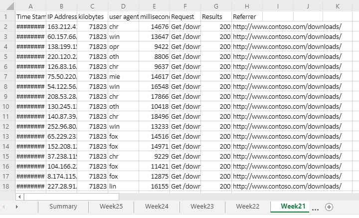
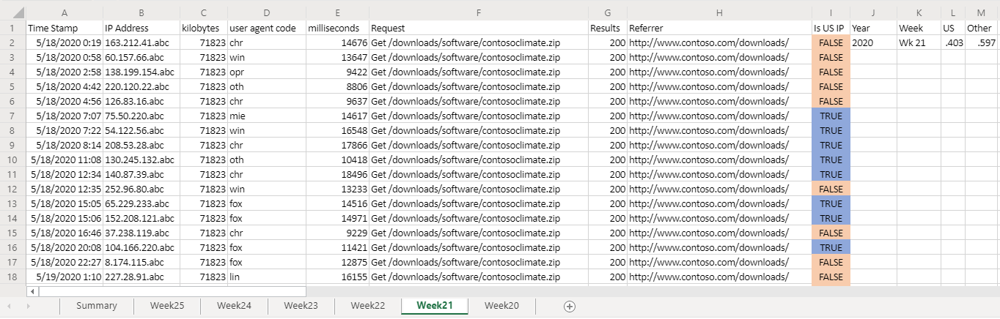

# <a name="office-scripts-sample-scenario-analyze-web-downloads"></a>Beispielszenario für Office-Skripts: Analysieren von Webdownloads

In diesem Szenario haben Sie die Aufgabe, Download Berichte von der Website Ihres Unternehmens zu analysieren. Das Ziel dieser Analyse besteht darin zu ermitteln, ob der Webdatenverkehr aus den USA oder anderswo in der Welt stammt.

Ihre Kollegen laden die Rohdaten in Ihre Arbeitsmappe hoch. Die Datenmenge jeder Woche verfügt über ein eigenes Arbeitsblatt. Es gibt auch das **Zusammenfassungs** Arbeitsblatt mit einer Tabelle und einem Diagramm, in denen Wochen überwochen Trends angezeigt werden.

Sie entwickeln ein Skript, mit dem wöchentliche Downloads von Daten im aktiven Arbeitsblatt analysiert werden. Er analysiert die IP-Adresse, die jedem Download zugeordnet ist, und ermittelt, ob er aus den USA stammt oder nicht. Die Antwort wird als boolescher Wert in das Arbeitsblatt eingefügt ("true" oder "false"), und die bedingte Formatierung wird auf diese Zellen angewendet. Die Ergebnisse der IP-Adressposition werden auf dem Arbeitsblatt summiert und in die Zusammenfassungstabelle kopiert.

## <a name="scripting-skills-covered"></a>Abgedeckte Skript Fertigkeiten

- Text Analyse
- Unter Funktionen in Skripts
- Bedingte Formatierung
- Tabellen

## <a name="demo-video"></a>Demo Video

Dieses Beispiel wurde als Teil des Office-Add-ins Entwickler-Community-Aufrufs für den 2020. Februar verdemot.

> [!VIDEO https://www.youtube.com/embed/vPEqbb7t6-Y?start=154]

## <a name="setup-instructions"></a>Setup Anweisungen

1. Laden Sie <a href="analyze-web-downloads.xlsx">analyze-web-downloads.xlsx</a> auf Ihre OneDrive herunter.

2. Öffnen Sie die Arbeitsmappe mit Excel für das Internet.

3. Öffnen Sie auf der Registerkarte **automatisieren** den **Code-Editor**.

4. Klicken Sie im Aufgabenbereich **Code-Editor** auf **Neues Skript** , und fügen Sie das folgende Skript in den Editor ein.

    ```TypeScript
    function main(workbook: ExcelScript.Workbook) {
      // Get the Summary worksheet and table.
      let summaryWorksheet = workbook.getWorksheet("Summary");
      let summaryTable = summaryWorksheet?.getTable("Table1");
      if (!summaryWorksheet || !summaryTable) {
          console.log("The script expects the Summary worksheet with a summary table named Table1. Please download the correct template and try again.");
          return;
      }
  
      // Get the current worksheet.
      let currentWorksheet = workbook.getActiveWorksheet();
      if (!currentWorksheet.getName().toLocaleLowerCase().startsWith("week")) {
          console.log("Please switch worksheet to one of the weekly data sheets and try again.")
          return;
      }
  
      // Get the values of the active range of the active worksheet.
      let logRange = currentWorksheet.getUsedRange();
  
        if (logRange.getColumnCount() !== 8) {
        console.log(`Verify that you are on the correct worksheet. Either the week's data has been already processed or the content is incorrect. The following columns are expected: ${[
          "Time Stamp", "IP Address", "kilobytes", "user agent code", "milliseconds", "Request", "Results", "Referrer"
        ]}`);
        return;
      }
      // Get the range that will contain TRUE/FALSE if the IP address is from the United States (US).
      let isUSColumn = logRange
          .getLastColumn()
          .getOffsetRange(0, 1);
  
      // Get the values of all the US IP addresses.
      let ipRange = workbook.getWorksheet("USIPAddresses").getUsedRange();
      let ipRangeValues = ipRange.getValues();
      let logRangeValues = logRange.getValues();
      // Remove the first row.
      let topRow = logRangeValues.shift();
      console.log(`Analyzing ${logRangeValues.length} entries.`);
  
      // Create a new array to contain the boolean representing if this is a US IP address.
      let newCol = [];
  
      // Go through each row in worksheet and add Boolean.
      for (let i = 0; i < logRangeValues.length; i++) {
          let curRowIP = logRangeValues[i][1];
          if (findIP(ipRangeValues, ipAddressToInteger(curRowIP)) > 0) {
              newCol.push([true]);
          } else {
              newCol.push([false]);
          }
      }
  
      // Remove the empty column header and add proper heading.
      newCol = [["Is US IP"], ...newCol];
  
      // Write the result to the spreadsheet.
      console.log(`Adding column to indicate whether IP belongs to US region or not at address: ${isUSColumn.getAddress()}`);
      console.log(newCol.length);
      console.log(newCol);
      isUSColumn.setValues(newCol);
  
      // Call the local function to add summary data to the worksheet.
      addSummaryData();
  
      // Call the local function to apply conditional formatting.
  
      applyConditionalFormatting(isUSColumn);
  
      // Autofit columns.
      currentWorksheet.getUsedRange().getFormat().autofitColumns();
  
      // Get the calculated summary data.
      let summaryRangeValues = currentWorksheet.getRange("J2:M2").getValues();
  
      // Add the corresponding row to the summary table.
      summaryTable.addRow(null, summaryRangeValues[0]);
      console.log("Complete.");
      return;

    /**
     * A function to add summary data on the worksheet.
     */
    function addSummaryData() {
        // Add a summary row and table.
        let summaryHeader = [["Year", "Week", "US", "Other"]];
        let countTrueFormula =
            "=COUNTIF(" + isUSColumn.getAddress() + ', "=TRUE")/' + (newCol.length - 1);
        let countFalseFormula =
            "=COUNTIF(" + isUSColumn.getAddress() + ', "=FALSE")/' + (newCol.length - 1);

        let summaryContent = [
            [
                '=TEXT(A2,"YYYY")',
                '=TEXTJOIN(" ", FALSE, "Wk", WEEKNUM(A2))',
                countTrueFormula,
                countFalseFormula
            ]
        ];
        let summaryHeaderRow = currentWorksheet
            .getRange("J1:M1");
        let summaryContentRow = currentWorksheet
            .getRange("J2:M2");
        console.log("2");

        summaryHeaderRow.setValues(summaryHeader);
        console.log("3");

        summaryContentRow.setValues(summaryContent);
        console.log("4");

        let formats = [[".000", ".000"]];
        summaryContentRow
            .getOffsetRange(0, 2)
            .getResizedRange(0, -2).setNumberFormats(formats);
        }
    }
    /**
     * Apply conditional formatting based on TRUE/FALSE values of the Is US IP column.
     */
    function applyConditionalFormatting(isUSColumn: ExcelScript.Range) {
        // Add conditional formatting to the new column.
        let conditionalFormatTrue = isUSColumn.addConditionalFormat(
            ExcelScript.ConditionalFormatType.cellValue
        );
        let conditionalFormatFalse = isUSColumn.addConditionalFormat(
            ExcelScript.ConditionalFormatType.cellValue
        );
        // Set TRUE to light blue and FALSE to light orange.
        conditionalFormatTrue.getCellValue().getFormat().getFill().setColor("#8FA8DB");
        conditionalFormatTrue.getCellValue().setRule({
            formula1: "=TRUE",
            operator: ExcelScript.ConditionalCellValueOperator.equalTo
        });
        conditionalFormatTrue.getCellValue().getFormat().getFill().setColor("#F8CCAD");
        conditionalFormatTrue.getCellValue().setRule({
            formula1: "=FALSE",
            operator: ExcelScript.ConditionalCellValueOperator.equalTo
        });
    }
    /**
     * Translate an IP address into an integer.
     * @param ipAddress: IP address to verify.
     */
    function ipAddressToInteger(ipAddress: string): number {
        // Split the IP address into octets.
        let octets = ipAddress.split(".");

        // Create a number for each octet and do the math to create the integer value of the IP address.
        let fullNum =
            // Define an arbitrary number for the last octet.
            111 +
            parseInt(octets[2]) * 256 +
            parseInt(octets[1]) * 65536 +
            parseInt(octets[0]) * 16777216;
        return fullNum;
    }
    /**
     * Return the row number where the ip address is found.
     * @param ipLookupTable IP look-up table.
     * @param n IP address to number value.  
     */
    function findIP(ipLookupTable: number[][], n: number): number {
        for (let i = 0; i < ipLookupTable.length; i++) {
            if (ipLookupTable[i][0] <= n && ipLookupTable[i][1] >= n) {
                return i;
            }
        }
        return -1;
    }
    ```

5. Benennen Sie das Skript zum **Analysieren von Webdownloads** um, und speichern Sie es.

## <a name="running-the-script"></a>Ausführen des Skripts

Navigieren Sie zu einem der **Wochen \* \* ** Arbeitsblätter, und führen Sie das Skript zum **Analysieren von Webdownloads** aus. Das Skript wendet die bedingte Formatierung und die Speicherort Kennzeichnung auf dem aktuellen Blatt an. Außerdem wird das **Zusammenfassungs** Arbeitsblatt aktualisiert.

### <a name="before-running-the-script"></a>Vor dem Ausführen des Skripts



### <a name="after-running-the-script"></a>Nach dem Ausführen des Skripts




