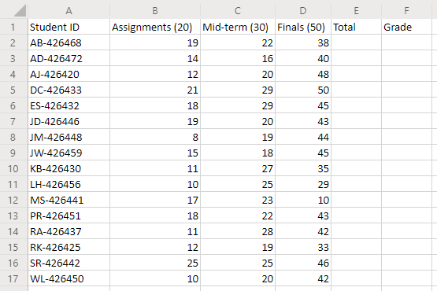
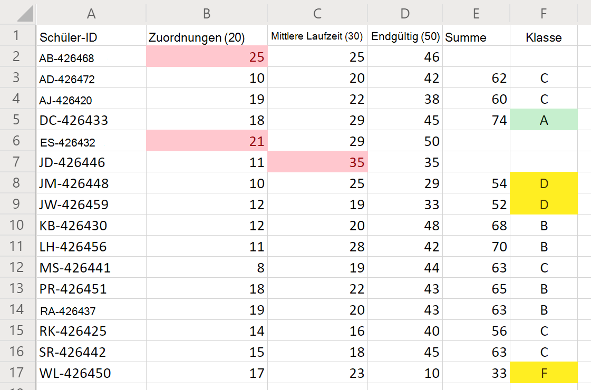

# <a name="office-scripts-sample-scenario-grade-calculator"></a><span data-ttu-id="14ac1-103">Beispielszenario für Office-Skripts: Grade Calculator</span><span class="sxs-lookup"><span data-stu-id="14ac1-103">Office Scripts sample scenario: Grade calculator</span></span>

<span data-ttu-id="14ac1-104">In diesem Szenario sind Sie ein Kursleiter, der die Auszählung jedes Schülers angeht.</span><span class="sxs-lookup"><span data-stu-id="14ac1-104">In this scenario, you're an instructor tallying every student's end-of-term grades.</span></span> <span data-ttu-id="14ac1-105">Sie haben die Noten für ihre Zuweisungen und Tests eingegeben, während Sie gehen.</span><span class="sxs-lookup"><span data-stu-id="14ac1-105">You've been entering the scores for their assignments and tests as you go.</span></span> <span data-ttu-id="14ac1-106">Nun ist es an der Zeit, die Schicksale der Schüler zu bestimmen.</span><span class="sxs-lookup"><span data-stu-id="14ac1-106">Now, it is time to determine the students' fates.</span></span>

<span data-ttu-id="14ac1-107">Sie entwickeln ein Skript, das die Noten für jede Punkte Kategorie summiert.</span><span class="sxs-lookup"><span data-stu-id="14ac1-107">You'll develop a script that totals the grades for each point category.</span></span> <span data-ttu-id="14ac1-108">Anschließend wird jedem Schüler basierend auf der Gesamtzahl ein Brief Grad zugewiesen.</span><span class="sxs-lookup"><span data-stu-id="14ac1-108">It will then assign a letter grade to each student based on the total.</span></span> <span data-ttu-id="14ac1-109">Um die Genauigkeit sicherzustellen, fügen Sie ein paar Schecks hinzu, um zu sehen, ob einzelne Noten zu niedrig oder hoch sind.</span><span class="sxs-lookup"><span data-stu-id="14ac1-109">To help ensure accuracy, you'll add a couple checks to see if any individual scores are too low or high.</span></span> <span data-ttu-id="14ac1-110">Wenn die Punktzahl eines Schülers kleiner als 0 (null) oder größer als der mögliche Punktwert ist, wird die Zelle durch das Skript mit einer roten Füllung markiert und nicht mit der Summe der Punkte des Schülers.</span><span class="sxs-lookup"><span data-stu-id="14ac1-110">If a student's score is less than zero or more than the possible point value, the script will flag the cell with a red fill and not total that student's points.</span></span> <span data-ttu-id="14ac1-111">Dies ist ein klarer Hinweis darauf, welche Datensätze Sie doppelt überprüfen müssen.</span><span class="sxs-lookup"><span data-stu-id="14ac1-111">This will be a clear indication of which records you need to double-check.</span></span> <span data-ttu-id="14ac1-112">Sie fügen auch einige grundlegende Formatierungen zu den Noten hinzu, damit Sie den oberen und unteren Teil der Klasse schnell anzeigen können.</span><span class="sxs-lookup"><span data-stu-id="14ac1-112">You'll also add some basic formatting to the grades so you can quickly view the top and bottom of the class.</span></span>

## <a name="scripting-skills-covered"></a><span data-ttu-id="14ac1-113">Abgedeckte Skript Fertigkeiten</span><span class="sxs-lookup"><span data-stu-id="14ac1-113">Scripting skills covered</span></span>

- <span data-ttu-id="14ac1-114">Zellenformatierung</span><span class="sxs-lookup"><span data-stu-id="14ac1-114">Cell formatting</span></span>
- <span data-ttu-id="14ac1-115">Fehlerüberprüfung</span><span class="sxs-lookup"><span data-stu-id="14ac1-115">Error checking</span></span>
- <span data-ttu-id="14ac1-116">Reguläre Ausdrücke</span><span class="sxs-lookup"><span data-stu-id="14ac1-116">Regular expressions</span></span>

## <a name="setup-instructions"></a><span data-ttu-id="14ac1-117">Setup Anweisungen</span><span class="sxs-lookup"><span data-stu-id="14ac1-117">Setup instructions</span></span>

1. <span data-ttu-id="14ac1-118">Laden Sie <a href="grade-calculator.xlsx">Grade-Calculator. xlsx</a> in Ihre OneDrive herunter.</span><span class="sxs-lookup"><span data-stu-id="14ac1-118">Download <a href="grade-calculator.xlsx">grade-calculator.xlsx</a> to your OneDrive.</span></span>

2. <span data-ttu-id="14ac1-119">Öffnen Sie die Arbeitsmappe mit Excel für das Internet.</span><span class="sxs-lookup"><span data-stu-id="14ac1-119">Open the workbook with Excel for the web.</span></span>

3. <span data-ttu-id="14ac1-120">Öffnen Sie auf der Registerkarte **automatisieren** den **Code-Editor**.</span><span class="sxs-lookup"><span data-stu-id="14ac1-120">Under the **Automate** tab, open the **Code Editor**.</span></span>

4. <span data-ttu-id="14ac1-121">Klicken Sie im Aufgabenbereich **Code-Editor** auf **Neues Skript** , und fügen Sie das folgende Skript in den Editor ein.</span><span class="sxs-lookup"><span data-stu-id="14ac1-121">In the **Code Editor** task pane, press **New Script** and paste the following script into the editor.</span></span>

    ```TypeScript
    async function main(context: Excel.RequestContext) {
      // Get the number of student record rows.
      let sheet = context.workbook.worksheets.getActiveWorksheet();
      let studentsRange = sheet.getUsedRange().load("values, rowCount");
      await context.sync();
      console.log("Total students: " + (studentsRange.rowCount - 1));

      // Clean up any formatting from previous runs of the script.
      studentsRange.clear(Excel.ClearApplyTo.formats);
      studentsRange.getColumn(4).getCell(0, 0).getRowsBelow(studentsRange.rowCount - 1).clear(Excel.ClearApplyTo.all);
      studentsRange.getColumn(5).getCell(0, 0).getRowsBelow(studentsRange.rowCount - 1).clear(Excel.ClearApplyTo.all);
      await context.sync();

      // Parse the headers for the maximum possible scores for each category.
      // The format is `category (score)`.
      let assignmentsMax = studentsRange.values[0][1].match(/\d+/)[0];
      let midTermMax = studentsRange.values[0][2].match(/\d+/)[0];
      let finalsMax = studentsRange.values[0][3].match(/\d+/)[0];
      console.log("Assignments max score:" + assignmentsMax);
      console.log("Mid-term max score: " + midTermMax);
      console.log("Final max score: " + finalsMax);

      // Look at every student row.
      for (let i = 1; i < studentsRange.values.length; i++) {
        let row = studentsRange.values[i];
        let total = row[1] + row[2] + row[3];
        let valid = true;

        // Look for any records that are too low or too high.
        if (row[1] < 0 || row[1] > assignmentsMax) {
          studentsRange.getCell(i, 1).format.fill.color = "Red";
          valid = false;
        }
        if (row[2] < 0 || row[2] > midTermMax) {
          studentsRange.getCell(i, 2).format.fill.color = "Red";
          valid = false;
        }
        if (row[3] < 0 || row[3] > finalsMax) {
          studentsRange.getCell(i, 3).format.fill.color = "Red";
          valid = false;
        }

        // If the scores are valid, total that student's points and assign them a letter grade.
        if (valid) {
          let grade: string;
          switch (true) {
            case total < 60:
              grade = "E";
              break;
            case total < 70:
              grade = "D";
              break;
            case total < 80:
              grade = "C";
              break;
            case total < 90:
              grade = "B";
              break;
            default:
              grade = "A";
              break;
          }

          studentsRange.getCell(i, 4).values = [[total]];
          studentsRange.getCell(i, 5).values = [[grade]];

          // Highlight excellent students and those in need of attention.
          if (grade === "A") {
            studentsRange.getCell(i, 5).format.fill.color = "Green";
          } else if (grade === "E" || grade === "D") {
            studentsRange.getCell(i, 5).format.fill.color = "Orange";
          }
        }
      }

      studentsRange.getColumn(5).format.horizontalAlignment = "Center";
    }
    ```

5. <span data-ttu-id="14ac1-122">Benennen Sie das Skript in den **Grade Calculator** um, und speichern Sie es.</span><span class="sxs-lookup"><span data-stu-id="14ac1-122">Rename the script to **Grade Calculator** and save it.</span></span>

## <a name="running-the-script"></a><span data-ttu-id="14ac1-123">Ausführen des Skripts</span><span class="sxs-lookup"><span data-stu-id="14ac1-123">Running the script</span></span>

<span data-ttu-id="14ac1-124">Führen Sie das **Grade Calculator** -Skript auf dem einzigen Arbeitsblatt aus.</span><span class="sxs-lookup"><span data-stu-id="14ac1-124">Run the **Grade Calculator** script on the only worksheet.</span></span> <span data-ttu-id="14ac1-125">Das Skript summiert die Noten und weist jedem Schüler eine Note zu.</span><span class="sxs-lookup"><span data-stu-id="14ac1-125">The script will total the grades and assign each student a letter grade.</span></span> <span data-ttu-id="14ac1-126">Wenn einzelne Noten mehr Punkte aufweisen als die Zuordnung oder der Test Wert ist, wird die betroffene Note rot markiert, und die Summe wird nicht berechnet.</span><span class="sxs-lookup"><span data-stu-id="14ac1-126">If any individual grades have more points than the assignment or test is worth, then the offending grade is marked red and the total is not calculated.</span></span>

### <a name="before-running-the-script"></a><span data-ttu-id="14ac1-127">Vor dem Ausführen des Skripts</span><span class="sxs-lookup"><span data-stu-id="14ac1-127">Before running the script</span></span>



### <a name="after-running-the-script"></a><span data-ttu-id="14ac1-129">Nach dem Ausführen des Skripts</span><span class="sxs-lookup"><span data-stu-id="14ac1-129">After running the script</span></span>


