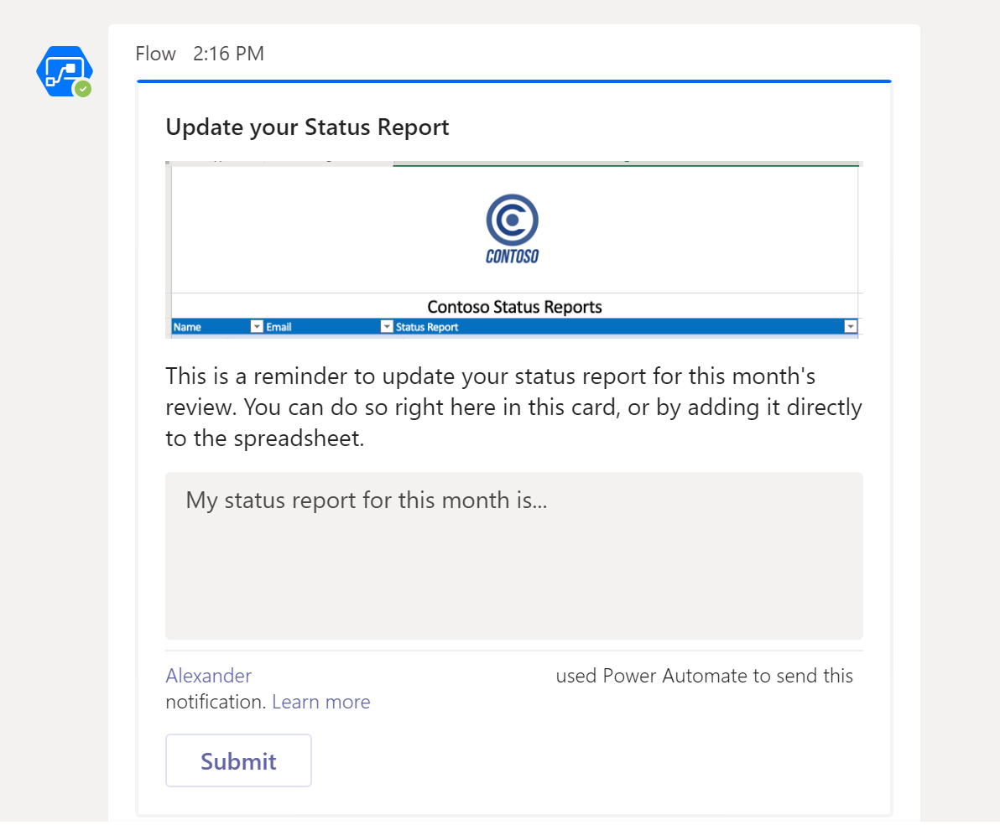

# <a name="office-scripts-sample-scenario-automated-task-reminders"></a><span data-ttu-id="28daf-103">Beispielszenario für Office-Skripts: automatische Aufgaben Erinnerungen</span><span class="sxs-lookup"><span data-stu-id="28daf-103">Office Scripts sample scenario: Automated task reminders</span></span>

<span data-ttu-id="28daf-104">In diesem Szenario werden Sie ein Projekt verwalten.</span><span class="sxs-lookup"><span data-stu-id="28daf-104">In this scenario you're managing a project.</span></span> <span data-ttu-id="28daf-105">Sie verwenden ein Excel-Arbeitsblatt, um den Status Ihrer Mitarbeiter monatlich nachzuverfolgen.</span><span class="sxs-lookup"><span data-stu-id="28daf-105">You use an Excel worksheet to track your employees' status every month.</span></span> <span data-ttu-id="28daf-106">Sie müssen die Benutzer häufig darauf hinweisen, dass Sie Ihren Status ausfüllen, sodass Sie sich entschieden haben, diesen erinnerungsprozess zu automatisieren.</span><span class="sxs-lookup"><span data-stu-id="28daf-106">You often need to remind people to fill out their status, so you've decided to automate that reminder process.</span></span>

<span data-ttu-id="28daf-107">Sie erstellen einen Power-Automatisierungs Fluss für Nachrichten Personen mit fehlenden Statusfeldern und wenden ihre Antworten auf das Arbeitsblatt an.</span><span class="sxs-lookup"><span data-stu-id="28daf-107">You'll create a Power Automate flow to message people with missing status fields and apply their responses to the spreadsheet.</span></span> <span data-ttu-id="28daf-108">Dazu entwickeln Sie ein Skript paar zur Verarbeitung der Arbeitsmappe.</span><span class="sxs-lookup"><span data-stu-id="28daf-108">To do this, you'll develop a pair of scripts to handle the working with the workbook.</span></span> <span data-ttu-id="28daf-109">Das erste Skript ruft eine Liste von Personen mit leeren Status ab, und das zweite Skript fügt der rechten Zeile eine Statuszeichenfolge hinzu.</span><span class="sxs-lookup"><span data-stu-id="28daf-109">The first script gets a list of people with blank statuses and the second script adds a status string to the right row.</span></span> <span data-ttu-id="28daf-110">Sie verwenden auch [Adaptive Teams-Karten](/microsoftteams/platform/task-modules-and-cards/what-are-cards) , damit Mitarbeiter Ihren Status direkt aus der Benachrichtigung eingeben können.</span><span class="sxs-lookup"><span data-stu-id="28daf-110">You'll also make use of [Teams Adaptive Cards](/microsoftteams/platform/task-modules-and-cards/what-are-cards) to have employees enter their status directly from the notification.</span></span>

## <a name="scripting-skills-covered"></a><span data-ttu-id="28daf-111">Abgedeckte Skript Fertigkeiten</span><span class="sxs-lookup"><span data-stu-id="28daf-111">Scripting skills covered</span></span>

- <span data-ttu-id="28daf-112">Erstellen von Flows in Power Automation</span><span class="sxs-lookup"><span data-stu-id="28daf-112">Create flows in Power Automate</span></span>
- <span data-ttu-id="28daf-113">Übergeben von Daten an Skripts</span><span class="sxs-lookup"><span data-stu-id="28daf-113">Pass data to scripts</span></span>
- <span data-ttu-id="28daf-114">Zurückgeben von Daten aus Skripts</span><span class="sxs-lookup"><span data-stu-id="28daf-114">Return data from scripts</span></span>
- <span data-ttu-id="28daf-115">Adaptive Teams-Karten</span><span class="sxs-lookup"><span data-stu-id="28daf-115">Teams Adaptive Cards</span></span>
- <span data-ttu-id="28daf-116">Tabellen</span><span class="sxs-lookup"><span data-stu-id="28daf-116">Tables</span></span>

## <a name="prerequisites"></a><span data-ttu-id="28daf-117">Voraussetzungen</span><span class="sxs-lookup"><span data-stu-id="28daf-117">Prerequisites</span></span>

<span data-ttu-id="28daf-118">Dieses Szenario verwendet [Power Automation](https://flow.microsoft.com) und [Microsoft Teams](https://www.microsoft.com/microsoft-365/microsoft-teams/group-chat-software).</span><span class="sxs-lookup"><span data-stu-id="28daf-118">This scenario uses [Power Automate](https://flow.microsoft.com) and [Microsoft Teams](https://www.microsoft.com/microsoft-365/microsoft-teams/group-chat-software).</span></span> <span data-ttu-id="28daf-119">Sie müssen beide mit dem Konto verbunden sein, das Sie für die Entwicklung von Office-Skripts verwenden.</span><span class="sxs-lookup"><span data-stu-id="28daf-119">You will need both associated with the account that you use for developing Office Scripts.</span></span> <span data-ttu-id="28daf-120">Für den kostenlosen Zugriff auf ein Microsoft Developer-Abonnement, um mehr über diese Anwendungen zu erfahren und mit diesen zu arbeiten, sollten Sie sich an das [Microsoft 365 Developer Program](https://developer.microsoft.com/microsoft-365/dev-program)anschließen.</span><span class="sxs-lookup"><span data-stu-id="28daf-120">For free access to a Microsoft Developer subscription to learn about and work with these applications, consider joining the [Microsoft 365 Developer Program](https://developer.microsoft.com/microsoft-365/dev-program).</span></span>

## <a name="setup-instructions"></a><span data-ttu-id="28daf-121">Setup Anweisungen</span><span class="sxs-lookup"><span data-stu-id="28daf-121">Setup instructions</span></span>

1. <span data-ttu-id="28daf-122">Laden Sie <a href="task-reminders.xlsx">task-reminders.xlsx</a> auf Ihre OneDrive herunter.</span><span class="sxs-lookup"><span data-stu-id="28daf-122">Download <a href="task-reminders.xlsx">task-reminders.xlsx</a> to your OneDrive.</span></span>

2. <span data-ttu-id="28daf-123">Öffnen Sie die Arbeitsmappe in Excel im Internet.</span><span class="sxs-lookup"><span data-stu-id="28daf-123">Open the workbook in Excel on the web.</span></span>

3. <span data-ttu-id="28daf-124">Öffnen Sie auf der Registerkarte **automatisieren** den **Code-Editor**.</span><span class="sxs-lookup"><span data-stu-id="28daf-124">Under the **Automate** tab, open the **Code Editor**.</span></span>

4. <span data-ttu-id="28daf-125">Zunächst benötigen wir ein Skript, um alle Mitarbeiter mit Statusberichten abzurufen, die in der Kalkulationstabelle fehlen.</span><span class="sxs-lookup"><span data-stu-id="28daf-125">First, we need a script to get all the employees with status reports that are missing from the spreadsheet.</span></span> <span data-ttu-id="28daf-126">Klicken Sie im Aufgabenbereich **Code-Editor** auf **Neues Skript** , und fügen Sie das folgende Skript in den Editor ein.</span><span class="sxs-lookup"><span data-stu-id="28daf-126">In the **Code Editor** task pane, press **New Script** and paste the following script into the editor.</span></span>

    ```typescript
    /**
     * This script looks for missing status reports in a project management table.
     *
     * @returns An array of Employee objects (containing their names and emails).
     */
    function main(workbook: ExcelScript.Workbook): Employee[] {
      // Get the first worksheet and the first table on that worksheet.
      let sheet = workbook.getFirstWorksheet()
      let table = sheet.getTables()[0];

      // Give the column indices names matching their expected content.
      const NAME_INDEX = 0;
      const EMAIL_INDEX = 1;
      const STATUS_REPORT_INDEX = 2;

      // Get the data for the whole table.
      let bodyRangeValues = table.getRangeBetweenHeaderAndTotal().getValues();

      // Create the array of Employee objects to return.
      let people: Employee[] = [];

      // Loop through the table and check each row for completion.
      for (let i = 0; i < bodyRangeValues.length; i++) {
        let row = bodyRangeValues[i];
        if (row[STATUS_REPORT_INDEX] === "") {
          // Save the email to return.
          people.push({ name: row[NAME_INDEX], email: row[EMAIL_INDEX] });
        }
      }

      // Log the array to verify we're getting the right rows.
      console.log(people);

      // Return the array of Employees.
      return people;
    }

    /**
     * An interface representing an employee.
     * An array of Employees will be returned from the script
     * for the Power Automate flow.
     */
    interface Employee {
      name: string;
      email: string;
    }
    ```

5. <span data-ttu-id="28daf-127">Speichern Sie das Skript mit dem Namen **Get People**.</span><span class="sxs-lookup"><span data-stu-id="28daf-127">Save the script with the name **Get People**.</span></span>

6. <span data-ttu-id="28daf-128">Als nächstes benötigen wir ein zweites Skript, um die Statusberichts Karten zu verarbeiten und die neuen Informationen in das Arbeitsblatt einzufügen.</span><span class="sxs-lookup"><span data-stu-id="28daf-128">Next, we need a second script to process the status report cards and put the new information in the spreadsheet.</span></span> <span data-ttu-id="28daf-129">Klicken Sie im Aufgabenbereich **Code-Editor** auf **Neues Skript** , und fügen Sie das folgende Skript in den Editor ein.</span><span class="sxs-lookup"><span data-stu-id="28daf-129">In the **Code Editor** task pane, press **New Script** and paste the following script into the editor.</span></span>

    ```typescript
    /**
     * This script applies the results of a Teams Adaptive Card about
     * a status update to a project management table.
     *
     * @param senderEmail - The email address of the employee updating their status.
     * @param statusReportResponse - The employee's status report.
     */
    function main(workbook: ExcelScript.Workbook,
      senderEmail: string,
      statusReportResponse: string) {

      // Get the first worksheet and the first table in that worksheet.
      let sheet = workbook.getFirstWorksheet();
      let table = sheet.getTables()[0];

      // Give the column indices names matching their expected content.
      const NAME_INDEX = 0;
      const EMAIL_INDEX = 1;
      const STATUS_REPORT_INDEX = 2;

      // Get the range and data for the whole table.
      let bodyRange = table.getRangeBetweenHeaderAndTotal();
      let tableRowCount = bodyRange.getRowCount();
      let bodyRangeValues = bodyRange.getValues();

      // Create a flag to denote success.
      let statusAdded = false;

      // Loop through the table and check each row for a matching email address.
      for (let i = 0; i < tableRowCount && !statusAdded; i++) {
        let row = bodyRangeValues[i];

        // Check if the row's email address matches.
        if (row[EMAIL_INDEX] === senderEmail) {
          // Add the Teams Adaptive Card response to the table.
          bodyRange.getCell(i, STATUS_REPORT_INDEX).setValues([
            [statusReportResponse]
          ]);
          statusAdded = true;
        }
      }

      // If successful, log the status update.
      if (statusAdded) {
        console.log(
          `Successfully added status report for ${senderEmail} containing: ${statusReportResponse}`
        );
      }
    }
    ```

7. <span data-ttu-id="28daf-130">Speichern Sie das Skript mit dem Namen " **Save Status**".</span><span class="sxs-lookup"><span data-stu-id="28daf-130">Save the script with the name **Save Status**.</span></span>

8. <span data-ttu-id="28daf-131">Jetzt müssen wir den Fluss erstellen.</span><span class="sxs-lookup"><span data-stu-id="28daf-131">Now, we need to create the flow.</span></span> <span data-ttu-id="28daf-132">Öffnen Sie [Power automatisieren](https://flow.microsoft.com/).</span><span class="sxs-lookup"><span data-stu-id="28daf-132">Open [Power Automate](https://flow.microsoft.com/).</span></span>

    > [!TIP]
    > <span data-ttu-id="28daf-133">Wenn Sie noch keinen Flow erstellt haben, lesen Sie bitte unser Tutorial [Start using scripts with Power automatisieren](../../tutorials/excel-power-automate-manual.md) , um die Grundlagen zu erfahren.</span><span class="sxs-lookup"><span data-stu-id="28daf-133">If you haven't created a flow before, please check out our tutorial [Start using scripts with Power Automate](../../tutorials/excel-power-automate-manual.md) to learn the basics.</span></span>

9. <span data-ttu-id="28daf-134">Erstellen Sie einen neuen **sofort Ablauf**.</span><span class="sxs-lookup"><span data-stu-id="28daf-134">Create a new **Instant flow**.</span></span>

10. <span data-ttu-id="28daf-135">Wählen Sie einen Fluss aus den Optionen **manuell auslösen** aus, und klicken Sie dann auf **Erstellen**.</span><span class="sxs-lookup"><span data-stu-id="28daf-135">Choose **Manually trigger a flow** from the options and press **Create**.</span></span>

11. <span data-ttu-id="28daf-136">Der Fluss muss das **Get People** -Skript aufrufen, um alle Mitarbeiter mit leeren Statusfeldern abzurufen.</span><span class="sxs-lookup"><span data-stu-id="28daf-136">The flow needs to call the **Get People** script to get all the employees with empty status fields.</span></span> <span data-ttu-id="28daf-137">Klicken Sie auf **New Step** , und wählen Sie **Excel Online (Business)** aus.</span><span class="sxs-lookup"><span data-stu-id="28daf-137">Press **New step** and select **Excel Online (Business)**.</span></span> <span data-ttu-id="28daf-138">Wählen Sie unter **Aktionen**die Option **Skript ausführen (Vorschau)** aus.</span><span class="sxs-lookup"><span data-stu-id="28daf-138">Under **Actions**, select **Run script (preview)**.</span></span> <span data-ttu-id="28daf-139">Geben Sie für den Ablauf Schritt folgende Einträge an:</span><span class="sxs-lookup"><span data-stu-id="28daf-139">Provide the following entries for the flow step:</span></span>

    - <span data-ttu-id="28daf-140">**Speicherort**: OneDrive für Unternehmen</span><span class="sxs-lookup"><span data-stu-id="28daf-140">**Location**: OneDrive for Business</span></span>
    - <span data-ttu-id="28daf-141">**Dokumentbibliothek**: OneDrive</span><span class="sxs-lookup"><span data-stu-id="28daf-141">**Document Library**: OneDrive</span></span>
    - <span data-ttu-id="28daf-142">**Datei**: task-reminders.xlsx</span><span class="sxs-lookup"><span data-stu-id="28daf-142">**File**: task-reminders.xlsx</span></span>
    - <span data-ttu-id="28daf-143">**Skript**: Get People</span><span class="sxs-lookup"><span data-stu-id="28daf-143">**Script**: Get People</span></span>

    

12. <span data-ttu-id="28daf-145">Im nächsten Schritt muss der Fluss jeden Mitarbeiter in dem vom Skript zurückgegebenen Array verarbeiten.</span><span class="sxs-lookup"><span data-stu-id="28daf-145">Next, the flow needs to process each Employee in the array returned by the script.</span></span> <span data-ttu-id="28daf-146">Klicken Sie auf **New Step** , und wählen Sie **in einem Teams-Benutzer eine Adaptive Karte bereit**stellen aus, und warten Sie auf eine Antwort.</span><span class="sxs-lookup"><span data-stu-id="28daf-146">Press **New step** and select **Post an Adaptive Card to a Teams user and wait for a response**.</span></span>

13. <span data-ttu-id="28daf-147">Fügen Sie **Recipient** für das Feld Empfänger **e-Mail-** Nachweise aus dem dynamischen Inhalt hinzu (die Auswahl wird das Excel-Logo haben).</span><span class="sxs-lookup"><span data-stu-id="28daf-147">For the **Recipient** field, add **email** from the dynamic content (the selection will have the Excel logo by it).</span></span> <span data-ttu-id="28daf-148">Das Hinzufügen von **e-Mail** bewirkt, dass der Fluss Schritt von einem für **jeden Block angewendet** wird.</span><span class="sxs-lookup"><span data-stu-id="28daf-148">Adding **email** causes the flow step to be surrounded by an **Apply to each** block.</span></span> <span data-ttu-id="28daf-149">Das bedeutet, dass das Array von Power Automation iteriert wird.</span><span class="sxs-lookup"><span data-stu-id="28daf-149">That means the array will be iterated over by Power Automate.</span></span>

14. <span data-ttu-id="28daf-150">Für das Senden einer adaptiven Karte muss die JSON der Karte als **Nachricht**bereitgestellt werden.</span><span class="sxs-lookup"><span data-stu-id="28daf-150">Sending an Adaptive Card requires the card's JSON to be provided as the **Message**.</span></span> <span data-ttu-id="28daf-151">Sie können den [Adaptive Card-Designer](https://adaptivecards.io/designer/) verwenden, um benutzerdefinierte Karten zu erstellen.</span><span class="sxs-lookup"><span data-stu-id="28daf-151">You can use the [Adaptive Card Designer](https://adaptivecards.io/designer/) to create custom cards.</span></span> <span data-ttu-id="28daf-152">Verwenden Sie für dieses Beispiel die folgende JSON.</span><span class="sxs-lookup"><span data-stu-id="28daf-152">For this sample, use the following JSON.</span></span>  

    ```json
    {
      "$schema": "http://adaptivecards.io/schemas/adaptive-card.json",
      "type": "AdaptiveCard",
      "version": "1.0",
      "body": [
        {
          "type": "TextBlock",
          "size": "Medium",
          "weight": "Bolder",
          "text": "Update your Status Report"
        },
        {
          "type": "Image",
          "altText": "",
          "url": "https://i.imgur.com/f5RcuF3.png"
        },
        {
          "type": "TextBlock",
          "text": "This is a reminder to update your status report for this month's review. You can do so right here in this card, or by adding it directly to the spreadsheet.",
          "wrap": true
        },
        {
          "type": "Input.Text",
          "placeholder": "My status report for this month is...",
          "id": "response",
          "isMultiline": true
        }
      ],
      "actions": [
        {
          "type": "Action.Submit",
          "title": "Submit",
          "id": "submit"
        }
      ]
    }
    ```

15. <span data-ttu-id="28daf-153">Füllen Sie die restlichen Felder wie folgt aus:</span><span class="sxs-lookup"><span data-stu-id="28daf-153">Fill out the remaining fields as follows:</span></span>

    - <span data-ttu-id="28daf-154">**Update Nachricht**: Vielen Dank, dass Sie Ihren Statusbericht übermitteln.</span><span class="sxs-lookup"><span data-stu-id="28daf-154">**Update message**: Thank you for submitting your status report.</span></span> <span data-ttu-id="28daf-155">Ihre Antwort wurde dem Arbeitsblatt erfolgreich hinzugefügt.</span><span class="sxs-lookup"><span data-stu-id="28daf-155">Your response has been successfully added to the spreadsheet.</span></span>
    - <span data-ttu-id="28daf-156">**Sollte Update Card**: Ja</span><span class="sxs-lookup"><span data-stu-id="28daf-156">**Should update card**: Yes</span></span>

16. <span data-ttu-id="28daf-157">Klicken Sie im Feld **auf jeden Block anwenden** , indem Sie eine **Adaptive Karte an einen Microsoft Teams-Benutzer senden und auf eine Antwort warten**auf **Aktion hinzufügen**.</span><span class="sxs-lookup"><span data-stu-id="28daf-157">In the **Apply to each** block, following the **Post an Adaptive Card to a Teams user and wait for a response**, press **Add an action**.</span></span> <span data-ttu-id="28daf-158">Wählen Sie **Excel Online (Business)** aus.</span><span class="sxs-lookup"><span data-stu-id="28daf-158">Select **Excel Online (Business)**.</span></span> <span data-ttu-id="28daf-159">Wählen Sie unter **Aktionen**die Option **Skript ausführen (Vorschau)** aus.</span><span class="sxs-lookup"><span data-stu-id="28daf-159">Under **Actions**, select **Run script (preview)**.</span></span> <span data-ttu-id="28daf-160">Geben Sie für den Ablauf Schritt folgende Einträge an:</span><span class="sxs-lookup"><span data-stu-id="28daf-160">Provide the following entries for the flow step:</span></span>

    - <span data-ttu-id="28daf-161">**Speicherort**: OneDrive für Unternehmen</span><span class="sxs-lookup"><span data-stu-id="28daf-161">**Location**: OneDrive for Business</span></span>
    - <span data-ttu-id="28daf-162">**Dokumentbibliothek**: OneDrive</span><span class="sxs-lookup"><span data-stu-id="28daf-162">**Document Library**: OneDrive</span></span>
    - <span data-ttu-id="28daf-163">**Datei**: task-reminders.xlsx</span><span class="sxs-lookup"><span data-stu-id="28daf-163">**File**: task-reminders.xlsx</span></span>
    - <span data-ttu-id="28daf-164">**Skript**: Save Status</span><span class="sxs-lookup"><span data-stu-id="28daf-164">**Script**: Save Status</span></span>
    - <span data-ttu-id="28daf-165">**senderEmail**: e-Mail *(dynamischer Inhalt aus Excel)*</span><span class="sxs-lookup"><span data-stu-id="28daf-165">**senderEmail**: email *(dynamic content from Excel)*</span></span>
    - <span data-ttu-id="28daf-166">**statusReportResponse**: Antwort *(dynamischer Inhalt aus Teams)*</span><span class="sxs-lookup"><span data-stu-id="28daf-166">**statusReportResponse**: response *(dynamic content from Teams)*</span></span>

    

17. <span data-ttu-id="28daf-168">Speichern Sie den Fluss.</span><span class="sxs-lookup"><span data-stu-id="28daf-168">Save the flow.</span></span>

## <a name="running-the-flow"></a><span data-ttu-id="28daf-169">Ablauf des Flusses</span><span class="sxs-lookup"><span data-stu-id="28daf-169">Running the flow</span></span>

<span data-ttu-id="28daf-170">Um den Fluss zu testen, stellen Sie sicher, dass Tabellenzeilen mit leerem Status eine e-Mail-Adresse verwenden, die mit einem Microsoft Teams-Konto verknüpft ist (Sie sollten beim Testen wahrscheinlich ihre eigene e-Mail-Adresse verwenden).</span><span class="sxs-lookup"><span data-stu-id="28daf-170">To test the flow, make sure any table rows with blank status use an email address tied to a Teams account (you should probably use your own email address while testing).</span></span>

<span data-ttu-id="28daf-171">Sie können entweder **Test** aus dem Flow Designer auswählen oder den Fluss auf der Seite **meine Flows** ausführen.</span><span class="sxs-lookup"><span data-stu-id="28daf-171">You can either select **Test** from the flow designer, or run the flow from the **My flows** page.</span></span> <span data-ttu-id="28daf-172">Nachdem Sie den Fluss gestartet und die Verwendung der erforderlichen Verbindungen akzeptiert haben, sollten Sie eine Adaptive Karte von Power Automation über Teams erhalten.</span><span class="sxs-lookup"><span data-stu-id="28daf-172">After starting the flow and accepting the use of the required connections, you should receive an Adaptive Card from Power Automate through Teams.</span></span> <span data-ttu-id="28daf-173">Nachdem Sie das Feld Status in der Karte ausgefüllt haben, wird der Fluss fortgesetzt und das Arbeitsblatt mit dem von Ihnen bereitgestellten Status aktualisiert.</span><span class="sxs-lookup"><span data-stu-id="28daf-173">Once you fill out the status field in the card, the flow will continue and update the spreadsheet with the status you provide.</span></span>

### <a name="before-running-the-flow"></a><span data-ttu-id="28daf-174">Vor dem Ausführen des Flusses</span><span class="sxs-lookup"><span data-stu-id="28daf-174">Before running the flow</span></span>


### <a name="receiving-the-adaptive-card"></a><span data-ttu-id="28daf-176">Empfangen der adaptiven Karte</span><span class="sxs-lookup"><span data-stu-id="28daf-176">Receiving the Adaptive Card</span></span>



### <a name="after-running-the-flow"></a><span data-ttu-id="28daf-178">Nach Ausführung des Flusses</span><span class="sxs-lookup"><span data-stu-id="28daf-178">After running the flow</span></span>


