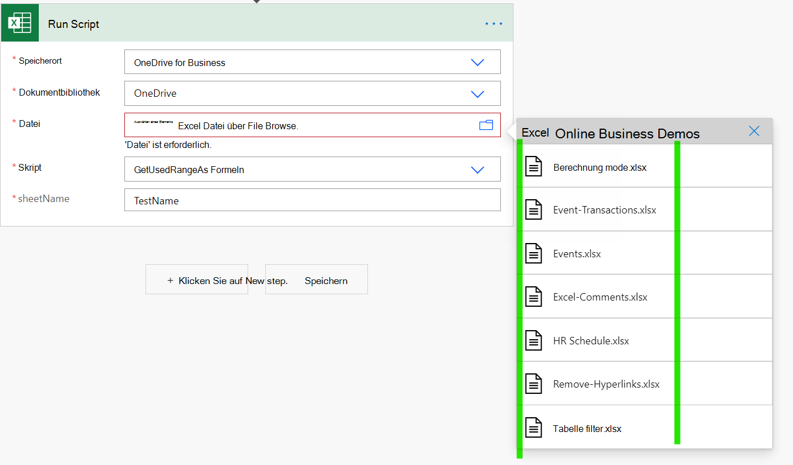
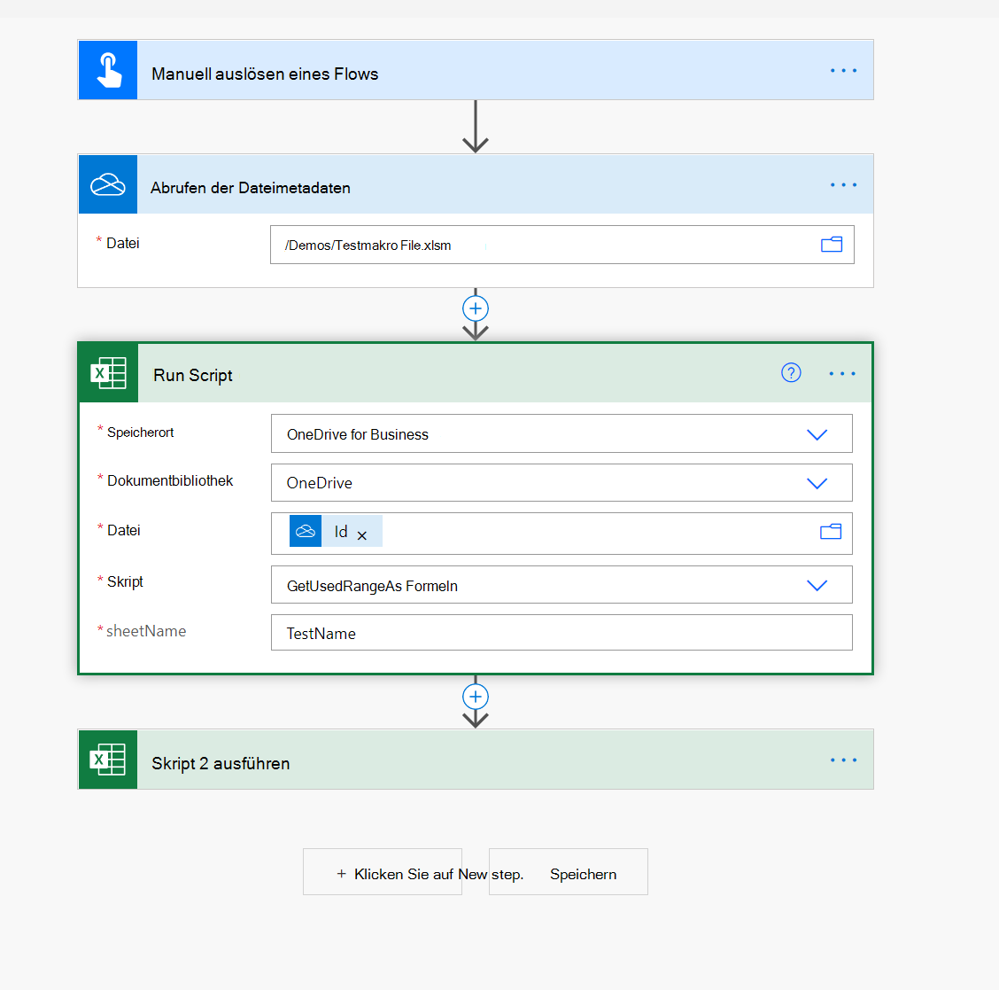

# Verwenden von Makrodateien in Power Automate-Flüssen

[Power Automate-Flüsse](https://flow.microsoft.com/) stellen [Excel-Connectors](https://flow.microsoft.com/connectors/shared_excelonlinebusiness/excel-online-business/) zur Verfügung, mit deren Hilfe Sie Excel-Dateien mit den restlichen Organisationsdaten und Apps wie Teams, Outlook und SharePoint verbinden können.

Makrodateien können jedoch nicht im Dateidropdown ausgewählt werden (siehe ein Beispiel im folgenden Screenshot).

Eine Möglichkeit, dieses Problem zu beheben, besteht in der Einbeziehung der Aktion "Dateimetadaten erhalten" (OneDrive oder SharePoint) und verwenden Sie die ID-Eigenschaft in der Aktion "Skript ausführen", wie im folgenden Screenshot gezeigt.

> [!NOTE]
> Einige XLSM (insbesondere diejenigen mit ActiveX/Formularsteuerelementen) funktionieren möglicherweise nicht im Excel-Onlineconnector. Testen Sie unbedingt, bevor Sie Ihre Lösung bereitstellen.

