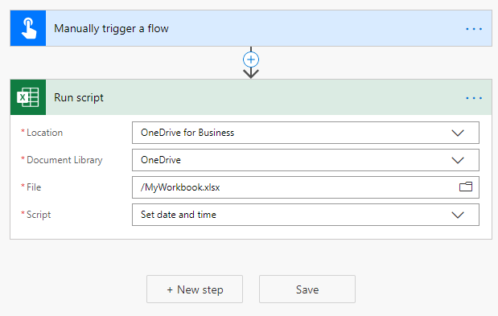

# <a name="start-using-scripts-with-power-automate-preview"></a>Starten der Verwendung von Skripts mit Power Automation (Vorschau)

In diesem Lernprogramm erfahren Sie, wie Sie ein Office-Skript für Excel im Internet mithilfe von [Power Automation](https://flow.microsoft.com)ausführen.

## <a name="prerequisites"></a>Voraussetzungen

[!INCLUDE [Tutorial prerequisites](../includes/tutorial-prerequisites.md)]

> [!IMPORTANT]
> In diesem Lernprogramm wird davon ausgegangen, dass Sie den [Datensatz, bearbeiten und Erstellen von Office-Skripts in Excel](excel-tutorial.md) im Webtutorial abgeschlossen haben.

## <a name="prepare-the-workbook"></a>Vorbereiten der Arbeitsmappe

Power Automation kann keine relativen Verweise wie `Workbook.getActiveWorksheet` den Zugriff auf Arbeitsmappen-Komponenten verwenden. Daher benötigen wir eine Arbeitsmappe und ein Arbeitsblatt mit konsistenten Namen, auf die Power Automation verweisen kann.

1. Erstellen Sie eine neue Arbeitsmappe mit dem Namen **myworkbook**.

2. Erstellen Sie in der Arbeitsmappe **myworkbook** ein Arbeitsblatt mit dem Namen **TutorialWorksheet**.

## <a name="create-an-office-script"></a>Erstellen eines Office-Skripts

1. Wechseln Sie zur Registerkarte **automatisieren** , und wählen Sie **Code-Editor**aus.

2. Wählen Sie **Neues Skript**aus.

3. Ersetzen Sie das Standardskript durch das folgende Skript. Dieses Skript fügt das aktuelle Datum und die Uhrzeit den ersten beiden Zellen des **TutorialWorksheet** -Arbeitsblatts hinzu.

    ```TypeScript
    function main(workbook: ExcelScript.Workbook) {
      // Get the "TutorialWorksheet" worksheet from the workbook.
      let worksheet = workbook.getWorksheet("TutorialWorksheet");

      // Get the cells at A1 and B1.
      let dateRange = worksheet.getRange("A1");
      let timeRange = worksheet.getRange("B1");

      // Get the current date and time using the JavaScript Date object.
      let date = new Date(Date.now());

      // Add the date string to A1.
      dateRange.setValue(date.toLocaleDateString());

      // Add the time string to B1.
      timeRange.setValue(date.toLocaleTimeString());
    }
    ```

4. Benennen Sie das Skript so um, dass **Datum und Uhrzeit festgelegt**werden. Drücken Sie den Skriptnamen, um ihn zu ändern.

5. Speichern Sie das Skript durch Drücken von **Save Script**.

## <a name="create-an-automated-workflow-with-power-automate"></a>Erstellen eines automatisierten Workflows mit Power Automation

1. Melden Sie sich bei der [Power Automation Preview-Website](https://flow.microsoft.com)an.

2. Klicken Sie im Menü, das auf der linken Seite des Bildschirms angezeigt wird, auf **Erstellen**. Damit gelangen Sie zur Liste der Möglichkeiten zum Erstellen neuer Workflows.

    

3. Wählen Sie im Abschnitt **Anfang von leerer** **Sofortnachrichten Fluss**aus. Dadurch wird ein manuell aktivierter Workflow erstellt.

    

4. Geben Sie im Dialogfeld, das angezeigt wird, im Textfeld **Fluss Name** einen Namen für den Fluss ein, und wählen Sie in der Liste der Optionen unter **Wählen Sie aus, wie der Fluss ausgelöst**wird **einen Fluss** aus, und klicken Sie dann auf **Erstellen**.

    

5. Klicken Sie auf **New Step**.

6. Wählen Sie die Registerkarte **Standard** aus, und wählen Sie dann **Excel Online (Business)** aus.

    

7. Wählen Sie unter **Aktionen**die Option **Skript ausführen (Vorschau)** aus.

    

8. Geben Sie die folgenden Einstellungen für den **Run Script** Connector an:

    - **Speicherort**: OneDrive für Unternehmen
    - **Dokumentbibliothek**: OneDrive
    - **Datei**: MyWorkbook.xlsx
    - **Skript**: Festlegen von Datum und Uhrzeit

    

9. Klicken Sie auf **Speichern**.

Ihr Flow kann nun über Power Automation ausgeführt werden. Sie können es mit der Schaltfläche **Test** im Flow-Editor testen oder die restlichen Lernprogramm Schritte durchführen, um den Fluss aus ihrer Flow-Auflistung auszuführen.

## <a name="run-the-script-through-power-automate"></a>Ausführen des Skripts über Power Automation

1. Wählen Sie auf der Seite Main Power automatisieren die Option **meine Flows**aus.

    

2. Wählen Sie in der Liste der auf der Registerkarte **meine Flows** angezeigten Flows den **Lernprogramm Fluss** aus. Dies zeigt die Details des Datenstroms, den wir zuvor erstellt haben.

3. Drücken Sie **Run**.

    

4. Ein Aufgabenbereich wird zum Ausführen des Flusses angezeigt. Wenn Sie aufgefordert werden, sich **bei Excel online anzumelden** , tun Sie dies, indem Sie auf **weiter**klicken.

5. Drücken Sie die **Ablaufsteuerung**. Dadurch wird der Fluss ausgeführt, der das zugehörige Office-Skript ausführt.

6. Klicken Sie auf **Fertig**. Sie sollten den Abschnitt **Runs** entsprechend aktualisieren sehen.

7. Aktualisieren Sie die Seite, um die Ergebnisse der Power-Automatisierung anzuzeigen. Wenn es gelungen ist, wechseln Sie zur Arbeitsmappe, um die aktualisierten Zellen anzuzeigen. Wenn ein Fehler aufgetreten ist, überprüfen Sie die Fluss Einstellungen, und führen Sie ihn ein zweites Mal aus.

    

## <a name="next-steps"></a>Nächste Schritte

Führen Sie das Lernprogramm [automatisch ausgeführte Skripts mit automatisiertem Power Automation Flow aus](excel-power-automate-trigger.md) . Hier erfahren Sie, wie Sie Daten aus einem Workflowdienst an Ihr Office-Skript übergeben.
