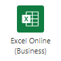

# <a name="start-using-scripts-with-power-automate-preview"></a><span data-ttu-id="e4012-103">Starten der Verwendung von Skripts mit Power Automation (Vorschau)</span><span class="sxs-lookup"><span data-stu-id="e4012-103">Start using scripts with Power Automate (preview)</span></span>

<span data-ttu-id="e4012-104">In diesem Lernprogramm erfahren Sie, wie Sie ein Office-Skript für Excel im Internet mithilfe von [Power Automation](https://flow.microsoft.com)ausführen.</span><span class="sxs-lookup"><span data-stu-id="e4012-104">This tutorial teaches you how to run an Office Script for Excel on the web through [Power Automate](https://flow.microsoft.com).</span></span>

## <a name="prerequisites"></a><span data-ttu-id="e4012-105">Voraussetzungen</span><span class="sxs-lookup"><span data-stu-id="e4012-105">Prerequisites</span></span>

[!INCLUDE [Tutorial prerequisites](../includes/tutorial-prerequisites.md)]

> [!IMPORTANT]
> <span data-ttu-id="e4012-106">In diesem Lernprogramm wird davon ausgegangen, dass Sie den [Datensatz, bearbeiten und Erstellen von Office-Skripts in Excel](excel-tutorial.md) im Webtutorial abgeschlossen haben.</span><span class="sxs-lookup"><span data-stu-id="e4012-106">This tutorial assumes you have completed the [Record, edit, and create Office Scripts in Excel on the web](excel-tutorial.md) tutorial.</span></span>

## <a name="prepare-the-workbook"></a><span data-ttu-id="e4012-107">Vorbereiten der Arbeitsmappe</span><span class="sxs-lookup"><span data-stu-id="e4012-107">Prepare the workbook</span></span>

<span data-ttu-id="e4012-108">Power Automation kann keine relativen Verweise wie `Workbook.getActiveWorksheet` den Zugriff auf Arbeitsmappen-Komponenten verwenden.</span><span class="sxs-lookup"><span data-stu-id="e4012-108">Power Automate can't use relative references like `Workbook.getActiveWorksheet` to access workbook components.</span></span> <span data-ttu-id="e4012-109">Daher benötigen wir eine Arbeitsmappe und ein Arbeitsblatt mit konsistenten Namen, auf die Power Automation verweisen kann.</span><span class="sxs-lookup"><span data-stu-id="e4012-109">So, we need a workbook and worksheet with consistent names that Power Automate can reference.</span></span>

1. <span data-ttu-id="e4012-110">Erstellen Sie eine neue Arbeitsmappe mit dem Namen **myworkbook**.</span><span class="sxs-lookup"><span data-stu-id="e4012-110">Create a new workbook named **MyWorkbook**.</span></span>

2. <span data-ttu-id="e4012-111">Erstellen Sie in der Arbeitsmappe **myworkbook** ein Arbeitsblatt mit dem Namen **TutorialWorksheet**.</span><span class="sxs-lookup"><span data-stu-id="e4012-111">In the **MyWorkbook** workbook, create a worksheet called **TutorialWorksheet**.</span></span>

## <a name="create-an-office-script"></a><span data-ttu-id="e4012-112">Erstellen eines Office-Skripts</span><span class="sxs-lookup"><span data-stu-id="e4012-112">Create an Office Script</span></span>

1. <span data-ttu-id="e4012-113">Wechseln Sie zur Registerkarte **automatisieren** , und wählen Sie **Code-Editor**aus.</span><span class="sxs-lookup"><span data-stu-id="e4012-113">Go to the **Automate** tab and select **Code Editor**.</span></span>

2. <span data-ttu-id="e4012-114">Wählen Sie **Neues Skript**aus.</span><span class="sxs-lookup"><span data-stu-id="e4012-114">Select **New Script**.</span></span>

3. <span data-ttu-id="e4012-115">Ersetzen Sie das Standardskript durch das folgende Skript.</span><span class="sxs-lookup"><span data-stu-id="e4012-115">Replace the default script with the following script.</span></span> <span data-ttu-id="e4012-116">Dieses Skript fügt das aktuelle Datum und die Uhrzeit den ersten beiden Zellen des **TutorialWorksheet** -Arbeitsblatts hinzu.</span><span class="sxs-lookup"><span data-stu-id="e4012-116">This script adds the current date and time to the first two cells of the **TutorialWorksheet** worksheet.</span></span>

    ```TypeScript
    function main(workbook: ExcelScript.Workbook) {
      // Get the "TutorialWorksheet" worksheet from the workbook.
      let worksheet = workbook.getWorksheet("TutorialWorksheet");

      // Get the cells at A1 and B1.
      let dateRange = worksheet.getRange("A1");
      let timeRange = worksheet.getRange("B1");

      // Get the current date and time using the JavaScript Date object.
      let date = new Date(Date.now());

      // Add the date string to A1.
      dateRange.setValue(date.toLocaleDateString());

      // Add the time string to B1.
      timeRange.setValue(date.toLocaleTimeString());
    }
    ```

4. <span data-ttu-id="e4012-117">Benennen Sie das Skript so um, dass **Datum und Uhrzeit festgelegt**werden.</span><span class="sxs-lookup"><span data-stu-id="e4012-117">Rename the script to **Set date and time**.</span></span> <span data-ttu-id="e4012-118">Drücken Sie den Skriptnamen, um ihn zu ändern.</span><span class="sxs-lookup"><span data-stu-id="e4012-118">Press the script name to change it.</span></span>

5. <span data-ttu-id="e4012-119">Speichern Sie das Skript durch Drücken von **Save Script**.</span><span class="sxs-lookup"><span data-stu-id="e4012-119">Save the script by pressing **Save Script**.</span></span>

## <a name="create-an-automated-workflow-with-power-automate"></a><span data-ttu-id="e4012-120">Erstellen eines automatisierten Workflows mit Power Automation</span><span class="sxs-lookup"><span data-stu-id="e4012-120">Create an automated workflow with Power Automate</span></span>

1. <span data-ttu-id="e4012-121">Melden Sie sich bei der [Power Automation Preview-Website](https://flow.microsoft.com)an.</span><span class="sxs-lookup"><span data-stu-id="e4012-121">Sign in to the [Power Automate preview site](https://flow.microsoft.com).</span></span>

2. <span data-ttu-id="e4012-122">Klicken Sie im Menü, das auf der linken Seite des Bildschirms angezeigt wird, auf **Erstellen**.</span><span class="sxs-lookup"><span data-stu-id="e4012-122">In the menu that's displayed on the left side of the screen, press **Create**.</span></span> <span data-ttu-id="e4012-123">Damit gelangen Sie zur Liste der Möglichkeiten zum Erstellen neuer Workflows.</span><span class="sxs-lookup"><span data-stu-id="e4012-123">This brings you to list of ways to create new workflows.</span></span>

    

3. <span data-ttu-id="e4012-125">Wählen Sie im Abschnitt **Anfang von leerer** **Sofortnachrichten Fluss**aus.</span><span class="sxs-lookup"><span data-stu-id="e4012-125">In the **Start from blank** section, select **Instant flow**.</span></span> <span data-ttu-id="e4012-126">Dadurch wird ein manuell aktivierter Workflow erstellt.</span><span class="sxs-lookup"><span data-stu-id="e4012-126">This creates a manually activated workflow.</span></span>

    

4. <span data-ttu-id="e4012-128">Geben Sie im Dialogfeld, das angezeigt wird, im Textfeld **Fluss Name** einen Namen für den Fluss ein, und wählen Sie in der Liste der Optionen unter **Wählen Sie aus, wie der Fluss ausgelöst**wird **einen Fluss** aus, und klicken Sie dann auf **Erstellen**.</span><span class="sxs-lookup"><span data-stu-id="e4012-128">In the dialog window that appears, enter a name for your flow in the **Flow name** text box, select **Manually trigger a flow** from the list of options under **Choose how to trigger the flow**, and press **Create**.</span></span>

    

5. <span data-ttu-id="e4012-130">Klicken Sie auf **New Step**.</span><span class="sxs-lookup"><span data-stu-id="e4012-130">Press **New step**.</span></span>

6. <span data-ttu-id="e4012-131">Wählen Sie die Registerkarte **Standard** aus, und wählen Sie dann **Excel Online (Business)** aus.</span><span class="sxs-lookup"><span data-stu-id="e4012-131">Select the **Standard** tab, then select **Excel Online (Business)**.</span></span>

    

7. <span data-ttu-id="e4012-133">Wählen Sie unter **Aktionen**die Option **Skript ausführen (Vorschau)** aus.</span><span class="sxs-lookup"><span data-stu-id="e4012-133">Under **Actions**, select **Run script (preview)**.</span></span>

    

8. <span data-ttu-id="e4012-135">Geben Sie die folgenden Einstellungen für den **Run Script** Connector an:</span><span class="sxs-lookup"><span data-stu-id="e4012-135">Specify the following settings for the **Run script** connector:</span></span>

    - <span data-ttu-id="e4012-136">**Speicherort**: OneDrive für Unternehmen</span><span class="sxs-lookup"><span data-stu-id="e4012-136">**Location**: OneDrive for Business</span></span>
    - <span data-ttu-id="e4012-137">**Dokumentbibliothek**: OneDrive</span><span class="sxs-lookup"><span data-stu-id="e4012-137">**Document Library**: OneDrive</span></span>
    - <span data-ttu-id="e4012-138">**Datei**: MyWorkbook.xlsx</span><span class="sxs-lookup"><span data-stu-id="e4012-138">**File**: MyWorkbook.xlsx</span></span>
    - <span data-ttu-id="e4012-139">**Skript**: Festlegen von Datum und Uhrzeit</span><span class="sxs-lookup"><span data-stu-id="e4012-139">**Script**: Set date and time</span></span>

    

9. <span data-ttu-id="e4012-141">Klicken Sie auf **Speichern**.</span><span class="sxs-lookup"><span data-stu-id="e4012-141">Press **Save**.</span></span>

<span data-ttu-id="e4012-142">Ihr Flow kann nun über Power Automation ausgeführt werden.</span><span class="sxs-lookup"><span data-stu-id="e4012-142">Your flow is now ready to be run through Power Automate.</span></span> <span data-ttu-id="e4012-143">Sie können es mit der Schaltfläche **Test** im Flow-Editor testen oder die restlichen Lernprogramm Schritte durchführen, um den Fluss aus ihrer Flow-Auflistung auszuführen.</span><span class="sxs-lookup"><span data-stu-id="e4012-143">You can test it using the **Test** button in the flow editor or follow the remaining tutorial steps to run the flow from your flow collection.</span></span>

## <a name="run-the-script-through-power-automate"></a><span data-ttu-id="e4012-144">Ausführen des Skripts über Power Automation</span><span class="sxs-lookup"><span data-stu-id="e4012-144">Run the script through Power Automate</span></span>

1. <span data-ttu-id="e4012-145">Wählen Sie auf der Seite Main Power automatisieren die Option **meine Flows**aus.</span><span class="sxs-lookup"><span data-stu-id="e4012-145">From the main Power Automate page, select **My flows**.</span></span>

    

2. <span data-ttu-id="e4012-147">Wählen Sie in der Liste der auf der Registerkarte **meine Flows** angezeigten Flows den **Lernprogramm Fluss** aus. Dies zeigt die Details des Datenstroms, den wir zuvor erstellt haben.</span><span class="sxs-lookup"><span data-stu-id="e4012-147">Select **My tutorial flow** from the list of flows displayed in the **My flows** tab. This shows the details of the flow we previously created.</span></span>

3. <span data-ttu-id="e4012-148">Drücken Sie **Run**.</span><span class="sxs-lookup"><span data-stu-id="e4012-148">Press **Run**.</span></span>

    

4. <span data-ttu-id="e4012-150">Ein Aufgabenbereich wird zum Ausführen des Flusses angezeigt.</span><span class="sxs-lookup"><span data-stu-id="e4012-150">A task pane will appear for running the flow.</span></span> <span data-ttu-id="e4012-151">Wenn Sie aufgefordert werden, sich **bei Excel online anzumelden** , tun Sie dies, indem Sie auf **weiter**klicken.</span><span class="sxs-lookup"><span data-stu-id="e4012-151">If you are asked to **Sign in** to Excel Online, do so by pressing **Continue**.</span></span>

5. <span data-ttu-id="e4012-152">Drücken Sie die **Ablaufsteuerung**.</span><span class="sxs-lookup"><span data-stu-id="e4012-152">Press **Run flow**.</span></span> <span data-ttu-id="e4012-153">Dadurch wird der Fluss ausgeführt, der das zugehörige Office-Skript ausführt.</span><span class="sxs-lookup"><span data-stu-id="e4012-153">This runs the flow, which runs the related Office Script.</span></span>

6. <span data-ttu-id="e4012-154">Klicken Sie auf **Fertig**.</span><span class="sxs-lookup"><span data-stu-id="e4012-154">Press **Done**.</span></span> <span data-ttu-id="e4012-155">Sie sollten den Abschnitt **Runs** entsprechend aktualisieren sehen.</span><span class="sxs-lookup"><span data-stu-id="e4012-155">You should see the **Runs** section update accordingly.</span></span>

7. <span data-ttu-id="e4012-156">Aktualisieren Sie die Seite, um die Ergebnisse der Power-Automatisierung anzuzeigen.</span><span class="sxs-lookup"><span data-stu-id="e4012-156">Refresh the page to see the results of the Power Automate.</span></span> <span data-ttu-id="e4012-157">Wenn es gelungen ist, wechseln Sie zur Arbeitsmappe, um die aktualisierten Zellen anzuzeigen.</span><span class="sxs-lookup"><span data-stu-id="e4012-157">If it succeeded, go to the workbook to see the updated cells.</span></span> <span data-ttu-id="e4012-158">Wenn ein Fehler aufgetreten ist, überprüfen Sie die Fluss Einstellungen, und führen Sie ihn ein zweites Mal aus.</span><span class="sxs-lookup"><span data-stu-id="e4012-158">If it failed, verify the flow's settings and run it a second time.</span></span>

    

## <a name="next-steps"></a><span data-ttu-id="e4012-160">Nächste Schritte</span><span class="sxs-lookup"><span data-stu-id="e4012-160">Next steps</span></span>

<span data-ttu-id="e4012-161">Führen Sie die [automatisch ausgeführten Skripts mit Power automatisieren Tutorial aus](excel-power-automate-trigger.md) .</span><span class="sxs-lookup"><span data-stu-id="e4012-161">Complete the [Automatically run scripts with Power Automate](excel-power-automate-trigger.md) tutorial.</span></span> <span data-ttu-id="e4012-162">Hier erfahren Sie, wie Sie Daten aus einem Workflowdienst an Ihr Office-Skript übergeben.</span><span class="sxs-lookup"><span data-stu-id="e4012-162">It teaches you how to pass data from a workflow service to your Office Script.</span></span>
