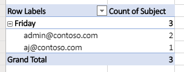

# <a name="automatically-run-scripts-with-power-automate-preview"></a><span data-ttu-id="94a44-103">Automatisches Ausführen von Skripts mit Power Automation (Vorschau)</span><span class="sxs-lookup"><span data-stu-id="94a44-103">Automatically run scripts with Power Automate (preview)</span></span>

<span data-ttu-id="94a44-104">In diesem Lernprogramm erfahren Sie, wie Sie ein Office-Skript für Excel im Internet mit einem automatisierten [Power-Automatisierungs](https://flow.microsoft.com) Workflow verwenden.</span><span class="sxs-lookup"><span data-stu-id="94a44-104">This tutorial teaches you how to use an Office Script for Excel on the web with an automated [Power Automate](https://flow.microsoft.com) workflow.</span></span> <span data-ttu-id="94a44-105">Ihr Skript wird automatisch jedes Mal ausgeführt, wenn Sie eine e-Mail erhalten, und es werden Informationen aus der e-Mail in einer Excel-Arbeitsmappe aufgezeichnet.</span><span class="sxs-lookup"><span data-stu-id="94a44-105">Your script will automatically run each time you receive an email, recording information from the email in an Excel workbook.</span></span>

## <a name="prerequisites"></a><span data-ttu-id="94a44-106">Voraussetzungen</span><span class="sxs-lookup"><span data-stu-id="94a44-106">Prerequisites</span></span>

[!INCLUDE [Tutorial prerequisites](../includes/tutorial-prerequisites.md)]

> [!IMPORTANT]
> <span data-ttu-id="94a44-107">In diesem Lernprogramm wird davon ausgegangen, dass Sie das Tutorial [Ausführen von Office-Skripts in Excel im Internet mit Power automatisieren](excel-power-automate-manual.md) abgeschlossen haben.</span><span class="sxs-lookup"><span data-stu-id="94a44-107">This tutorial assumes you have completed the [Run Office Scripts in Excel on the web with Power Automate](excel-power-automate-manual.md) tutorial.</span></span>

## <a name="prepare-the-workbook"></a><span data-ttu-id="94a44-108">Vorbereiten der Arbeitsmappe</span><span class="sxs-lookup"><span data-stu-id="94a44-108">Prepare the workbook</span></span>

<span data-ttu-id="94a44-109">Power Automation kann keine [relativen Verweise](../develop/power-automate-integration.md#avoid-using-relative-references) wie `Workbook.getActiveWorksheet` den Zugriff auf Arbeitsmappen-Komponenten verwenden.</span><span class="sxs-lookup"><span data-stu-id="94a44-109">Power Automate can't use [relative references](../develop/power-automate-integration.md#avoid-using-relative-references) like `Workbook.getActiveWorksheet` to access workbook components.</span></span> <span data-ttu-id="94a44-110">Daher benötigen wir eine Arbeitsmappe und ein Arbeitsblatt mit konsistenten Namen für Power Automation to Reference.</span><span class="sxs-lookup"><span data-stu-id="94a44-110">So, we need a workbook and worksheet with consistent names for Power Automate to reference.</span></span>

1. <span data-ttu-id="94a44-111">Erstellen Sie eine neue Arbeitsmappe mit dem Namen **myworkbook**.</span><span class="sxs-lookup"><span data-stu-id="94a44-111">Create a new workbook named **MyWorkbook**.</span></span>

2. <span data-ttu-id="94a44-112">Wechseln Sie zur Registerkarte **automatisieren** , und wählen Sie **Code-Editor**aus.</span><span class="sxs-lookup"><span data-stu-id="94a44-112">Go to the **Automate** tab and select **Code Editor**.</span></span>

3. <span data-ttu-id="94a44-113">Wählen Sie **Neues Skript**aus.</span><span class="sxs-lookup"><span data-stu-id="94a44-113">Select **New Script**.</span></span>

4. <span data-ttu-id="94a44-114">Ersetzen Sie den vorhandenen Code durch das folgende Skript, und drücken Sie **Run**.</span><span class="sxs-lookup"><span data-stu-id="94a44-114">Replace the existing code with the following script and press **Run**.</span></span> <span data-ttu-id="94a44-115">Dadurch wird die Arbeitsmappe mit konsistenten Tabellen-, Tabellen-und PivotTable-Namen eingerichtet.</span><span class="sxs-lookup"><span data-stu-id="94a44-115">This will setup the workbook with consistent worksheet, table, and PivotTable names.</span></span>

    ```TypeScript
    function main(workbook: ExcelScript.Workbook) {
      // Add a new worksheet to store our email table
      let emailsSheet = workbook.addWorksheet("Emails");

      // Add data and create a table
      emailsSheet.getRange("A1:D1").setValues([
        ["Date", "Day of the week", "Email address", "Subject"]
      ]);
      let newTable = workbook.addTable(emailsSheet.getRange("A1:D2"), true);
      newTable.setName("EmailTable");

      // Add a new PivotTable to a new worksheet
      let pivotWorksheet = workbook.addWorksheet("SubjectPivot");
      let newPivotTable = workbook.addPivotTable("Pivot", "EmailTable", pivotWorksheet.getRange("A3:C20"));

      // Setup the pivot hierarchies
      newPivotTable.addRowHierarchy(newPivotTable.getHierarchy("Day of the week"));
      newPivotTable.addRowHierarchy(newPivotTable.getHierarchy("Email address"));
      newPivotTable.addDataHierarchy(newPivotTable.getHierarchy("Subject"));
    }
    ```

## <a name="create-an-office-script-for-your-automated-workflow"></a><span data-ttu-id="94a44-116">Erstellen eines Office-Skripts für Ihren automatisierten Workflow</span><span class="sxs-lookup"><span data-stu-id="94a44-116">Create an Office Script for your automated workflow</span></span>

<span data-ttu-id="94a44-117">Lassen Sie uns ein Skript erstellen, das Informationen aus einer e-Mail protokolliert.</span><span class="sxs-lookup"><span data-stu-id="94a44-117">Let's create a script that logs information from an email.</span></span> <span data-ttu-id="94a44-118">Wir möchten wissen, wie an welchen Wochentagen die meisten e-Mails empfangen werden und wie viele eindeutige Absender diese e-Mail senden.</span><span class="sxs-lookup"><span data-stu-id="94a44-118">We want to know how which days of the week we receive the most mail and how many unique senders are sending that mail.</span></span> <span data-ttu-id="94a44-119">Unsere Arbeitsmappe enthält eine Tabelle mit **Datum**, **Wochentag**, **e-Mail-Adresse**und **Betreff** -Spalten.</span><span class="sxs-lookup"><span data-stu-id="94a44-119">Our workbook has a table with **Date**, **Day of the week**, **Email address**, and **Subject** columns.</span></span> <span data-ttu-id="94a44-120">Unser Arbeitsblatt verfügt auch über eine PivotTable, die am **Tag der Woche** und der **e-Mail-Adresse** (Dies sind die Zeilen Hierarchien) pivotiert.</span><span class="sxs-lookup"><span data-stu-id="94a44-120">Our worksheet also has a PivotTable that is pivoting on the **Day of the week** and **Email address** (those are the row hierarchies).</span></span> <span data-ttu-id="94a44-121">Die Anzahl der eindeutigen **Subjekte** ist die aggregierte Information, die angezeigt wird (die Datenhierarchie).</span><span class="sxs-lookup"><span data-stu-id="94a44-121">The count of unique **Subjects** is the aggregated information being displayed (the data hierarchy).</span></span> <span data-ttu-id="94a44-122">Unser Skript aktualisiert diese PivotTable nach dem Aktualisieren der e-Mail-Tabelle.</span><span class="sxs-lookup"><span data-stu-id="94a44-122">We'll have our script refresh that PivotTable after updating the email table.</span></span>

1. <span data-ttu-id="94a44-123">Wählen Sie im **Code-Editor**die Option **Neues Skript**aus.</span><span class="sxs-lookup"><span data-stu-id="94a44-123">From within the **Code Editor**, select **New Script**.</span></span>

2. <span data-ttu-id="94a44-124">Der Ablauf, den wir später im Lernprogramm erstellen werden, sendet unsere Skript Informationen zu jeder empfangenen e-Mail.</span><span class="sxs-lookup"><span data-stu-id="94a44-124">The flow that we'll create later in the tutorial will send our script information about each email that's received.</span></span> <span data-ttu-id="94a44-125">Das Skript muss diese Eingabe über Parameter in der `main` -Funktion akzeptieren.</span><span class="sxs-lookup"><span data-stu-id="94a44-125">The script needs to accept that input through parameters in the `main` function.</span></span> <span data-ttu-id="94a44-126">Ersetzen Sie das Standardskript durch das folgende Skript:</span><span class="sxs-lookup"><span data-stu-id="94a44-126">Replace the default script with the following script:</span></span>

    ```TypeScript
    function main(
      workbook: ExcelScript.Workbook,
      from: string,
      dateReceived: string,
      subject: string) {

    }
    ```

3. <span data-ttu-id="94a44-127">Das Skript benötigt Zugriff auf die Tabelle und die PivotTable der Arbeitsmappe.</span><span class="sxs-lookup"><span data-stu-id="94a44-127">The script needs access to the workbook's table and PivotTable.</span></span> <span data-ttu-id="94a44-128">Fügen Sie nach dem Öffnen den folgenden Code zum Text des Skripts hinzu `{` :</span><span class="sxs-lookup"><span data-stu-id="94a44-128">Add the following code to the body of the script, after the opening `{`:</span></span>

    ```TypeScript
    // Get the email table.
    let emailWorksheet = workbook.getWorksheet("Emails");
    let table = emailWorksheet.getTable("EmailTable");
  
    // Get the PivotTable.
    let pivotTableWorksheet = workbook.getWorksheet("SubjectPivot");
    let pivotTable = pivotTableWorksheet.getPivotTable("Pivot");
    ```

4. <span data-ttu-id="94a44-129">Der- `dateReceived` Parameter ist vom Typ `string` .</span><span class="sxs-lookup"><span data-stu-id="94a44-129">The `dateReceived` parameter is of type `string`.</span></span> <span data-ttu-id="94a44-130">Let es Convert, dass ein [ `Date` Objekt](../develop/javascript-objects.md#date) , damit wir ganz einfach den Tag der Woche erhalten können.</span><span class="sxs-lookup"><span data-stu-id="94a44-130">Let's convert that to a [`Date` object](../develop/javascript-objects.md#date) so we can easily get the day of the week.</span></span> <span data-ttu-id="94a44-131">Anschließend müssen wir den Zahlenwert des Tages einer besser lesbaren Version zuordnen.</span><span class="sxs-lookup"><span data-stu-id="94a44-131">After doing that, we'll need to map the day's number value to a more readable version.</span></span> <span data-ttu-id="94a44-132">Fügen Sie den folgenden Code am Ende Ihres Skripts vor dem Schließen hinzu `}` :</span><span class="sxs-lookup"><span data-stu-id="94a44-132">Add the following code to the end of your script, before the closing `}`:</span></span>

    ```TypeScript
    // Parse the received date string.
    let date = new Date(dateReceived);

    // Convert number representing the day of the week into the name of the day.
    let dayText : string;
    switch (date.getDay()) {
      case 0:
        dayText = "Sunday";
        break;
      case 1:
        dayText = "Monday";
        break;
      case 2:
        dayText = "Tuesday";
        break;
      case 3:
        dayText = "Wednesday";
        break;
      case 4:
        dayText = "Thursday";
        break;
      case 5:
        dayText = "Friday";
        break;
      default:
        dayText = "Saturday";
        break;
    }
    ```

5. <span data-ttu-id="94a44-133">Die `subject` Zeichenfolge kann das Antwort-Tag "Re:" enthalten.</span><span class="sxs-lookup"><span data-stu-id="94a44-133">The `subject` string may include the "RE:" reply tag.</span></span> <span data-ttu-id="94a44-134">Lassen Sie uns diese aus der Zeichenfolge entfernen, damit e-Mails im gleichen Thread denselben Betreff für die Tabelle haben.</span><span class="sxs-lookup"><span data-stu-id="94a44-134">Let's remove that from the string so that emails in the same thread have the same subject for the table.</span></span> <span data-ttu-id="94a44-135">Fügen Sie den folgenden Code am Ende Ihres Skripts vor dem Schließen hinzu `}` :</span><span class="sxs-lookup"><span data-stu-id="94a44-135">Add the following code to the end of your script, before the closing `}`:</span></span>

    ```TypeScript
    // Remove the reply tag from the email subject to group emails on the same thread.
    let subjectText = subject.replace("Re: ", "");
    subjectText = subjectText.replace("RE: ", "");
    ```

6. <span data-ttu-id="94a44-136">Nachdem die e-Mail-Daten nach unserem Geschmack formatiert wurden, fügen wir der e-Mail-Tabelle eine Zeile hinzu.</span><span class="sxs-lookup"><span data-stu-id="94a44-136">Now that the email data has been formatted to our liking, let's add a row to the email table.</span></span> <span data-ttu-id="94a44-137">Fügen Sie den folgenden Code am Ende Ihres Skripts vor dem Schließen hinzu `}` :</span><span class="sxs-lookup"><span data-stu-id="94a44-137">Add the following code to the end of your script, before the closing `}`:</span></span>

    ```TypeScript
    // Add the parsed text to the table.
    table.addRow(-1, [dateReceived, dayText, from, subjectText]);
    ```

7. <span data-ttu-id="94a44-138">Lassen Sie uns schließlich sicherstellen, dass die PivotTable aktualisiert wird.</span><span class="sxs-lookup"><span data-stu-id="94a44-138">Finally, let's make sure the PivotTable is refreshed.</span></span> <span data-ttu-id="94a44-139">Fügen Sie den folgenden Code am Ende Ihres Skripts vor dem Schließen hinzu `}` :</span><span class="sxs-lookup"><span data-stu-id="94a44-139">Add the following code to the end of your script, before the closing `}`:</span></span>

    ```TypeScript
    // Refresh the PivotTable to include the new row.
    pivotTable.refresh();
    ```

8. <span data-ttu-id="94a44-140">Benennen Sie die **e-Mail-Skriptaufzeichnung** um, und drücken Sie **Skript speichern**.</span><span class="sxs-lookup"><span data-stu-id="94a44-140">Rename your script **Record Email** and press **Save script**.</span></span>

<span data-ttu-id="94a44-141">Ihr Skript ist jetzt für einen Power automatisieren-Workflow verfügbar.</span><span class="sxs-lookup"><span data-stu-id="94a44-141">Your script is now ready for a Power Automate workflow.</span></span> <span data-ttu-id="94a44-142">Es sollte wie das folgende Skript aussehen:</span><span class="sxs-lookup"><span data-stu-id="94a44-142">It should look like the following script:</span></span>

```TypeScript
function main(
  workbook: ExcelScript.Workbook,
  from: string,
  dateReceived: string,
  subject: string) {
  // Get the email table.
  let emailWorksheet = workbook.getWorksheet("Emails");
  let table = emailWorksheet.getTable("EmailTable");

  // Get the PivotTable.
  let pivotTableWorksheet = workbook.getWorksheet("Pivot");
  let pivotTable = pivotTableWorksheet.getPivotTable("SubjectPivot");

  // Parse the received date string.
  let date = new Date(dateReceived);

  // Convert number representing the day of the week into the name of the day.
  let dayText: string;
  switch (date.getDay()) {
    case 0:
      dayText = "Sunday";
      break;
    case 1:
      dayText = "Monday";
      break;
    case 2:
      dayText = "Tuesday";
      break;
    case 3:
      dayText = "Wednesday";
      break;
    case 4:
      dayText = "Thursday";
      break;
    case 5:
      dayText = "Friday";
      break;
    default:
      dayText = "Saturday";
      break;
  }

  // Remove the reply tag from the email subject to group emails on the same thread.
  let subjectText = subject.replace("Re: ", "");
  subjectText = subjectText.replace("RE: ", "");

  // Add the parsed text to the table.
  table.addRow(-1, [dateReceived, dayText, from, subjectText]);

  // Refresh the PivotTable to include the new row.
  pivotTable.refresh();
}
```

## <a name="create-an-automated-workflow-with-power-automate"></a><span data-ttu-id="94a44-143">Erstellen eines automatisierten Workflows mit Power Automation</span><span class="sxs-lookup"><span data-stu-id="94a44-143">Create an automated workflow with Power Automate</span></span>

1. <span data-ttu-id="94a44-144">Melden Sie sich bei der [Power Automation Preview-Website](https://flow.microsoft.com)an.</span><span class="sxs-lookup"><span data-stu-id="94a44-144">Sign in to the [Power Automate preview site](https://flow.microsoft.com).</span></span>

2. <span data-ttu-id="94a44-145">Klicken Sie im Menü, das auf der linken Seite des Bildschirms angezeigt wird, auf **Erstellen**.</span><span class="sxs-lookup"><span data-stu-id="94a44-145">In the menu that's displayed on the left side of the screen, press **Create**.</span></span> <span data-ttu-id="94a44-146">Damit gelangen Sie zur Liste der Möglichkeiten zum Erstellen neuer Workflows.</span><span class="sxs-lookup"><span data-stu-id="94a44-146">This brings you to list of ways to create new workflows.</span></span>

    

3. <span data-ttu-id="94a44-148">Wählen Sie im Abschnitt **Anfang von leer** den Eintrag **automatischer Fluss**aus.</span><span class="sxs-lookup"><span data-stu-id="94a44-148">In the **Start from blank** section, select **Automated flow**.</span></span> <span data-ttu-id="94a44-149">Dadurch wird ein Workflow erstellt, der durch ein Ereignis ausgelöst wird, beispielsweise das Empfangen einer e-Mail.</span><span class="sxs-lookup"><span data-stu-id="94a44-149">This creates a workflow triggered by an event, such as receiving an email.</span></span>

    

4. <span data-ttu-id="94a44-151">Geben Sie im angezeigten Dialogfeld einen Namen für den Fluss in das Textfeld **Fluss Name** ein.</span><span class="sxs-lookup"><span data-stu-id="94a44-151">In the dialog window that appears, enter a name for your flow in the **Flow name** text box.</span></span> <span data-ttu-id="94a44-152">Wählen Sie dann, **Wenn eine neue e-Mail** aus der Liste der Optionen unter **Choose your Flow es Trigger**kommt.</span><span class="sxs-lookup"><span data-stu-id="94a44-152">Then select **When a new email arrives** from the list of options under **Choose your flow's trigger**.</span></span> <span data-ttu-id="94a44-153">Möglicherweise müssen Sie mithilfe des Felds Suchen nach der Option suchen.</span><span class="sxs-lookup"><span data-stu-id="94a44-153">You may need to search for the option using the search box.</span></span> <span data-ttu-id="94a44-154">Klicken Sie abschließend auf **Erstellen**.</span><span class="sxs-lookup"><span data-stu-id="94a44-154">Finally, press **Create**.</span></span>

    

    > [!NOTE]
    > <span data-ttu-id="94a44-156">In diesem Lernprogramm wird Outlook verwendet.</span><span class="sxs-lookup"><span data-stu-id="94a44-156">This tutorial uses Outlook.</span></span> <span data-ttu-id="94a44-157">Fühlen Sie sich frei, stattdessen Ihren bevorzugten e-Mail-Dienst zu verwenden, obwohl einige Optionen unterschiedlich sein können.</span><span class="sxs-lookup"><span data-stu-id="94a44-157">Feel free to use your preferred email service instead, though some options may be different.</span></span>

5. <span data-ttu-id="94a44-158">Klicken Sie auf **New Step**.</span><span class="sxs-lookup"><span data-stu-id="94a44-158">Press **New step**.</span></span>

6. <span data-ttu-id="94a44-159">Wählen Sie die Registerkarte **Standard** aus, und wählen Sie dann **Excel Online (Business)** aus.</span><span class="sxs-lookup"><span data-stu-id="94a44-159">Select the **Standard** tab, then select **Excel Online (Business)**.</span></span>

    

7. <span data-ttu-id="94a44-161">Wählen Sie unter **Aktionen**die Option **Skript ausführen (Vorschau)** aus.</span><span class="sxs-lookup"><span data-stu-id="94a44-161">Under **Actions**, select **Run script (preview)**.</span></span>

    

8. <span data-ttu-id="94a44-163">Geben Sie die folgenden Einstellungen für den **Run Script** Connector an:</span><span class="sxs-lookup"><span data-stu-id="94a44-163">Specify the following settings for the **Run script** connector:</span></span>

    - <span data-ttu-id="94a44-164">**Speicherort**: OneDrive für Unternehmen</span><span class="sxs-lookup"><span data-stu-id="94a44-164">**Location**: OneDrive for Business</span></span>
    - <span data-ttu-id="94a44-165">**Dokumentbibliothek**: OneDrive</span><span class="sxs-lookup"><span data-stu-id="94a44-165">**Document Library**: OneDrive</span></span>
    - <span data-ttu-id="94a44-166">**Datei**: MyWorkbook.xlsx</span><span class="sxs-lookup"><span data-stu-id="94a44-166">**File**: MyWorkbook.xlsx</span></span>
    - <span data-ttu-id="94a44-167">**Skript**: Aufzeichnen von e-Mails</span><span class="sxs-lookup"><span data-stu-id="94a44-167">**Script**: Record Email</span></span>
    - <span data-ttu-id="94a44-168">**von**: from *(dynamischer Inhalt aus Outlook)*</span><span class="sxs-lookup"><span data-stu-id="94a44-168">**from**: From *(dynamic content from Outlook)*</span></span>
    - <span data-ttu-id="94a44-169">**dateReceived**: Empfangszeit *(dynamischer Inhalt aus Outlook)*</span><span class="sxs-lookup"><span data-stu-id="94a44-169">**dateReceived**: Received Time *(dynamic content from Outlook)*</span></span>
    - <span data-ttu-id="94a44-170">**Betreff**: Subject *(dynamischer Inhalt aus Outlook)*</span><span class="sxs-lookup"><span data-stu-id="94a44-170">**subject**: Subject *(dynamic content from Outlook)*</span></span>

    <span data-ttu-id="94a44-171">*Beachten Sie, dass die Parameter für das Skript nur dann angezeigt werden, wenn das Skript ausgewählt ist.*</span><span class="sxs-lookup"><span data-stu-id="94a44-171">*Note that the parameters for the script will only appear once the script is selected.*</span></span>

    

9. <span data-ttu-id="94a44-173">Klicken Sie auf **Speichern**.</span><span class="sxs-lookup"><span data-stu-id="94a44-173">Press **Save**.</span></span>

<span data-ttu-id="94a44-174">Ihr Flow ist jetzt aktiviert.</span><span class="sxs-lookup"><span data-stu-id="94a44-174">Your flow is now enabled.</span></span> <span data-ttu-id="94a44-175">Jedes Mal, wenn Sie eine e-Mail über Outlook erhalten, wird das Skript automatisch ausgeführt.</span><span class="sxs-lookup"><span data-stu-id="94a44-175">It will automatically run your script each time you receive an email through Outlook.</span></span>

## <a name="manage-the-script-in-power-automate"></a><span data-ttu-id="94a44-176">Verwalten des Skripts in Power Automation</span><span class="sxs-lookup"><span data-stu-id="94a44-176">Manage the script in Power Automate</span></span>

1. <span data-ttu-id="94a44-177">Wählen Sie auf der Seite Main Power automatisieren die Option **meine Flows**aus.</span><span class="sxs-lookup"><span data-stu-id="94a44-177">From the main Power Automate page, select **My flows**.</span></span>

    

2. <span data-ttu-id="94a44-179">Wählen Sie den Fluss aus.</span><span class="sxs-lookup"><span data-stu-id="94a44-179">Select your flow.</span></span> <span data-ttu-id="94a44-180">Hier können Sie den Ausführungsverlauf anzeigen.</span><span class="sxs-lookup"><span data-stu-id="94a44-180">Here you can see the run history.</span></span> <span data-ttu-id="94a44-181">Sie können die Seite aktualisieren oder die Schaltfläche **alle Läufe** aktualisieren drücken, um den Verlauf zu aktualisieren.</span><span class="sxs-lookup"><span data-stu-id="94a44-181">You can refresh the page or press the refresh **All runs** button to update the history.</span></span> <span data-ttu-id="94a44-182">Der Fluss wird kurz nach dem Empfang einer e-Mail ausgelöst.</span><span class="sxs-lookup"><span data-stu-id="94a44-182">The flow will trigger shortly after an email is received.</span></span> <span data-ttu-id="94a44-183">Testen Sie den Ablauf durch Senden von e-Mails.</span><span class="sxs-lookup"><span data-stu-id="94a44-183">Test the flow by sending yourself mail.</span></span>

<span data-ttu-id="94a44-184">Wenn der Fluss ausgelöst wird und Ihr Skript erfolgreich ausgeführt wird, sollten Sie die Tabelle und das PivotTable-Update der Arbeitsmappe sehen.</span><span class="sxs-lookup"><span data-stu-id="94a44-184">When the flow is triggered and successfully runs your script, you should see the workbook's table and PivotTable update.</span></span>




## <a name="next-steps"></a><span data-ttu-id="94a44-187">Nächste Schritte</span><span class="sxs-lookup"><span data-stu-id="94a44-187">Next steps</span></span>

<span data-ttu-id="94a44-188">Weitere Informationen zum Verbinden von Office-Skripts mit Power Automation finden Sie unter [integrieren von Office-Skripts mit Power Automation](../develop/power-automate-integration.md) .</span><span class="sxs-lookup"><span data-stu-id="94a44-188">Visit [Integrate Office Scripts with Power Automate](../develop/power-automate-integration.md) to learn more about connecting Office Scripts with Power Automate.</span></span>

<span data-ttu-id="94a44-189">Sie können auch das [Beispielszenario für automatisierte Aufgaben Erinnerungen](../resources/scenarios/task-reminders.md) lesen, um zu erfahren, wie Sie Office-Skripts und Power Automation mit Adaptive Teams-Karten kombinieren.</span><span class="sxs-lookup"><span data-stu-id="94a44-189">You can also check out the [Automated task reminders sample scenario](../resources/scenarios/task-reminders.md) to learn how to combine Office Scripts and Power Automate with Teams Adaptive Cards.</span></span>
