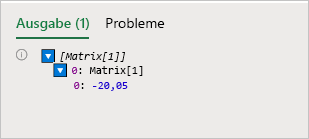
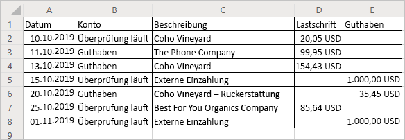

# <a name="read-workbook-data-with-office-scripts-in-excel-on-the-web"></a><span data-ttu-id="151c4-103">Lesen Sie Arbeitsmappendaten mit Office-Skripts in Excel im Web</span><span class="sxs-lookup"><span data-stu-id="151c4-103">Read workbook data with Office Scripts in Excel on the web</span></span>

<span data-ttu-id="151c4-104">In diesem Lernprogramm erfahren Sie, wie Sie Daten aus einer Arbeitsmappe mit einem Office-Skript für Excel im Web lesen.</span><span class="sxs-lookup"><span data-stu-id="151c4-104">This tutorial teaches you how to read data from a workbook with an Office Script for Excel on the web.</span></span> <span data-ttu-id="151c4-105">Anschließend bearbeiten Sie die gelesenen Daten und fügen sie wieder in die Arbeitsmappe ein.</span><span class="sxs-lookup"><span data-stu-id="151c4-105">You'll then edit the data you read and put it back in the workbook.</span></span>

> [!TIP]
> <span data-ttu-id="151c4-106">Wenn Sie mit Office-Skripten noch nicht vertraut sind, empfehlen wir, mit dem [Aufzeichnen, Bearbeiten und Erstellen von Office-Skripten in Excel im Web](excel-tutorial.md)-Lernprogramm zu beginnen.</span><span class="sxs-lookup"><span data-stu-id="151c4-106">If you are new to Office Scripts, we recommend starting with the [Record, edit, and create Office Scripts in Excel on the web](excel-tutorial.md) tutorial.</span></span>

## <a name="prerequisites"></a><span data-ttu-id="151c4-107">Voraussetzungen</span><span class="sxs-lookup"><span data-stu-id="151c4-107">Prerequisites</span></span>

[!INCLUDE [Tutorial prerequisites](../includes/tutorial-prerequisites.md)]

> [!IMPORTANT]
> <span data-ttu-id="151c4-108">Dieses Lernprogramm richtet sich an Anfänger bis Fortgeschrittene mit JavaScript oder TypeScript.</span><span class="sxs-lookup"><span data-stu-id="151c4-108">This tutorial is intended for people with beginner to intermediate-level knowledge of JavaScript or TypeScript.</span></span> <span data-ttu-id="151c4-109">Wenn Sie noch nicht mit JavaScript vertraut sind, empfehlen wir Ihnen, das [Mozilla-JavaScript-Lernprogramm](https://developer.mozilla.org/docs/Web/JavaScript/Guide/Introduction) durchzusehen.</span><span class="sxs-lookup"><span data-stu-id="151c4-109">If you're new to JavaScript, we recommend reviewing the [Mozilla JavaScript tutorial](https://developer.mozilla.org/docs/Web/JavaScript/Guide/Introduction).</span></span> <span data-ttu-id="151c4-110">Weitere Informationen über die Skriptumgebung finden Sie unter [Office-Skripts in Excel im Web](../overview/excel.md).</span><span class="sxs-lookup"><span data-stu-id="151c4-110">Visit [Office Scripts in Excel on the web](../overview/excel.md) to learn more about the script environment.</span></span>

## <a name="read-a-cell"></a><span data-ttu-id="151c4-111">Lesen einer Zelle</span><span class="sxs-lookup"><span data-stu-id="151c4-111">Read a cell</span></span>

<span data-ttu-id="151c4-112">Mit dem Action Recorder erstellte Skripte können nur Informationen in die Arbeitsmappe schreiben.</span><span class="sxs-lookup"><span data-stu-id="151c4-112">Scripts made with the Action Recorder can only write information to the workbook.</span></span> <span data-ttu-id="151c4-113">Mit dem Code-Editor können Sie Skripte bearbeiten und erstellen, die auch Daten aus einer Arbeitsmappe lesen.</span><span class="sxs-lookup"><span data-stu-id="151c4-113">With the Code Editor, you can edit and make scripts that also read data from a workbook.</span></span>

<span data-ttu-id="151c4-114">Lassen Sie uns ein Skript erstellen, das Daten liest und basierend auf dem Gelesenen agiert.</span><span class="sxs-lookup"><span data-stu-id="151c4-114">Let's make a script that reads data and acts based on what was read.</span></span> <span data-ttu-id="151c4-115">Wir werden mit einem Muster-Kontoauszug arbeiten.</span><span class="sxs-lookup"><span data-stu-id="151c4-115">We're going to work with a sample banking statement.</span></span> <span data-ttu-id="151c4-116">Diese Erklärung ist ein kombinierter Prüfungs- und Gutschrift-Kontoauszug.</span><span class="sxs-lookup"><span data-stu-id="151c4-116">This statement is a combined checking and credit statement.</span></span> <span data-ttu-id="151c4-117">Leider melden sie Bilanzänderungen unterschiedlich.</span><span class="sxs-lookup"><span data-stu-id="151c4-117">Unfortunately, they report balance changes differently.</span></span> <span data-ttu-id="151c4-118">Der Prüfungskontoauszug gibt die Einnahmen als positive Gutschrift und die Kosten als negative Belastung an.</span><span class="sxs-lookup"><span data-stu-id="151c4-118">The checking statement gives income as positive credit and costs as negative debit.</span></span> <span data-ttu-id="151c4-119">Der Gutschrift-Kontoauszug macht das Gegenteil.</span><span class="sxs-lookup"><span data-stu-id="151c4-119">The credit statement does the opposite.</span></span>

<span data-ttu-id="151c4-120">Im weiteren Verlauf des Lernprogramms werden diese Daten mithilfe eines Skripts normalisiert.</span><span class="sxs-lookup"><span data-stu-id="151c4-120">Over the rest of the tutorial, we will normalize this data using a script.</span></span> <span data-ttu-id="151c4-121">Lassen Sie uns zunächst lernen, wie Sie Daten aus der Arbeitsmappe lesen.</span><span class="sxs-lookup"><span data-stu-id="151c4-121">First, let's learn how to read data from the workbook.</span></span>

1. <span data-ttu-id="151c4-122">Erstellen Sie ein neues Arbeitsblatt in der Arbeitsmappe, die Sie für den Rest des Lernprogramms verwendet haben.</span><span class="sxs-lookup"><span data-stu-id="151c4-122">Create a new worksheet in the workbook you've used for the rest of the tutorial.</span></span>
2. <span data-ttu-id="151c4-123">Kopieren Sie die folgenden Daten und fügen Sie sie ab Zelle **A1** in das neue Arbeitsblatt ein.</span><span class="sxs-lookup"><span data-stu-id="151c4-123">Copy the following data and paste it into the new worksheet, starting at cell **A1**.</span></span>

    |<span data-ttu-id="151c4-124">Datum</span><span class="sxs-lookup"><span data-stu-id="151c4-124">Date</span></span> |<span data-ttu-id="151c4-125">Konto</span><span class="sxs-lookup"><span data-stu-id="151c4-125">Account</span></span> |<span data-ttu-id="151c4-126">Beschreibung</span><span class="sxs-lookup"><span data-stu-id="151c4-126">Description</span></span> |<span data-ttu-id="151c4-127">Lastschrift</span><span class="sxs-lookup"><span data-stu-id="151c4-127">Debit</span></span> |<span data-ttu-id="151c4-128">Guthaben</span><span class="sxs-lookup"><span data-stu-id="151c4-128">Credit</span></span> |
    |:--|:--|:--|:--|:--|
    |<span data-ttu-id="151c4-129">10.10.2019</span><span class="sxs-lookup"><span data-stu-id="151c4-129">10/10/2019</span></span> |<span data-ttu-id="151c4-130">Wird geprüft</span><span class="sxs-lookup"><span data-stu-id="151c4-130">Checking</span></span> |<span data-ttu-id="151c4-131">Coho Vineyard</span><span class="sxs-lookup"><span data-stu-id="151c4-131">Coho Vineyard</span></span> |<span data-ttu-id="151c4-132">-20.05</span><span class="sxs-lookup"><span data-stu-id="151c4-132">-20.05</span></span> | |
    |<span data-ttu-id="151c4-133">11.10.2019</span><span class="sxs-lookup"><span data-stu-id="151c4-133">10/11/2019</span></span> |<span data-ttu-id="151c4-134">Guthaben</span><span class="sxs-lookup"><span data-stu-id="151c4-134">Credit</span></span> |<span data-ttu-id="151c4-135">The Phone Company</span><span class="sxs-lookup"><span data-stu-id="151c4-135">The Phone Company</span></span> |<span data-ttu-id="151c4-136">99.95</span><span class="sxs-lookup"><span data-stu-id="151c4-136">99.95</span></span> | |
    |<span data-ttu-id="151c4-137">13.10.2019</span><span class="sxs-lookup"><span data-stu-id="151c4-137">10/13/2019</span></span> |<span data-ttu-id="151c4-138">Guthaben</span><span class="sxs-lookup"><span data-stu-id="151c4-138">Credit</span></span> |<span data-ttu-id="151c4-139">Coho Vineyard</span><span class="sxs-lookup"><span data-stu-id="151c4-139">Coho Vineyard</span></span> |<span data-ttu-id="151c4-140">154.43</span><span class="sxs-lookup"><span data-stu-id="151c4-140">154.43</span></span> | |
    |<span data-ttu-id="151c4-141">15.10.2019</span><span class="sxs-lookup"><span data-stu-id="151c4-141">10/15/2019</span></span> |<span data-ttu-id="151c4-142">Wird geprüft</span><span class="sxs-lookup"><span data-stu-id="151c4-142">Checking</span></span> |<span data-ttu-id="151c4-143">Externe Einzahlung</span><span class="sxs-lookup"><span data-stu-id="151c4-143">External Deposit</span></span> | |<span data-ttu-id="151c4-144">1000</span><span class="sxs-lookup"><span data-stu-id="151c4-144">1000</span></span> |
    |<span data-ttu-id="151c4-145">20.10.2019</span><span class="sxs-lookup"><span data-stu-id="151c4-145">10/20/2019</span></span> |<span data-ttu-id="151c4-146">Guthaben</span><span class="sxs-lookup"><span data-stu-id="151c4-146">Credit</span></span> |<span data-ttu-id="151c4-147">Coho Vineyard – Rückerstattung</span><span class="sxs-lookup"><span data-stu-id="151c4-147">Coho Vineyard - Refund</span></span> | |<span data-ttu-id="151c4-148">-35.45</span><span class="sxs-lookup"><span data-stu-id="151c4-148">-35.45</span></span> |
    |<span data-ttu-id="151c4-149">25.10.2019</span><span class="sxs-lookup"><span data-stu-id="151c4-149">10/25/2019</span></span> |<span data-ttu-id="151c4-150">Wird geprüft</span><span class="sxs-lookup"><span data-stu-id="151c4-150">Checking</span></span> |<span data-ttu-id="151c4-151">Best For You Organics Company</span><span class="sxs-lookup"><span data-stu-id="151c4-151">Best For You Organics Company</span></span> | <span data-ttu-id="151c4-152">-85.64</span><span class="sxs-lookup"><span data-stu-id="151c4-152">-85.64</span></span> | |
    |<span data-ttu-id="151c4-153">01.11.2019</span><span class="sxs-lookup"><span data-stu-id="151c4-153">11/01/2019</span></span> |<span data-ttu-id="151c4-154">Wird geprüft</span><span class="sxs-lookup"><span data-stu-id="151c4-154">Checking</span></span> |<span data-ttu-id="151c4-155">Externe Einzahlung</span><span class="sxs-lookup"><span data-stu-id="151c4-155">External Deposit</span></span> | |<span data-ttu-id="151c4-156">1000</span><span class="sxs-lookup"><span data-stu-id="151c4-156">1000</span></span> |

3. <span data-ttu-id="151c4-157">Öffnen Sie den **Code-Editor**, und wählen Sie **Neuer Skript**aus.</span><span class="sxs-lookup"><span data-stu-id="151c4-157">Open the **Code Editor** and select **New Script**.</span></span>
4. <span data-ttu-id="151c4-158">Lassen Sie uns die Formatierung zurechtmachen.</span><span class="sxs-lookup"><span data-stu-id="151c4-158">Let's clean up the formatting.</span></span> <span data-ttu-id="151c4-159">Dies ist ein Finanzdokument. Ändern Sie daher die Zahlenformatierung in den Spalten **Lastschrift** und **Gutschrift**, um Werte als Dollarbeträge anzuzeigen.</span><span class="sxs-lookup"><span data-stu-id="151c4-159">This is a financial document, so let's change the number formatting in the **Debit** and **Credit** columns to show values as dollar amounts.</span></span> <span data-ttu-id="151c4-160">Passen wir auch die Spaltenbreite an die Daten an.</span><span class="sxs-lookup"><span data-stu-id="151c4-160">Let's also fit the column width to the data.</span></span>

    <span data-ttu-id="151c4-161">Ersetzen Sie den Skriptinhalt durch den folgenden Code:</span><span class="sxs-lookup"><span data-stu-id="151c4-161">Replace the script contents with the following code:</span></span>

    ```TypeScript
    function main(workbook: ExcelScript.Workbook) {
        // Get the current worksheet.
        let selectedSheet = workbook.getActiveWorksheet();

        // Format the range to display numerical dollar amounts.
        selectedSheet.getRange("D2:E8").setNumberFormat("$#,##0.00");

        // Fit the width of all the used columns to the data.
        selectedSheet.getUsedRange().getFormat().autofitColumns();
    }
    ```

5. <span data-ttu-id="151c4-162">Lesen wir nun einen Wert aus einer der Zahlenspalten.</span><span class="sxs-lookup"><span data-stu-id="151c4-162">Now let's read a value from one of the number columns.</span></span> <span data-ttu-id="151c4-163">Fügen Sie den folgenden Code am Ende des Skripts hinzu (vor der schließenden `}`):</span><span class="sxs-lookup"><span data-stu-id="151c4-163">Add the following code to the end of the script (before the closing `}`):</span></span>

    ```TypeScript
    // Get the value of cell D2.
    let range = selectedSheet.getRange("D2");
    console.log(range.getValues());
    ```

6. <span data-ttu-id="151c4-164">Führen Sie das Skript aus.</span><span class="sxs-lookup"><span data-stu-id="151c4-164">Run the script.</span></span>
7. <span data-ttu-id="151c4-165">Sie sollten `[Array[1]]` in der Konsole sehen.</span><span class="sxs-lookup"><span data-stu-id="151c4-165">You should see `[Array[1]]` in the console.</span></span> <span data-ttu-id="151c4-166">Dies ist keine Zahl, da Bereiche zweidimensionale Datenfelder sind.</span><span class="sxs-lookup"><span data-stu-id="151c4-166">This is not a number because ranges are two-dimensional arrays of data.</span></span> <span data-ttu-id="151c4-167">Dieser zweidimensionale Bereich wird direkt in der Konsole protokolliert.</span><span class="sxs-lookup"><span data-stu-id="151c4-167">That two-dimensional range is being logged to the console directly.</span></span> <span data-ttu-id="151c4-168">Glücklicherweise können Sie mit dem Code-Editor den Inhalt des Arrays anzeigen.</span><span class="sxs-lookup"><span data-stu-id="151c4-168">Luckily, the Code Editor lets you see the contents of the array.</span></span>
8. <span data-ttu-id="151c4-169">Wenn ein zweidimensionales Array in der Konsole protokolliert wird, werden Spaltenwerte unter jeder Zeile gruppiert.</span><span class="sxs-lookup"><span data-stu-id="151c4-169">When a two-dimensional array is logged to the console, it groups column values under each row.</span></span> <span data-ttu-id="151c4-170">Erweitern Sie das Array-Protokoll, indem Sie auf das blaue Dreieck klicken.</span><span class="sxs-lookup"><span data-stu-id="151c4-170">Expand the array log by pressing the blue triangle.</span></span>
9. <span data-ttu-id="151c4-171">Erweitern Sie die zweite Ebene des Arrays, indem Sie auf das neu aufgedeckte blaue Dreieck klicken.</span><span class="sxs-lookup"><span data-stu-id="151c4-171">Expand the second level of the array by pressing the newly revealed blue triangle.</span></span> <span data-ttu-id="151c4-172">Sie sollten jetzt Folgendes sehen:</span><span class="sxs-lookup"><span data-stu-id="151c4-172">You should now see this:</span></span>

    

## <a name="modify-the-value-of-a-cell"></a><span data-ttu-id="151c4-174">Ändern Sie den Wert einer Zelle</span><span class="sxs-lookup"><span data-stu-id="151c4-174">Modify the value of a cell</span></span>

<span data-ttu-id="151c4-175">Nachdem wir nun Daten lesen können, verwenden wir diese Daten, um die Arbeitsmappe zu ändern.</span><span class="sxs-lookup"><span data-stu-id="151c4-175">Now that we can read data, let's use that data to modify the workbook.</span></span> <span data-ttu-id="151c4-176">Wir werden den Wert der Zelle **D2** mit der `Math.abs` Funktion positiv machen.</span><span class="sxs-lookup"><span data-stu-id="151c4-176">We'll make the value of the cell **D2** positive with the `Math.abs` function.</span></span> <span data-ttu-id="151c4-177">Das [Math](https://developer.mozilla.org/docs/web/javascript/reference/global_objects/math)-Objekt enthält viele Funktionen, auf die Ihre Skripte Zugriff haben.</span><span class="sxs-lookup"><span data-stu-id="151c4-177">The [Math](https://developer.mozilla.org/docs/web/javascript/reference/global_objects/math) object contains many functions to which your scripts have access.</span></span> <span data-ttu-id="151c4-178">Weitere Informationen zu `Math` und andere integrierte Objekte finden Sie unter [Verwenden von integrierten JavaScript-Objekten in Office-Skripts](../develop/javascript-objects.md).</span><span class="sxs-lookup"><span data-stu-id="151c4-178">More information about `Math` and other built-in objects can be found at [Using built-in JavaScript objects in Office Scripts](../develop/javascript-objects.md).</span></span>

1. <span data-ttu-id="151c4-179">Fügen Sie am Ende des Skripts den folgenden Code hinzu:</span><span class="sxs-lookup"><span data-stu-id="151c4-179">Add the following code to the end of the script:</span></span>

    ```TypeScript
    // Run the `Math.abs` function with the value at D2 and apply that value back to D2.
    let positiveValue = Math.abs(range.getValue());
    range.setValue(positiveValue);
    ```

    <span data-ttu-id="151c4-180">Bitte beachten Sie, dass wir `getValue` und `setValue` verwenden.</span><span class="sxs-lookup"><span data-stu-id="151c4-180">Note that we're using `getValue` and `setValue`.</span></span> <span data-ttu-id="151c4-181">Diese Methoden funktionieren bei einer einzelnen Zelle.</span><span class="sxs-lookup"><span data-stu-id="151c4-181">These methods work on a single cell.</span></span> <span data-ttu-id="151c4-182">Wenn Sie mehrere Zellbereiche bearbeiten möchten, verwenden Sie `getValues` und `setValues`.</span><span class="sxs-lookup"><span data-stu-id="151c4-182">When handling multi-cell ranges, you'll want to use `getValues` and `setValues`.</span></span>

2. <span data-ttu-id="151c4-183">Der Wert von Zelle **D2** sollte jetzt positiv sein.</span><span class="sxs-lookup"><span data-stu-id="151c4-183">The value of cell **D2** should now be positive.</span></span>

## <a name="modify-the-values-of-a-column"></a><span data-ttu-id="151c4-184">Ändern Sie die Werte einer Spalte</span><span class="sxs-lookup"><span data-stu-id="151c4-184">Modify the values of a column</span></span>

<span data-ttu-id="151c4-185">Nachdem wir nun wissen, wie man in eine einzelne Zelle liest und schreibt, verallgemeinern wir das Skript so, dass es für die gesamten Spalten **Lastschrift** und **Gutschrift** funktioniert.</span><span class="sxs-lookup"><span data-stu-id="151c4-185">Now that we know how to read and write to a single cell, let's generalize the script to work on the entire **Debit** and **Credit** columns.</span></span>

1. <span data-ttu-id="151c4-186">Entfernen Sie den Code, der nur eine einzelne Zelle betrifft (den vorherigen Absolutwertcode), sodass Ihr Skript jetzt folgendermaßen aussieht:</span><span class="sxs-lookup"><span data-stu-id="151c4-186">Remove the code that affects only a single cell (the previous absolute value code), such that your script now looks like this:</span></span>

    ```TypeScript
    function main(workbook: ExcelScript.Workbook) {
        // Get the current worksheet.
        let selectedSheet = workbook.getActiveWorksheet();

        // Format the range to display numerical dollar amounts.
        selectedSheet.getRange("D2:E8").setNumberFormat("$#,##0.00");

        // Fit the width of all the used columns to the data.
        selectedSheet.getUsedRange().getFormat().autofitColumns();
    }
    ```

2. <span data-ttu-id="151c4-187">Fügen Sie am Ende des Skripts eine Schleife hinzu, die die Zeilen in den letzten beiden Spalten durchläuft.</span><span class="sxs-lookup"><span data-stu-id="151c4-187">Add a loop to the end of the script that iterates through the rows in the last two columns.</span></span> <span data-ttu-id="151c4-188">Für jede Zelle setzt das Skript den Wert auf den absoluten Wert des aktuellen Werts.</span><span class="sxs-lookup"><span data-stu-id="151c4-188">For each cell, the script sets the value to the current value's absolute value.</span></span>

    <span data-ttu-id="151c4-189">Beachten Sie, dass das Array, das die Zellenpositionen definiert, auf Null basiert.</span><span class="sxs-lookup"><span data-stu-id="151c4-189">Note that the array defining cell locations is zero-based.</span></span> <span data-ttu-id="151c4-190">Das heißt, Zelle **A1** ist `range[0][0]`.</span><span class="sxs-lookup"><span data-stu-id="151c4-190">That means cell **A1** is `range[0][0]`.</span></span>

    ```TypeScript
    // Get the values of the used range.
    let range = selectedSheet.getUsedRange();
    let rangeValues = range.getValues();

    // Iterate over the fourth and fifth columns and set their values to their absolute value.
    let rowCount = range.getRowCount();
    for (let i = 1; i < rowCount; i++) {
        // The column at index 3 is column "4" in the worksheet.
        if (rangeValues[i][3] != 0) {
            let positiveValue = Math.abs(rangeValues[i][3]);
            selectedSheet.getCell(i, 3).setValue(positiveValue);
        }

        // The column at index 4 is column "5" in the worksheet.
        if (rangeValues[i][4] != 0) {
            let positiveValue = Math.abs(rangeValues[i][4]);
            selectedSheet.getCell(i, 4).setValue(positiveValue);
        }
    }
    ```

    <span data-ttu-id="151c4-191">Dieser Teil des Skripts führt mehrere wichtige Aufgaben aus.</span><span class="sxs-lookup"><span data-stu-id="151c4-191">This portion of the script does several important tasks.</span></span> <span data-ttu-id="151c4-192">Zunächst werden die Werte und die Zeilenanzahl des verwendeten Bereichs abgerufen.</span><span class="sxs-lookup"><span data-stu-id="151c4-192">First, it gets the values and row count of the used range.</span></span> <span data-ttu-id="151c4-193">Auf diese Weise können wir uns die Werte ansehen und wissen, wann wir aufhören müssen.</span><span class="sxs-lookup"><span data-stu-id="151c4-193">This lets us look at values and know when to stop.</span></span> <span data-ttu-id="151c4-194">Zweitens durchläuft es den verwendeten Bereich und überprüft jede Zelle in den Spalten **Lastschrift** und **Gutschrift**.</span><span class="sxs-lookup"><span data-stu-id="151c4-194">Second, it iterates through the used range, checking each cell in the **Debit** or **Credit** columns.</span></span> <span data-ttu-id="151c4-195">Wenn der Wert in der Zelle nicht 0 ist, wird er durch seinen absoluten Wert ersetzt.</span><span class="sxs-lookup"><span data-stu-id="151c4-195">Finally, if the value in the cell is not 0, it is replaced by its absolute value.</span></span> <span data-ttu-id="151c4-196">Wir vermeiden Nullen, damit wir die leeren Zellen so lassen können, wie sie waren.</span><span class="sxs-lookup"><span data-stu-id="151c4-196">We're avoiding zeroes so we can leave the blank cells as they were.</span></span>

3. <span data-ttu-id="151c4-197">Führen Sie das Skript aus.</span><span class="sxs-lookup"><span data-stu-id="151c4-197">Run the script.</span></span>

    <span data-ttu-id="151c4-198">Ihr Kontoauszug sollte nun folgendermaßen aussehen:</span><span class="sxs-lookup"><span data-stu-id="151c4-198">Your banking statement should now look like this:</span></span>

    

## <a name="next-steps"></a><span data-ttu-id="151c4-200">Nächste Schritte</span><span class="sxs-lookup"><span data-stu-id="151c4-200">Next steps</span></span>

<span data-ttu-id="151c4-201">Öffnen Sie den Code-Editor, und probieren Sie einige unserer [Beispielskripts für Office-Skripts in Excel im Web](../resources/excel-samples.md)aus.</span><span class="sxs-lookup"><span data-stu-id="151c4-201">Open the Code Editor and try out some of our [Sample scripts for Office Scripts in Excel on the web](../resources/excel-samples.md).</span></span> <span data-ttu-id="151c4-202">Sie können auch [Skripting-Grundlagen für Office-Skripts in Excel im Web](../develop/scripting-fundamentals.md) aufrufen, um weitere Informationen zum Erstellen von Office-Skripts zu erhalten.</span><span class="sxs-lookup"><span data-stu-id="151c4-202">You can also visit [Scripting Fundamentals for Office Scripts in Excel on the web](../develop/scripting-fundamentals.md) to learn more about creating Office Scripts.</span></span>
