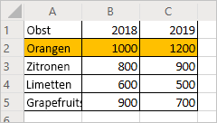
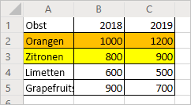
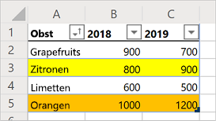

# <a name="record-edit-and-create-office-scripts-in-excel-on-the-web"></a><span data-ttu-id="141f5-103">Aufzeichnen, Bearbeiten und Erstellen von Office-Skripts in Excel im Web</span><span class="sxs-lookup"><span data-stu-id="141f5-103">Record, edit, and create Office Scripts in Excel on the web</span></span>

<span data-ttu-id="141f5-104">In diesem Lernprogramm lernen Sie die Grundlagen zum Aufzeichnen, Bearbeiten und Schreiben eines Office-Skripts für Excel im Web kennen.</span><span class="sxs-lookup"><span data-stu-id="141f5-104">This tutorial will teach you the basics of recording, editing, and writing an Office Script for Excel on the web.</span></span>

## <a name="prerequisites"></a><span data-ttu-id="141f5-105">Voraussetzungen</span><span class="sxs-lookup"><span data-stu-id="141f5-105">Prerequisites</span></span>

[!INCLUDE [Preview note](../includes/preview-note.md)]

<span data-ttu-id="141f5-106">Bevor Sie mit diesem Lernprogramm beginnen, benötigen Sie Zugriff auf Office-Skripts. Dies setzt Folgendes voraus:</span><span class="sxs-lookup"><span data-stu-id="141f5-106">Before starting this tutorial, you'll need access to Office Scripts, which requires the following:</span></span>

- <span data-ttu-id="141f5-107">[Excel im Web](https://www.office.com/launch/excel).</span><span class="sxs-lookup"><span data-stu-id="141f5-107">[Excel on the web](https://www.office.com/launch/excel).</span></span>
- <span data-ttu-id="141f5-108">Bitten Sie Ihren Administrator, [Office-Skripts für Ihre Organisation zu aktivieren](https://support.office.com/article/office-scripts-settings-in-m365-19d3c51a-6ca2-40ab-978d-60fa49554dcf). Dadurch wird die Registerkarte "**Automatisieren**" zum Menüband hinzugefügt.</span><span class="sxs-lookup"><span data-stu-id="141f5-108">Ask your administrator to [enable Office Scripts for your organization](https://support.office.com/article/office-scripts-settings-in-m365-19d3c51a-6ca2-40ab-978d-60fa49554dcf), which adds the **Automate** tab to the ribbon.</span></span>

> [!IMPORTANT]
> <span data-ttu-id="141f5-109">Dieses Lernprogramm richtet sich an Personen, die über mittlere JavaScript- oder TypeScript-Kenntnisse verfügen.</span><span class="sxs-lookup"><span data-stu-id="141f5-109">This tutorial is intended for people with beginner to intermediate-level knowledge of JavaScript or TypeScript.</span></span> <span data-ttu-id="141f5-110">Wenn Sie noch nicht mit JavaScript vertraut sind, empfehlen wir Ihnen, sich das [Mozilla-JavaScript-Lernprogramm](https://developer.mozilla.org/docs/Web/JavaScript/Guide/Introduction) durchzusehen.</span><span class="sxs-lookup"><span data-stu-id="141f5-110">If you're new to JavaScript, we recommend reviewing the [Mozilla JavaScript tutorial](https://developer.mozilla.org/docs/Web/JavaScript/Guide/Introduction).</span></span> <span data-ttu-id="141f5-111">Weitere Informationen über die Skriptumgebung finden Sie unter [Office-Skripts in Excel im Web](../overview/excel.md).</span><span class="sxs-lookup"><span data-stu-id="141f5-111">Visit [Office Scripts in Excel on the web](../overview/excel.md) to learn more about the script environment.</span></span>

## <a name="add-data-and-record-a-basic-script"></a><span data-ttu-id="141f5-112">Hinzufügen von Daten und Aufzeichnen eines einfachen Skripts</span><span class="sxs-lookup"><span data-stu-id="141f5-112">Add data and record a basic script</span></span>

<span data-ttu-id="141f5-113">Zuerst benötigen wir einige Daten und ein kleines Startskript.</span><span class="sxs-lookup"><span data-stu-id="141f5-113">First, we'll need some data and a small starting script.</span></span>

1. <span data-ttu-id="141f5-114">Erstellen Sie eine neue Arbeitsmappe in Excel im Web.</span><span class="sxs-lookup"><span data-stu-id="141f5-114">Create a new workbook in Excel for the Web.</span></span>
2. <span data-ttu-id="141f5-115">Kopieren Sie die folgenden Obst-Umsatzdaten, und fügen Sie diese beginnend bei Zelle **A1** in das Arbeitsblatt ein.</span><span class="sxs-lookup"><span data-stu-id="141f5-115">Copy the following fruit sales data and paste it into the worksheet, starting at cell **A1**.</span></span>

    |<span data-ttu-id="141f5-116">Obstsorte</span><span class="sxs-lookup"><span data-stu-id="141f5-116">Fruit</span></span> |<span data-ttu-id="141f5-117">2018</span><span class="sxs-lookup"><span data-stu-id="141f5-117">2018</span></span> |<span data-ttu-id="141f5-118">2019</span><span class="sxs-lookup"><span data-stu-id="141f5-118">2019</span></span> |
    |:---|:---|:---|
    |<span data-ttu-id="141f5-119">Orangen</span><span class="sxs-lookup"><span data-stu-id="141f5-119">Oranges</span></span> |<span data-ttu-id="141f5-120">1000</span><span class="sxs-lookup"><span data-stu-id="141f5-120">1000</span></span> |<span data-ttu-id="141f5-121">1200</span><span class="sxs-lookup"><span data-stu-id="141f5-121">1200</span></span> |
    |<span data-ttu-id="141f5-122">Zitronen</span><span class="sxs-lookup"><span data-stu-id="141f5-122">Lemons</span></span> |<span data-ttu-id="141f5-123">800</span><span class="sxs-lookup"><span data-stu-id="141f5-123">800</span></span> |<span data-ttu-id="141f5-124">900</span><span class="sxs-lookup"><span data-stu-id="141f5-124">900</span></span> |
    |<span data-ttu-id="141f5-125">Limetten</span><span class="sxs-lookup"><span data-stu-id="141f5-125">Limes</span></span> |<span data-ttu-id="141f5-126">600</span><span class="sxs-lookup"><span data-stu-id="141f5-126">600</span></span> |<span data-ttu-id="141f5-127">500</span><span class="sxs-lookup"><span data-stu-id="141f5-127">500</span></span> |
    |<span data-ttu-id="141f5-128">Grapefruits</span><span class="sxs-lookup"><span data-stu-id="141f5-128">Grapefruits</span></span> |<span data-ttu-id="141f5-129">900</span><span class="sxs-lookup"><span data-stu-id="141f5-129">900</span></span> |<span data-ttu-id="141f5-130">700</span><span class="sxs-lookup"><span data-stu-id="141f5-130">700</span></span> |

3. <span data-ttu-id="141f5-131">Öffnen Sie die Registerkarte **Automatisieren**. Falls die Registerkarte **Automatisieren** nicht angezeigt wird, überprüfen Sie den Menüband-Überlauf, indem Sie auf den Dropdownpfeil klicken.</span><span class="sxs-lookup"><span data-stu-id="141f5-131">Open the **Automate** tab. If you do not see the **Automate** tab, check the ribbon overflow by pressing the drop-down arrow.</span></span>
4. <span data-ttu-id="141f5-132">Klicken Sie auf die Schaltfläche **Aktionen aufzeichnen**.</span><span class="sxs-lookup"><span data-stu-id="141f5-132">Press the **Record Actions** button.</span></span>
5. <span data-ttu-id="141f5-133">Wählen Sie Zellen **A2:C2** (die Zeile "Orangen") aus, und legen Sie die Füllfarbe auf Orange fest.</span><span class="sxs-lookup"><span data-stu-id="141f5-133">Select cells **A2:C2** (the "Oranges" row) and set the fill color to orange.</span></span>
6. <span data-ttu-id="141f5-134">Beenden Sie die Aufzeichnung, indem Sie die Schaltfläche **Stopp** drücken.</span><span class="sxs-lookup"><span data-stu-id="141f5-134">Stop the recording by pressing the **Stop** button.</span></span>
7. <span data-ttu-id="141f5-135">Geben Sie in das Feld **Skriptnamen** einen einprägsamen Namen ein.</span><span class="sxs-lookup"><span data-stu-id="141f5-135">Fill in the **Script Name** field with a memorable name.</span></span>
8. <span data-ttu-id="141f5-136">*Optional:* Füllen Sie das Feld **Beschreibung** mit einer aussagekräftigen Beschreibung aus.</span><span class="sxs-lookup"><span data-stu-id="141f5-136">*Optional:* Fill in the **Description** field with a meaningful description.</span></span> <span data-ttu-id="141f5-137">Diese wird verwendet, um den Kontext des Skripts bereitzustellen.</span><span class="sxs-lookup"><span data-stu-id="141f5-137">This is used to provide context as to what the script does.</span></span> <span data-ttu-id="141f5-138">Für dieses Lernprogramm können Sie "Farbcodierte Zeilen einer Tabelle" verwenden.</span><span class="sxs-lookup"><span data-stu-id="141f5-138">For the tutorial, you can use "Color-codes rows of a table".</span></span>

   > [!TIP]
   > <span data-ttu-id="141f5-139">Sie können die Beschreibung eines Skripts später im Bereich **Skriptdetails** bearbeiten, der sich im Menü **...** des Code-Editors befindet.</span><span class="sxs-lookup"><span data-stu-id="141f5-139">You can edit a script's description later from the **Script Details** pane, which is located under the Code Editor's **...** menu.</span></span>

9. <span data-ttu-id="141f5-140">Klicken Sie auf die Schaltfläche **Speichern**, um das Skript zu speichern.</span><span class="sxs-lookup"><span data-stu-id="141f5-140">Save the script by pressing the **Save** button.</span></span>

    <span data-ttu-id="141f5-141">Ihr Arbeitsblatt sollte wie folgt aussehen (machen Sie sich keine Sorgen, wenn die Farbe anders ist):</span><span class="sxs-lookup"><span data-stu-id="141f5-141">Your worksheet should look like this (don't worry if the color is different):</span></span>

    

## <a name="edit-an-existing-script"></a><span data-ttu-id="141f5-143">Bearbeiten eines vorhandenen Skripts</span><span class="sxs-lookup"><span data-stu-id="141f5-143">Edit an existing script</span></span>

<span data-ttu-id="141f5-144">Das vorherige Skript hat die Zeile "Orangen" orangefarben eingefärbt.</span><span class="sxs-lookup"><span data-stu-id="141f5-144">The previous script colored the "Oranges" row to be orange.</span></span> <span data-ttu-id="141f5-145">Jetzt fügen wir eine gelbe Zeile für die "Zitronen" hinzu.</span><span class="sxs-lookup"><span data-stu-id="141f5-145">Let's add a yellow row for the "Lemons".</span></span>

1. <span data-ttu-id="141f5-146">Öffnen Sie die Registerkarte **Automatisieren**.</span><span class="sxs-lookup"><span data-stu-id="141f5-146">Open the **Automate** tab.</span></span>
2. <span data-ttu-id="141f5-147">Klicken Sie auf die Schaltfläche **Code-Editor**.</span><span class="sxs-lookup"><span data-stu-id="141f5-147">Press the **Code Editor** button.</span></span>
3. <span data-ttu-id="141f5-148">Öffnen Sie das im vorherigen Abschnitt aufgezeichnete Skript.</span><span class="sxs-lookup"><span data-stu-id="141f5-148">Open the script you recorded in the previous section.</span></span> <span data-ttu-id="141f5-149">Folgendes sollte nun auf dem Bildschirm angezeigt werden:</span><span class="sxs-lookup"><span data-stu-id="141f5-149">You should see something similar to this code:</span></span>

    ```TypeScript
    async function main(context: Excel.RequestContext) {
      // Set fill color to FFC000 for range Sheet1!A2:C2
      let workbook = context.workbook;
      let worksheets = workbook.worksheets;
      let selectedSheet = worksheets.getActiveWorksheet();
      selectedSheet.getRange("A2:C2").format.fill.color = "FFC000";
    }
    ```

    <span data-ttu-id="141f5-150">Dieser Code ruft das aktuelle Arbeitsblatt ab, indem er zuerst auf die Arbeitsblattsammlung der Arbeitsmappe zugreift.</span><span class="sxs-lookup"><span data-stu-id="141f5-150">This code gets the current worksheet by first accessing the workbook's worksheet collection.</span></span> <span data-ttu-id="141f5-151">Anschließend legt er die Füllfarbe des Bereichs **A2:C2** fest.</span><span class="sxs-lookup"><span data-stu-id="141f5-151">Then, it sets the fill color of the range **A2:C2**.</span></span>

    <span data-ttu-id="141f5-152">Bereiche sind ein wesentliches Element von Office-Skripts in Excel im Web.</span><span class="sxs-lookup"><span data-stu-id="141f5-152">Ranges are a fundamental part of Office Scripts in Excel on the web.</span></span> <span data-ttu-id="141f5-153">Ein Bereich ist ein zusammenhängender, rechteckiger Block von Zellen, die Werte, Formeln und Formatierungen enthalten.</span><span class="sxs-lookup"><span data-stu-id="141f5-153">A range is a contiguous, rectangular block of cells that contains values, formula, and formatting.</span></span> <span data-ttu-id="141f5-154">Hierbei handelt es sich um die grundlegende Struktur von Zellen, durch die Sie die meisten Skript-Aufgaben ausführen werden.</span><span class="sxs-lookup"><span data-stu-id="141f5-154">They are the basic structure of cells through which you'll perform most of your scripting tasks.</span></span>

4. <span data-ttu-id="141f5-155">Fügen Sie am Ende des Skripts die folgende Zeile ein (zwischen dem festgelegten `color` und der schließenden `}`):</span><span class="sxs-lookup"><span data-stu-id="141f5-155">Add the following line to the end of the script (between where the `color` is set and the closing `}`):</span></span>

    ```TypeScript
    selectedSheet.getRange("A3:C3").format.fill.color = "yellow";
    ```

5. <span data-ttu-id="141f5-156">Testen Sie das Skript, indem Sie **Ausführen** drücken.</span><span class="sxs-lookup"><span data-stu-id="141f5-156">Test the script by pressing **Run**.</span></span> <span data-ttu-id="141f5-157">Ihre Arbeitsmappe sollte nun wie folgt aussehen:</span><span class="sxs-lookup"><span data-stu-id="141f5-157">Your workbook should now look like this:</span></span>

    

## <a name="create-a-table"></a><span data-ttu-id="141f5-159">Erstellen einer Tabelle</span><span class="sxs-lookup"><span data-stu-id="141f5-159">Create a table</span></span>

<span data-ttu-id="141f5-160">Wandeln wir diese Obst-Umsatzdaten in eine Tabelle um.</span><span class="sxs-lookup"><span data-stu-id="141f5-160">Let's convert this fruit sales data into a table.</span></span> <span data-ttu-id="141f5-161">Wir verwenden unser Skript für den gesamten Prozess.</span><span class="sxs-lookup"><span data-stu-id="141f5-161">We'll use our script for the entire process.</span></span>

1. <span data-ttu-id="141f5-162">Fügen Sie die folgende Zeile am Ende des Skripts hinzu (vor der schließenden `}`):</span><span class="sxs-lookup"><span data-stu-id="141f5-162">Add the following line to the end of the script (before the closing `}`):</span></span>

    ```TypeScript
    let table = selectedSheet.tables.add("A1:C5", true);
    ```

2. <span data-ttu-id="141f5-163">Dieser Aufruf gibt ein `Table`-Objekt zurück.</span><span class="sxs-lookup"><span data-stu-id="141f5-163">That call returns a `Table` object.</span></span> <span data-ttu-id="141f5-164">Verwenden wir diese Tabelle zum Sortieren der Daten.</span><span class="sxs-lookup"><span data-stu-id="141f5-164">Let's use that table to sort the data.</span></span> <span data-ttu-id="141f5-165">Wir werden die Daten basierend auf den Werten in der Spalte "Obstsorte" in aufsteigender Reihenfolge sortieren.</span><span class="sxs-lookup"><span data-stu-id="141f5-165">We'll sort the data in ascending order based on the values in the "Fruit" column.</span></span> <span data-ttu-id="141f5-166">Fügen Sie dann die folgende Zeile nach der Tabellenerstellung hinzu:</span><span class="sxs-lookup"><span data-stu-id="141f5-166">Add the following line after the table creation:</span></span>

    ```TypeScript
    table.sort.apply([{ key: 0, ascending: true }]);
    ```

    <span data-ttu-id="141f5-167">Das Skript sollte wie folgt aussehen:</span><span class="sxs-lookup"><span data-stu-id="141f5-167">Your script should look like this:</span></span>

    ```TypeScript
    async function main(context: Excel.RequestContext) {
      // Set fill color to FFC000 for range Sheet1!A2:C2
      let workbook = context.workbook;
      let worksheets = workbook.worksheets;
      let selectedSheet = worksheets.getActiveWorksheet();
      selectedSheet.getRange("A2:C2").format.fill.color = "FFC000";
      selectedSheet.getRange("A3:C3").format.fill.color = "yellow";
      let table = selectedSheet.tables.add("A1:C5", true);
      table.sort.apply([{ key: 0, ascending: true }]);
    }
    ```

    <span data-ttu-id="141f5-168">Tabellen beinhalten ein `TableSort`-Objekt, auf das über die `Table.sort`-Eigenschaft zugegriffen wird.</span><span class="sxs-lookup"><span data-stu-id="141f5-168">Tables have a `TableSort` object, accessed through the `Table.sort` property.</span></span> <span data-ttu-id="141f5-169">Sie können auf dieses Objekt Sortierkriterien anwenden.</span><span class="sxs-lookup"><span data-stu-id="141f5-169">You can apply sorting criteria to that object.</span></span> <span data-ttu-id="141f5-170">Die `apply`-Methode bezieht eine Reihe von `SortField`-Objekten ein.</span><span class="sxs-lookup"><span data-stu-id="141f5-170">The `apply` method takes in an array of `SortField` objects.</span></span> <span data-ttu-id="141f5-171">In diesem Fall gibt es nur ein Sortierkriterium, also verwenden wir nur ein `SortField`.</span><span class="sxs-lookup"><span data-stu-id="141f5-171">In this case, we only have one sorting criteria, so we only use one `SortField`.</span></span> <span data-ttu-id="141f5-172">`key: 0` legt für die Spalte mit den die Sortierung bestimmenden Werten "0" fest (dies ist die erste Spalte in der Tabelle, in diesem Fall **A**).</span><span class="sxs-lookup"><span data-stu-id="141f5-172">`key: 0` sets the column with the sort-defining values to "0" (which is the first column on the table, **A** in this case).</span></span> <span data-ttu-id="141f5-173">`ascending: true` sortiert die Daten in aufsteigender Reihenfolge (statt in absteigender Reihenfolge).</span><span class="sxs-lookup"><span data-stu-id="141f5-173">`ascending: true` sorts the data in ascending order (instead of descending order).</span></span>

3. <span data-ttu-id="141f5-174">Führen Sie das Skript aus.</span><span class="sxs-lookup"><span data-stu-id="141f5-174">Run the script.</span></span> <span data-ttu-id="141f5-175">Es sollte eine Tabelle wie die folgende angezeigt werden:</span><span class="sxs-lookup"><span data-stu-id="141f5-175">You should see a table like this:</span></span>

    

    > [!NOTE]
    > <span data-ttu-id="141f5-177">Wenn Sie das Skript erneut ausführen, wird eine Fehlermeldung angezeigt.</span><span class="sxs-lookup"><span data-stu-id="141f5-177">If you re-run the script, you'll get an error.</span></span> <span data-ttu-id="141f5-178">Der Grund dafür ist, dass Sie keine Tabelle über eine andere Tabelle erstellen können.</span><span class="sxs-lookup"><span data-stu-id="141f5-178">This is because you cannot create a table on top of another table.</span></span> <span data-ttu-id="141f5-179">Sie können das Skript jedoch auf ein anderes Arbeitsblatt oder eine andere Arbeitsmappe anwenden.</span><span class="sxs-lookup"><span data-stu-id="141f5-179">However, you can run the script on a different worksheet or workbook.</span></span>

### <a name="re-run-the-script"></a><span data-ttu-id="141f5-180">Das Skript erneut ausführen</span><span class="sxs-lookup"><span data-stu-id="141f5-180">Re-run the script</span></span>

1. <span data-ttu-id="141f5-181">Erstellen Sie ein neues Arbeitsblatt in der aktuellen Arbeitsmappe.</span><span class="sxs-lookup"><span data-stu-id="141f5-181">Create a new worksheet in the current workbook.</span></span>
2. <span data-ttu-id="141f5-182">Kopieren Sie die Obstdaten am Anfang dieses Lernprogramms, und fügen Sie sie in das neue Arbeitsblatt ein, beginnend bei Zelle **A1**.</span><span class="sxs-lookup"><span data-stu-id="141f5-182">Copy the fruit data from the beginning of the tutorial and paste it into the new worksheet, starting at cell **A1**.</span></span>
3. <span data-ttu-id="141f5-183">Führen Sie das Skript aus.</span><span class="sxs-lookup"><span data-stu-id="141f5-183">Run the script.</span></span>

## <a name="next-steps"></a><span data-ttu-id="141f5-184">Nächste Schritte</span><span class="sxs-lookup"><span data-stu-id="141f5-184">Next steps</span></span>

<span data-ttu-id="141f5-185">Führen Sie das Lernprogramm [Lesen von Arbeitsmappendaten mit Office-Skripts in Excel im Web](excel-read-tutorial.md) aus.</span><span class="sxs-lookup"><span data-stu-id="141f5-185">Complete the [Read workbook data with Office Scripts in Excel on the web](excel-read-tutorial.md) tutorial.</span></span> <span data-ttu-id="141f5-186">Hier erfahren Sie, wie Sie mithilfe eines Office-Skripts Daten aus einer Arbeitsmappe lesen können.</span><span class="sxs-lookup"><span data-stu-id="141f5-186">It teaches you how to read data from a workbook with an Office Script.</span></span>
